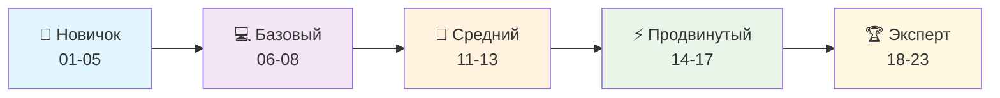

# 🐍 Полный курс Python

Добро пожаловать в comprehensive курс по изучению Python! Этот курс охватывает все аспекты современной разработки - от базовых концепций до enterprise-уровня решений.

## 🎯 Цель курса

Подготовить разработчиков, способных:
- 💻 Создавать качественные Python приложения
- 🏗️ Проектировать масштабируемые системы
- 🔧 Использовать современные инструменты и практики
- 🚀 Работать с cutting-edge технологиями
- 📊 Анализировать данные и создавать ML решения
- 🔒 Обеспечивать безопасность приложений

## 📚 Структура курса

Каждый раздел содержит:
- **📖 *.md** - Теоретические основы
- **📊 diagrams/*.md** - Mermaid диаграммы и визуализация
- **💻 examples/*.py** - Практические примеры
- **🎯 exercises/*.py** - Упражнения с решениями

## 🗂️ Содержание курса

### 🏗️ **Основы и базовые концепции (01-08)**

#### [📖 01. Введение в Python](./01_Введение/)
**Философия Python, история развития, основы синтаксиса**

#### [🔢 02. Базовые конструкции](./02_Базовые_конструкции/)
**Переменные, операторы, условия, циклы**

#### [📊 03. Структуры данных](./03_Структуры_данных/)
**Списки, кортежи, словари, множества**

#### [🔧 04. Функции](./04_Функции/)
**Определение функций, аргументы, возвращаемые значения**

#### [📦 05. Модули и пакеты](./05_Модули_и_пакеты/)
**Импорт, создание модулей, пакеты**

### 🚀 **Продвинутые темы (14-23)**

#### [🔍 23. Регулярные выражения](./23_Регулярные_выражения/)
**Валидация, парсинг, анализ текста, security patterns**

## 🎯 Траектория обучения



### 📊 Уровни сложности

| Уровень | Разделы | Описание | Время изучения |
|---------|---------|----------|----------------|
| 🎯 **Новичок** | 01-05 | Основы Python, синтаксис | 2-4 недели |
| 💻 **Базовый** | 06-08 | Файлы, ООП, исключения | 2-3 недели |
| 🚀 **Средний** | 11-13 | Библиотеки, типизация, архитектура | 3-4 недели |
| ⚡ **Продвинутый** | 14-17 | Современный Python, веб, БД | 4-5 недель |
| 🏆 **Эксперт** | 18-23 | Тестирование, DevOps, ML, Security | 5-6 недель |

## 🚀 Быстрый старт

### 1️⃣ **Для новичков** (начинающих программистов)
```bash
# Начните с основ
cd 01_Введение/
# Изучите теорию → посмотрите диаграммы → выполните примеры → решите упражнения
```

### 2️⃣ **Для Python разработчиков** (есть опыт в других языках)
```bash
# Начните с раздела 04 или 08
cd 04_Функции/  # или cd 08_ООП/
# Фокус на Python-специфичные особенности
```

### 3️⃣ **Для опытных разработчиков** (изучение продвинутых тем)
```bash
# Начните с раздела 14 или выберите интересующую область
cd 14_Типизация_и_аннотации/  # современные подходы
cd 16_Веб_разработка/          # веб-фреймворки
cd 20_Анализ_данных_и_ML/      # data science
```

## 📋 Предварительные требования

### 🔧 **Технические требования**
- **Python 3.8+** (рекомендуется 3.11+)
- **IDE/Editor**: VS Code, PyCharm, или аналогичный
- **Git** для клонирования репозитория
- **Docker** (для разделов по развертыванию)

### 📚 **Знания**
- **Базовые знания программирования** (для разделов 01-05)
- **Понимание алгоритмов** (для разделов 13+)
- **Опыт работы с командной строкой** (полезно)

## 🛠️ Установка и настройка

```bash
# Клонировать репозиторий
git clone https://github.com/your-username/python-course.git
cd python-course

# Создать виртуальное окружение
python -m venv venv

# Активировать (Windows)
venv\Scripts\activate

# Активировать (macOS/Linux)
source venv/bin/activate

# Установить зависимости
pip install -r requirements.txt
```

## 🎉 Начните изучение прямо сейчас!

Выберите раздел из навигации слева и начните свой путь к мастерству в Python! 🚀 
