# Диаграммы: Введение в Python

## 🏗️ Архитектура Python экосистемы

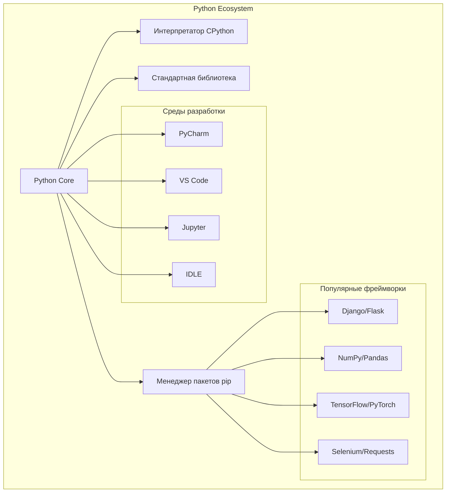

## 🔄 Процесс выполнения Python программы

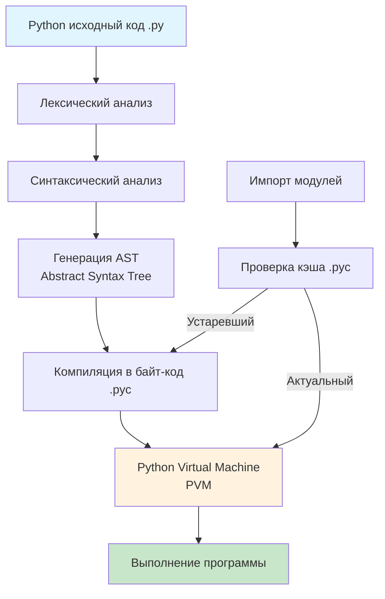

## 🌊 Поток управления в Python программе

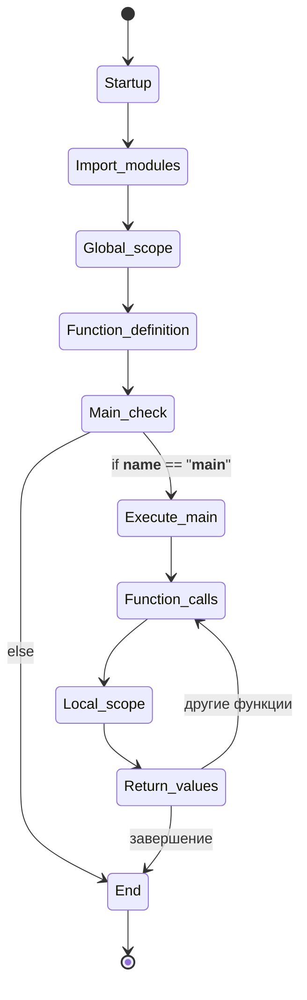

## 📊 Сравнение языков программирования

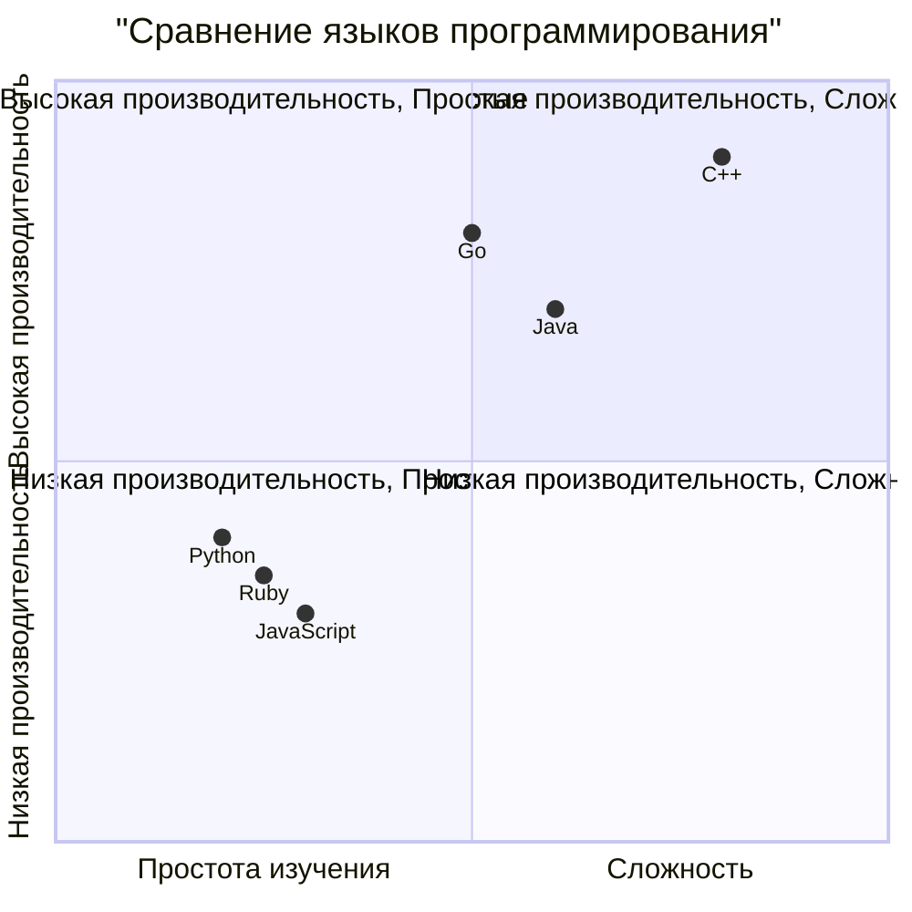

## 🎯 Области применения Python

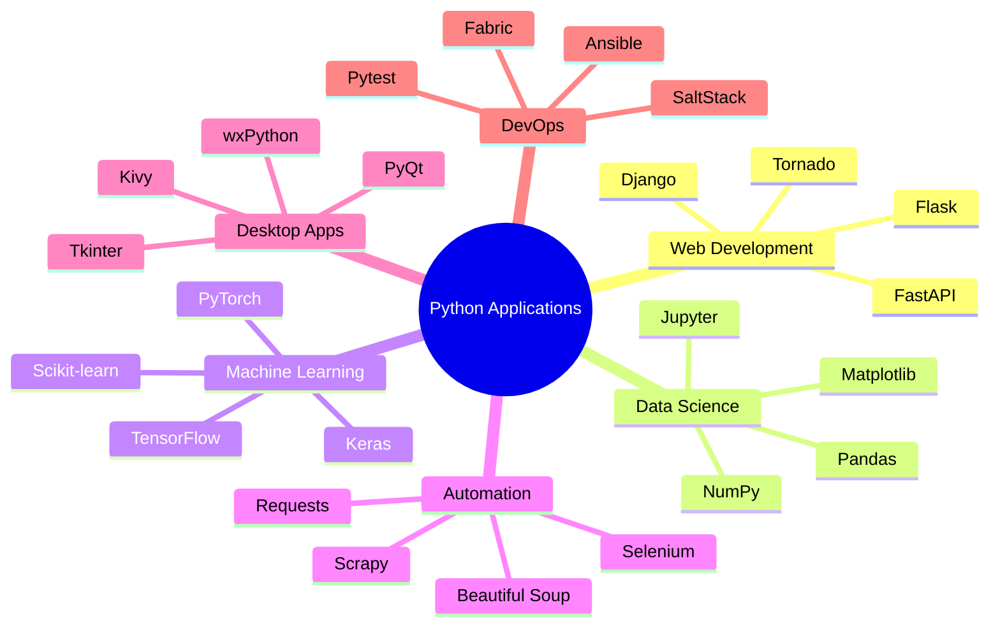

## 🔧 Процесс установки и настройки

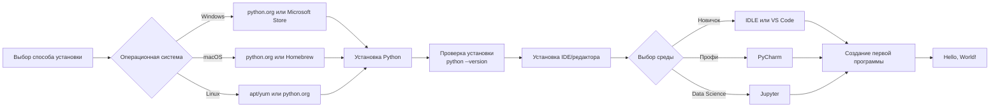

## 📈 Траектория изучения Python

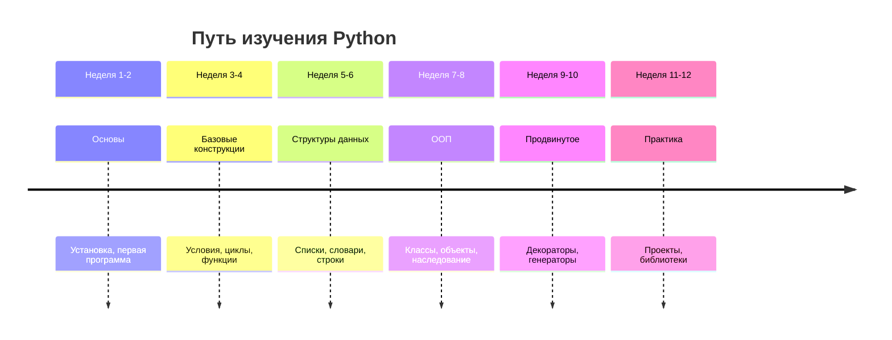

## 🏭 Python в различных доменах

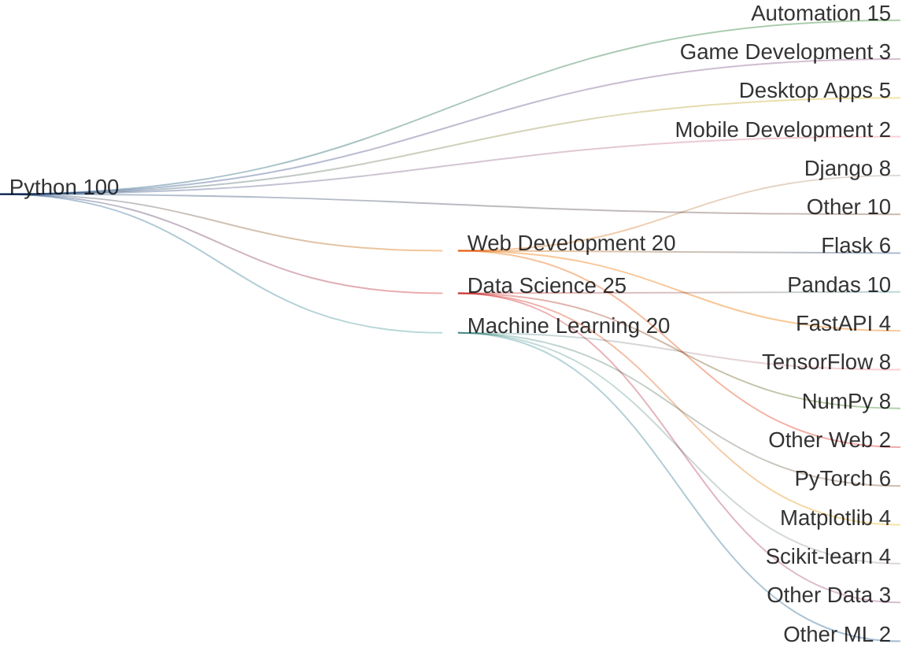

## 🔄 Жизненный цикл Python объекта

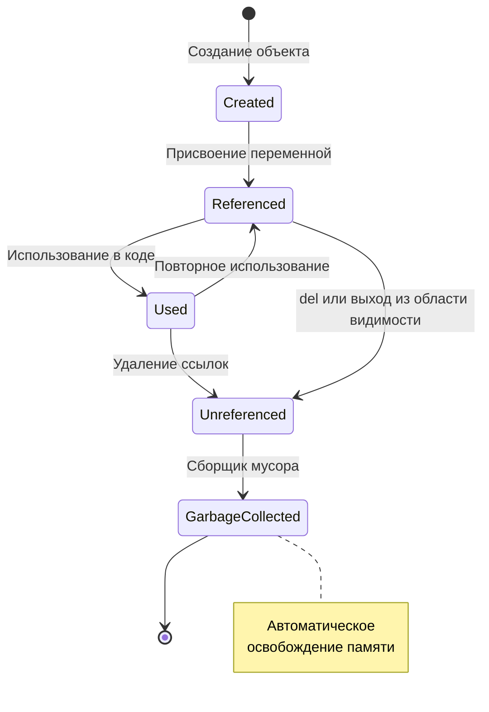

## 🎨 Принципы дизайна Python (Zen of Python)

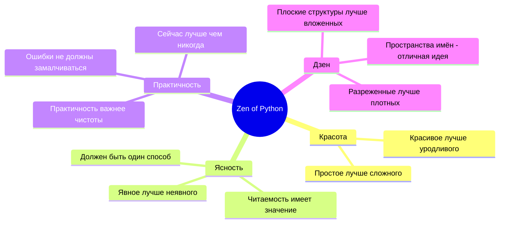

## 🔧 Архитектура интерпретатора Python

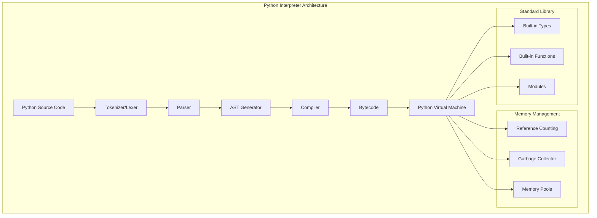

## 📱 Платформы и развертывание

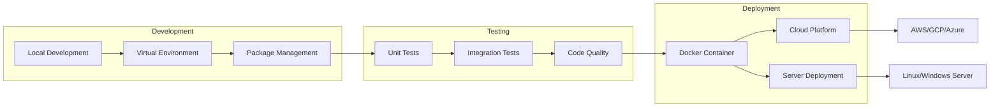

## 🔍 Отладка и профилирование

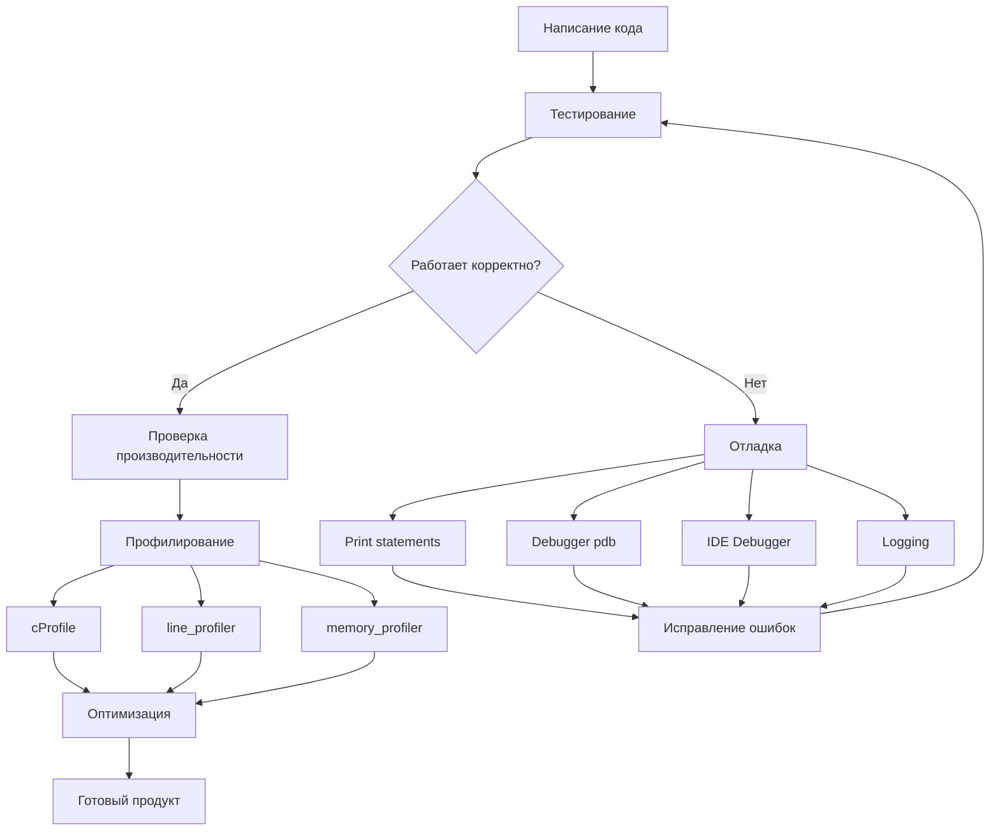

---

Эти диаграммы помогают визуализировать ключевые концепции введения в Python, от архитектуры языка до процессов разработки и развертывания. 