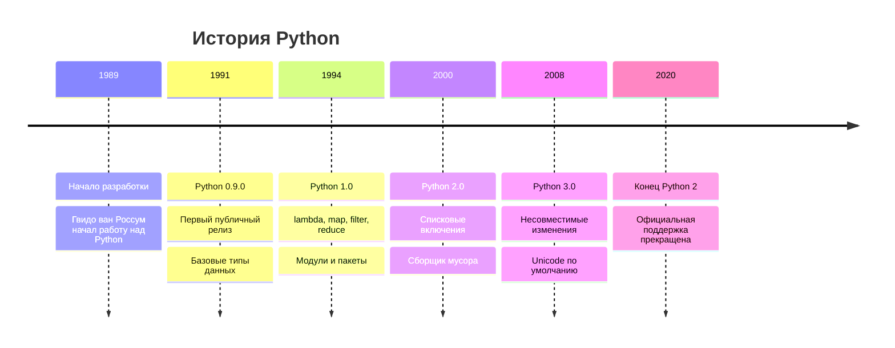

# Теория: Введение в Python

## 🎯 Цели раздела

После изучения этого раздела вы будете:
- Понимать философию и принципы Python
- Знать историю развития языка
- Уметь устанавливать и настраивать среду разработки
- Понимать основы синтаксиса Python

## 📖 Что такое Python?

Python — это высокоуровневый, интерпретируемый язык программирования общего назначения, созданный Гвидо ван Россумом в 1991 году.

### 🏗️ Основные характеристики

| Характеристика | Описание | Пример |
|----------------|----------|--------|
| **Простота** | Читаемый и понятный синтаксис | `print("Hello, World!")` |
| **Интерпретируемость** | Выполнение без компиляции | Сразу видите результат |
| **Кроссплатформенность** | Работает на всех ОС | Windows, macOS, Linux |
| **Динамическая типизация** | Типы определяются автоматически | `x = 42` (int автоматически) |
| **Объектно-ориентированный** | Всё является объектом | Даже числа и функции |

### 🎭 Философия Python: "Дзен Python"

```python
import this  # Выведет 19 принципов Python
```

**Ключевые принципы:**
1. **Красивое лучше уродливого**
2. **Явное лучше неявного**
3. **Простое лучше сложного**
4. **Читаемость имеет значение**
5. **Должен быть один способ сделать что-то**

## 📚 История развития



## 🔍 Сравнение с другими языками

| Язык | Плюсы | Минусы | Применение |
|------|-------|--------|------------|
| **Python** | Простота, читаемость, богатые библиотеки | Скорость выполнения | Data Science, веб, автоматизация |
| **Java** | Производительность, типизация | Многословность | Enterprise, Android |
| **JavaScript** | Везде в веб-разработке | Непоследовательность | Frontend, Backend (Node.js) |
| **C++** | Максимальная производительность | Сложность | Системное ПО, игры |

## 🏭 Области применения Python

### 1. **Веб-разработка**
- Django, Flask, FastAPI
- Серверная логика, API

### 2. **Data Science & AI**
- NumPy, Pandas, Scikit-learn
- TensorFlow, PyTorch

### 3. **Автоматизация**
- Скрипты администрирования
- Парсинг данных, автотесты

### 4. **Desktop приложения**
- Tkinter, PyQt, Kivy

### 5. **Научные вычисления**
- SciPy, Matplotlib
- Биоинформатика, физика

## ⚙️ Установка и настройка

### Проверка установки Python

```bash
# Проверка версии
python --version
python3 --version

# Проверка pip (менеджер пакетов)
pip --version
pip3 --version
```

### Варианты установки

#### 1. **Официальный сайт** (python.org)
- ✅ Последняя версия
- ✅ Стандартная библиотека
- ❌ Нужно отдельно устанавливать пакеты

#### 2. **Anaconda**
- ✅ Готовые пакеты для Data Science
- ✅ Менеджер окружений
- ❌ Большой размер

#### 3. **Системный менеджер пакетов**
```bash
# Ubuntu/Debian
sudo apt update
sudo apt install python3 python3-pip

# macOS (Homebrew)
brew install python

# Windows (Chocolatey)
choco install python
```

## 🛠️ Среды разработки

### Рекомендуемые IDE и редакторы

| IDE/Редактор | Уровень | Особенности |
|--------------|---------|-------------|
| **PyCharm** | Профессиональный | Полнофункциональная IDE |
| **VS Code** | Универсальный | Легкий, много расширений |
| **Jupyter** | Data Science | Интерактивные ноутбуки |
| **IDLE** | Начинающий | Встроенная среда Python |
| **Sublime Text** | Средний | Быстрый, настраиваемый |

### Настройка VS Code для Python

```json
// settings.json
{
    "python.defaultInterpreterPath": "/usr/bin/python3",
    "python.linting.enabled": true,
    "python.linting.pylintEnabled": true,
    "python.formatting.provider": "black",
    "editor.formatOnSave": true
}
```

## 🎯 Основы синтаксиса

### Структура программы Python

```python
#!/usr/bin/env python3
# -*- coding: utf-8 -*-
"""
Пример структуры Python программы.
Это многострочный комментарий (docstring).
"""

# Импорт модулей
import sys
from datetime import datetime

# Константы (по соглашению ЗАГЛАВНЫМИ)
MAX_CONNECTIONS = 100

# Глобальные переменные
app_name = "My Python App"

def main():
    """Главная функция программы."""
    print(f"Запуск {app_name}")
    print(f"Текущее время: {datetime.now()}")

# Условие для запуска только при прямом выполнении
if __name__ == "__main__":
    main()
```

### Основные синтаксические правила

#### 1. **Отступы (индентация)**
```python
# Правильно
if True:
    print("Отступ 4 пробела")
    if True:
        print("Вложенный отступ")

# Неправильно - будет ошибка
if True:
print("Нет отступа")  # IndentationError
```

#### 2. **Комментарии**
```python
# Однострочный комментарий

"""
Многострочный комментарий
или docstring
"""

x = 5  # Комментарий в конце строки
```

#### 3. **Именование переменных**
```python
# Правильно (snake_case)
user_name = "John"
max_retry_count = 3
is_active = True

# Неправильно
userName = "John"     # camelCase не принят в Python
MaxRetryCount = 3     # PascalCase только для классов
2user = "John"        # Нельзя начинать с цифры
user-name = "John"    # Дефисы запрещены
```

## 🔍 Интерпретатор Python

### Интерактивный режим (REPL)

```python
$ python3
Python 3.9.7 (default, Oct 13 2021, 06:44:56) 
[Clang 13.0.0 (clang-1300.0.29.3)] on darwin
Type "help", "copyright", "credits" or "license" for more information.
>>> print("Hello, World!")
Hello, World!
>>> 2 + 2
4
>>> exit()
```

### Выполнение скриптов

```bash
# Способ 1: через интерпретатор
python3 script.py

# Способ 2: исполняемый файл (Unix/Linux)
chmod +x script.py
./script.py
```

## 🎯 Основные типы данных

### Числовые типы

```python
# Целые числа (int)
age = 25
big_number = 1_000_000  # Разделители для читаемости

# Числа с плавающей точкой (float)
price = 19.99
scientific = 1.5e-4  # 0.00015

# Комплексные числа (complex)
complex_num = 3 + 4j
```

### Строки (str)

```python
# Разные способы создания строк
name = "Alice"
message = 'Hello, World!'
multiline = """
Многострочная
строка
"""

# f-строки (форматирование)
name = "Bob"
age = 30
greeting = f"Привет, {name}! Тебе {age} лет."
```

### Булевы значения (bool)

```python
is_student = True
is_graduated = False

# Преобразование в bool
bool(1)      # True
bool(0)      # False
bool("")     # False
bool("text") # True
```

## 🧮 Основные операторы

### Арифметические операторы

| Оператор | Описание | Пример | Результат |
|----------|----------|--------|-----------|
| `+` | Сложение | `5 + 3` | `8` |
| `-` | Вычитание | `5 - 3` | `2` |
| `*` | Умножение | `5 * 3` | `15` |
| `/` | Деление | `5 / 2` | `2.5` |
| `//` | Целочисленное деление | `5 // 2` | `2` |
| `%` | Остаток от деления | `5 % 2` | `1` |
| `**` | Возведение в степень | `2 ** 3` | `8` |

### Операторы сравнения

```python
x = 10
y = 20

x < y    # True
x > y    # False
x == y   # False
x != y   # True
x <= 10  # True
x >= 10  # True
```

### Логические операторы

```python
True and False  # False
True or False   # True
not True        # False

# Практический пример
age = 25
has_license = True

can_drive = age >= 18 and has_license  # True
```

## 🎯 Ключевые концепции

### 1. **Всё является объектом**
```python
x = 42
print(type(x))        # <class 'int'>
print(x.__class__)    # <class 'int'>
print(dir(x))         # Список всех методов числа
```

### 2. **Динамическая типизация**
```python
x = 42          # int
x = "Hello"     # str
x = [1, 2, 3]   # list
# Тип переменной может изменяться
```

### 3. **Сильная типизация**
```python
# Python не делает неявных преобразований
"5" + 3  # TypeError! Нужно явно: int("5") + 3
```

## 📝 Практические рекомендации

### 1. **Соглашения о коде (PEP 8)**
- Отступы: 4 пробела
- Максимальная длина строки: 79 символов
- Имена переменных: snake_case
- Имена классов: PascalCase
- Константы: UPPER_CASE

### 2. **Структура проекта**
```
my_project/
├── README.md
├── requirements.txt
├── src/
│   ├── __init__.py
│   └── main.py
├── tests/
│   └── test_main.py
└── docs/
    └── api.md
```

### 3. **Виртуальные окружения**
```bash
# Создание виртуального окружения
python3 -m venv myenv

# Активация
source myenv/bin/activate  # Linux/macOS
myenv\Scripts\activate     # Windows

# Установка пакетов
pip install requests

# Деактивация
deactivate
```

## 🔍 Отладка и профилирование

### Встроенный отладчик (pdb)
```python
import pdb

def calculate(x, y):
    pdb.set_trace()  # Точка останова
    result = x * y
    return result

calculate(5, 10)
```

### Профилирование производительности
```python
import cProfile
import time

def slow_function():
    time.sleep(1)
    return "Done"

# Профилирование
cProfile.run('slow_function()')
```

## 🎯 Заключение

Python — это мощный и гибкий язык программирования, который подходит как для начинающих, так и для профессиональных разработчиков. Его философия простоты и читаемости делает процесс программирования приятным и продуктивным.

### Следующие шаги:
1. Установите Python на свой компьютер
2. Выберите удобную среду разработки
3. Напишите свою первую программу
4. Изучите основные типы данных и операторы
5. Переходите к изучению структур данных

---

**Помните:** Лучший способ изучить программирование — это практика! Пишите код каждый день, экспериментируйте и не бойтесь ошибок. 