# Диаграммы: Базовые конструкции Python

## 🔄 Типы данных и их иерархия

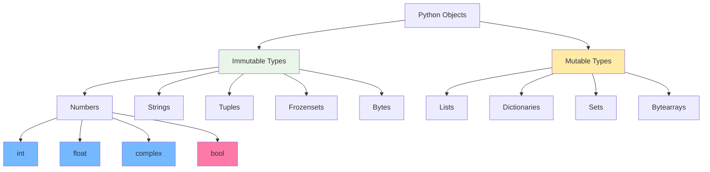

## 🔄 Жизненный цикл переменной

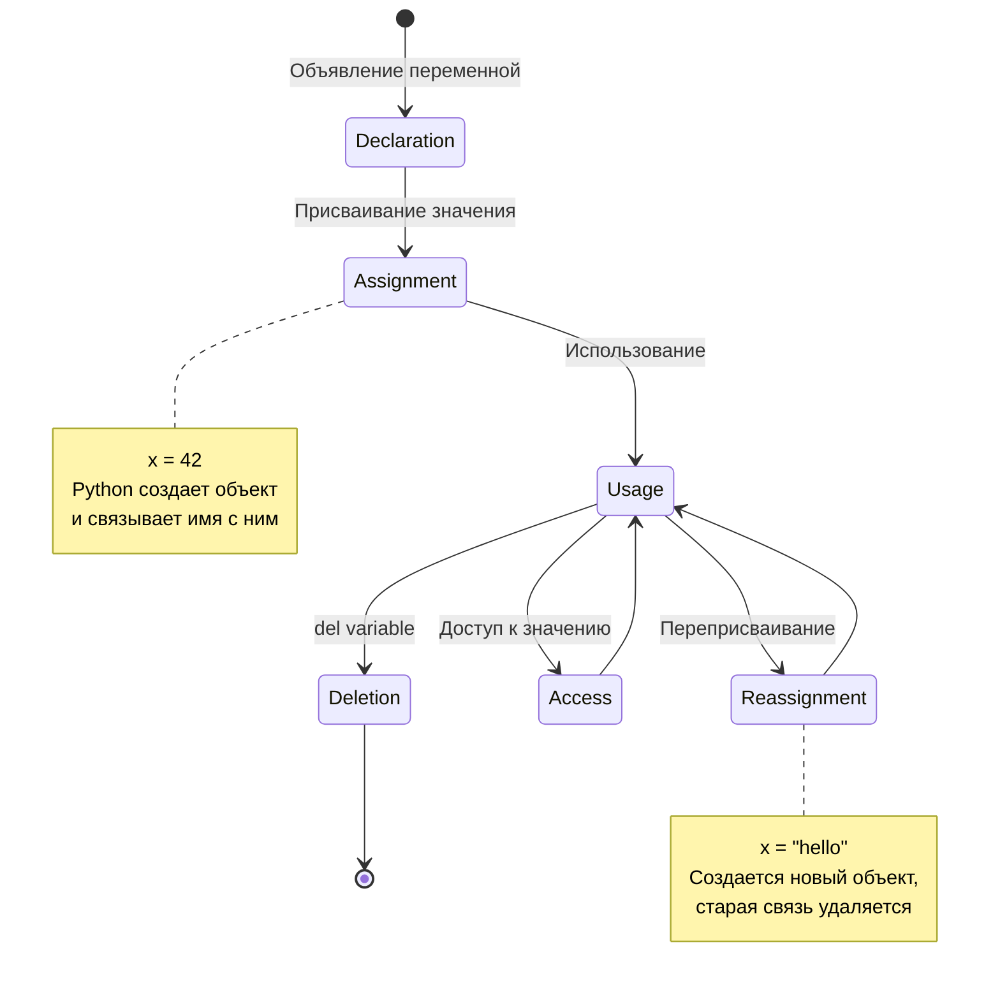

## 🧮 Операторы и их приоритет

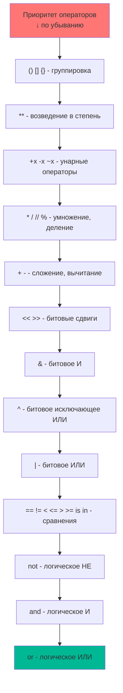

## 🎯 Поток выполнения условных конструкций

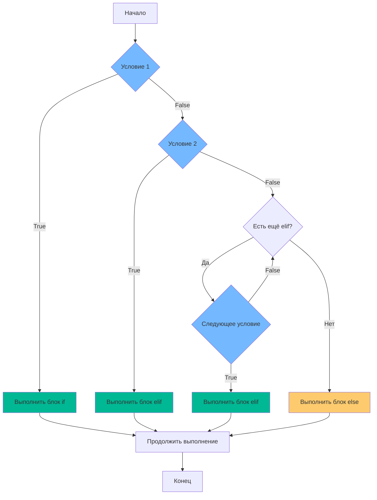

## 🔄 Виды циклов в Python

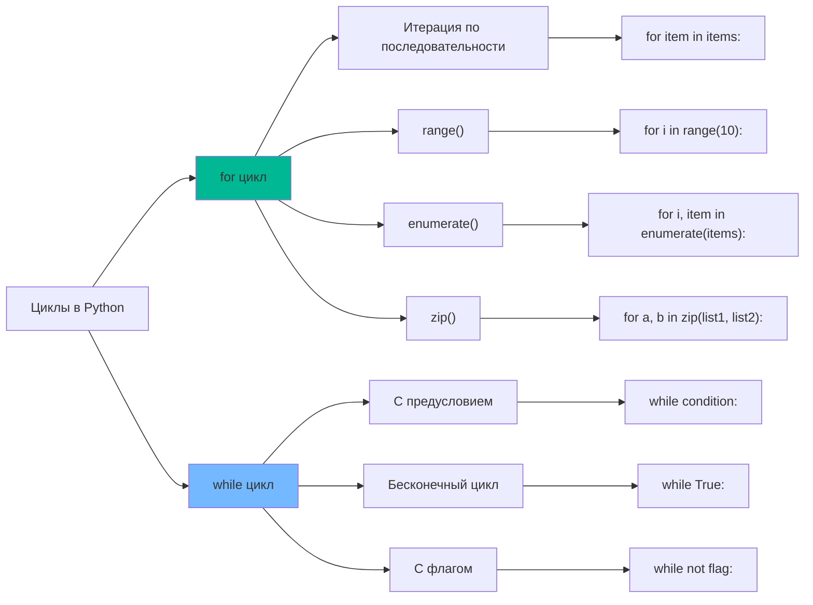

## 🔄 Управление циклами

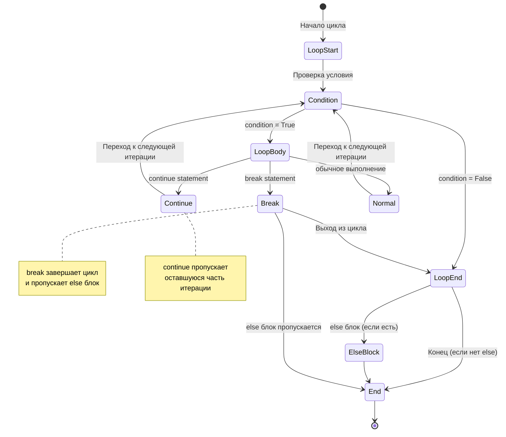

## 📊 Область видимости переменных (LEGB)

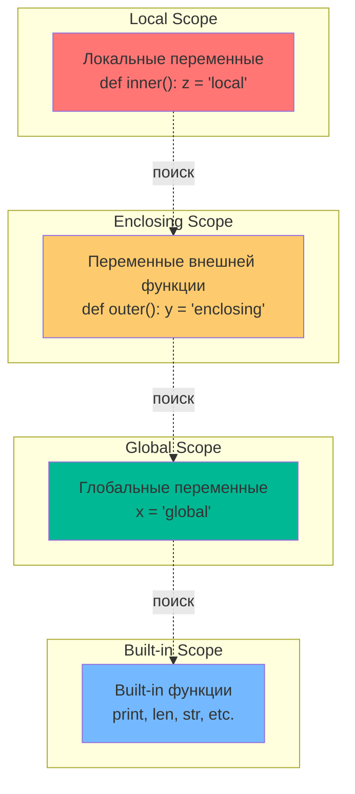

## 🔄 Преобразования типов данных

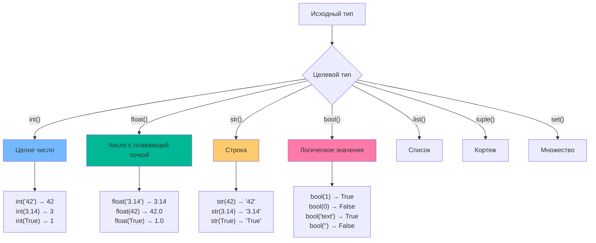

## 🎮 Логические операции и короткое замыкание

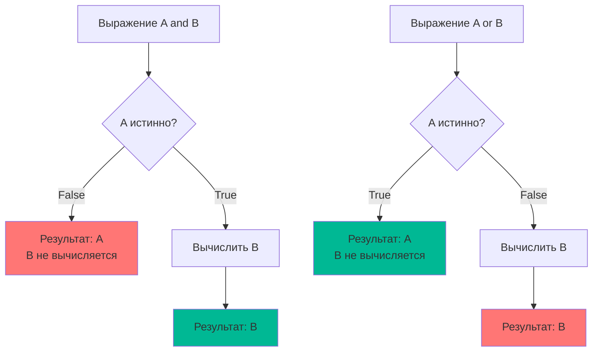

## 🔄 Обработка пользовательского ввода

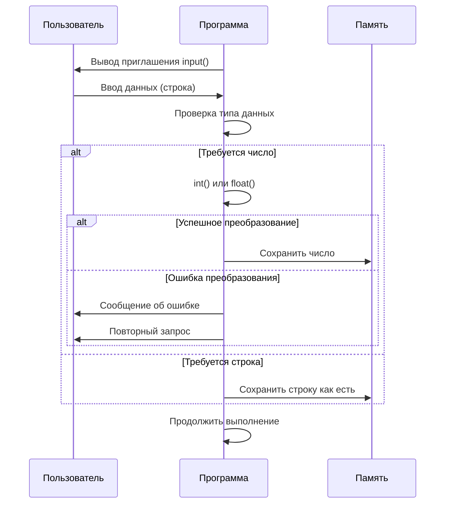

## 🎯 Тернарный оператор

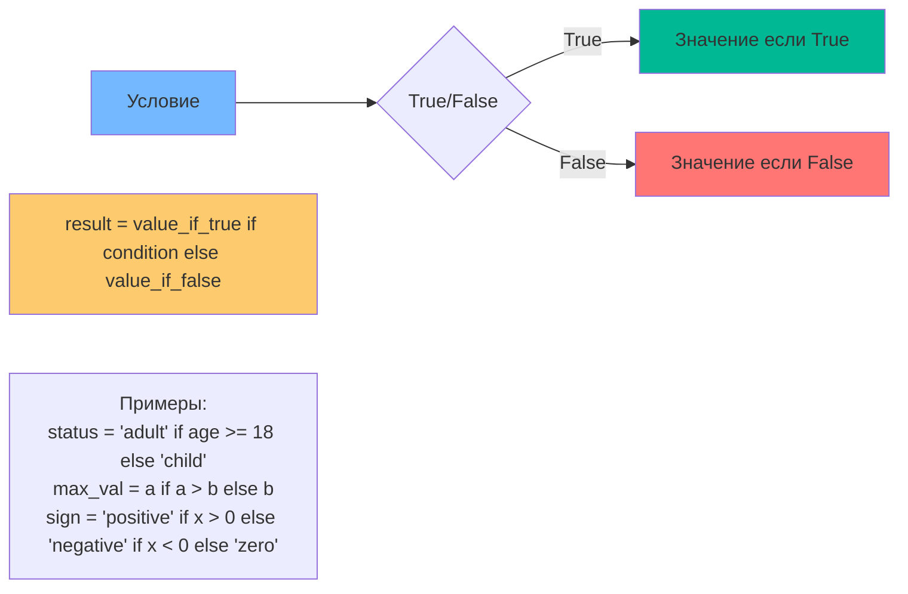

## 🔄 Цикл for с различными итерируемыми объектами

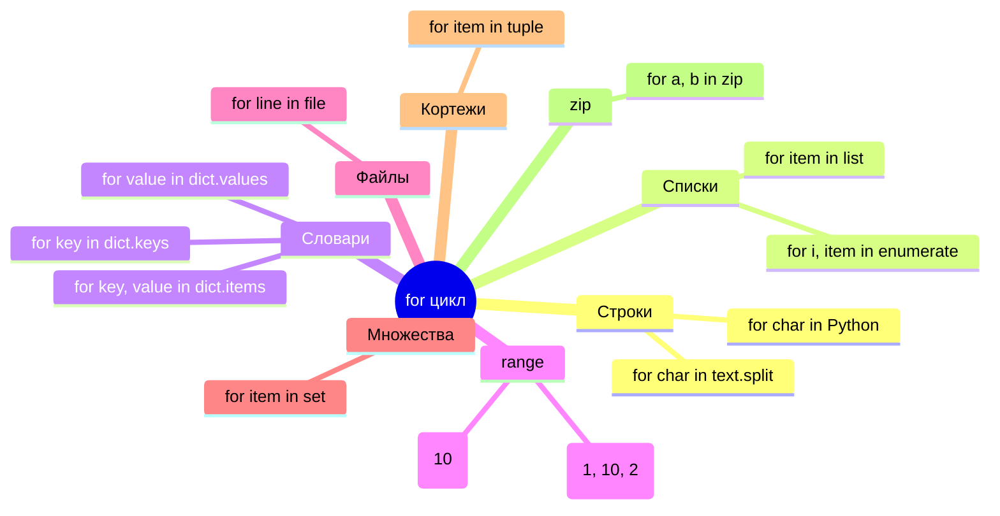

## 📊 Операции со строками

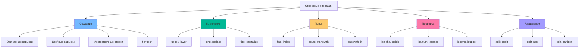

## 🔄 Сравнение различных типов циклов

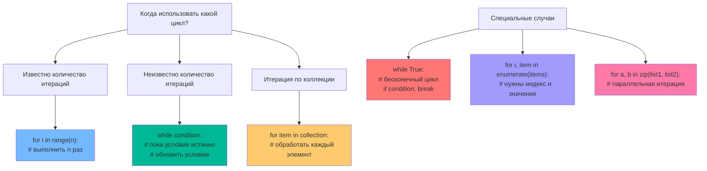

---

Эти диаграммы помогают визуализировать ключевые концепции базовых конструкций Python, включая типы данных, операторы, циклы, условия и область видимости переменных. 