# Диаграммы: Функции в Python

## 🎯 Анатомия функции

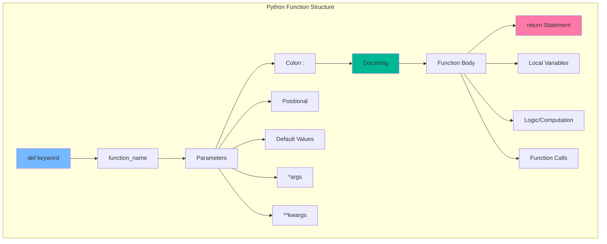

## 🔄 Типы параметров и их порядок

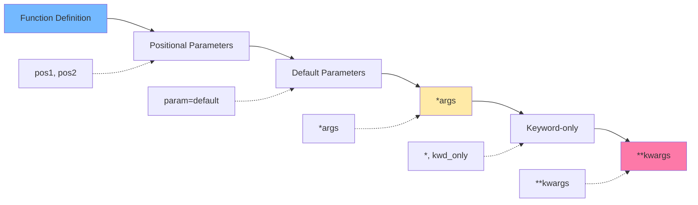

## 🌍 Область видимости (LEGB Rule)

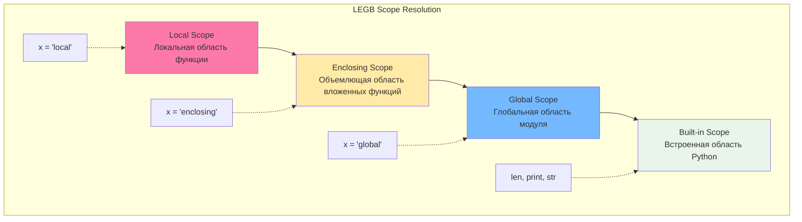

## 🎭 Жизненный цикл функции

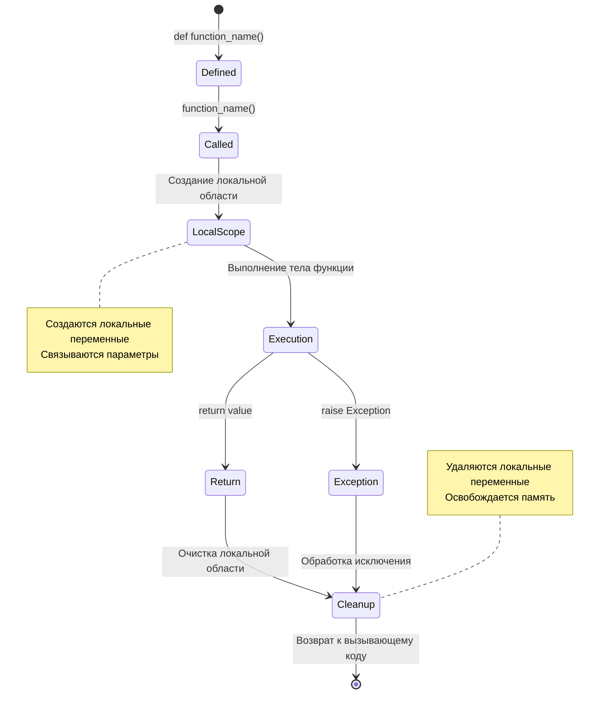

## 🏗️ Архитектура замыкания

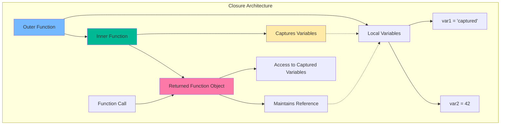

## 🎨 Паттерн декоратора

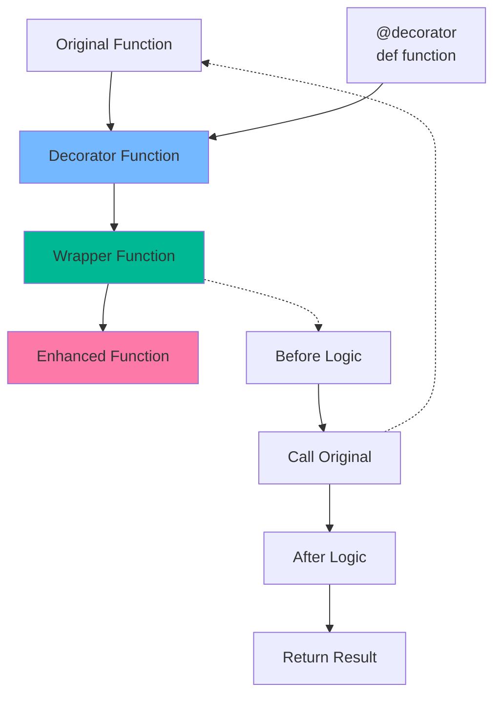

## 🔄 Генератор vs Обычная функция

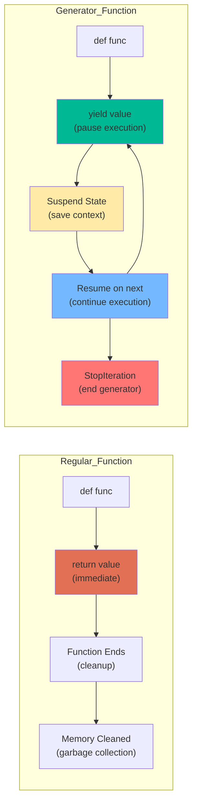

## 📊 Сравнение способов передачи аргументов

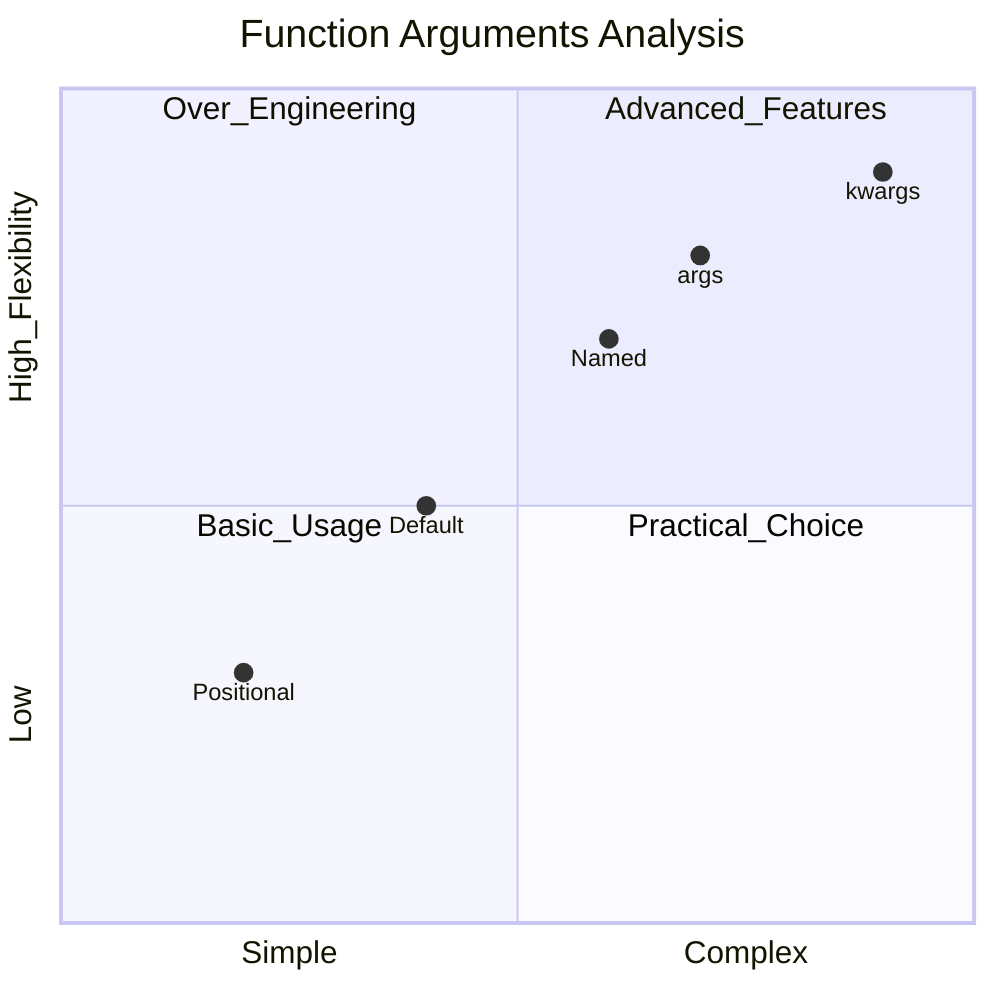

## 🎯 Применение декораторов

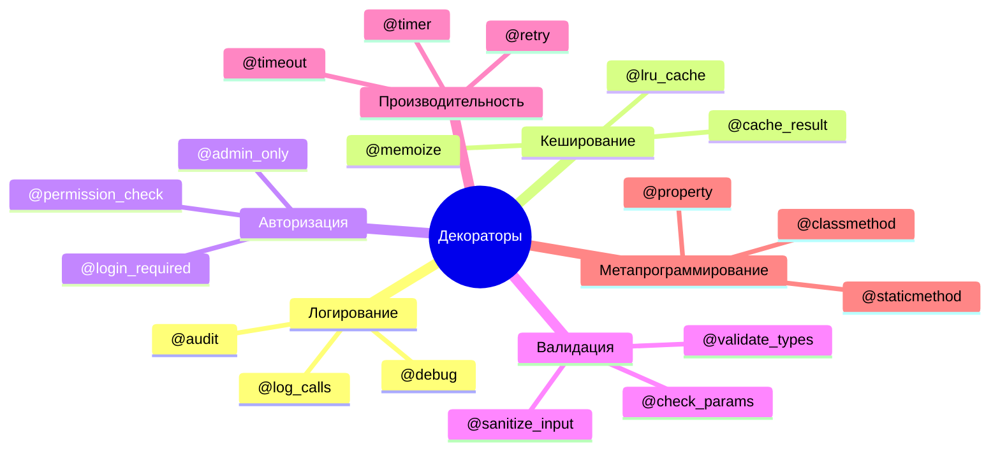

## 🔄 Цепочка вызовов функций

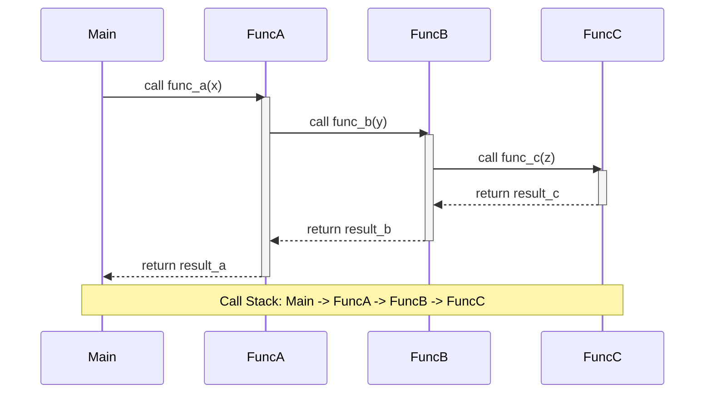

## 🧠 Стратегии оптимизации функций

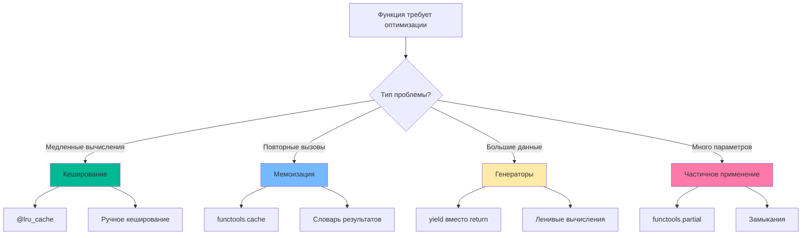

## 🎪 Функции высшего порядка

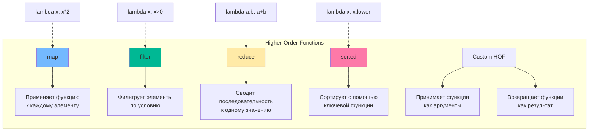

## 📈 Производительность: Функции vs Методы vs Лямбды

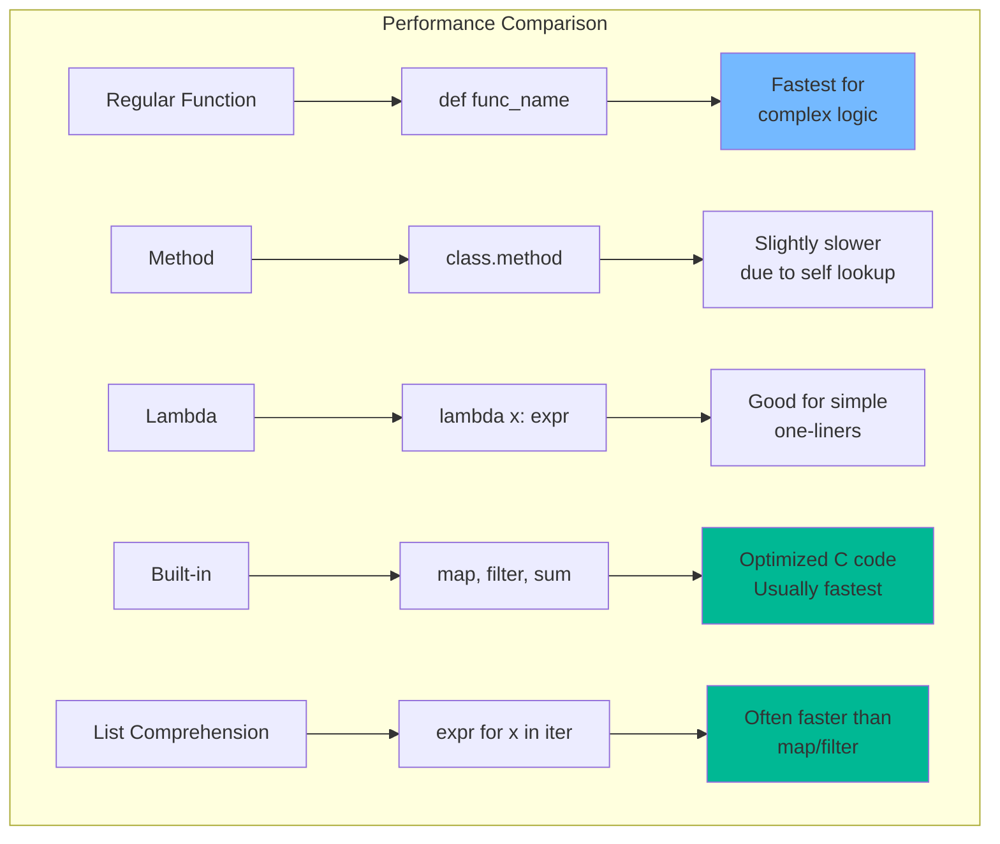

## 🔄 Паттерны использования генераторов

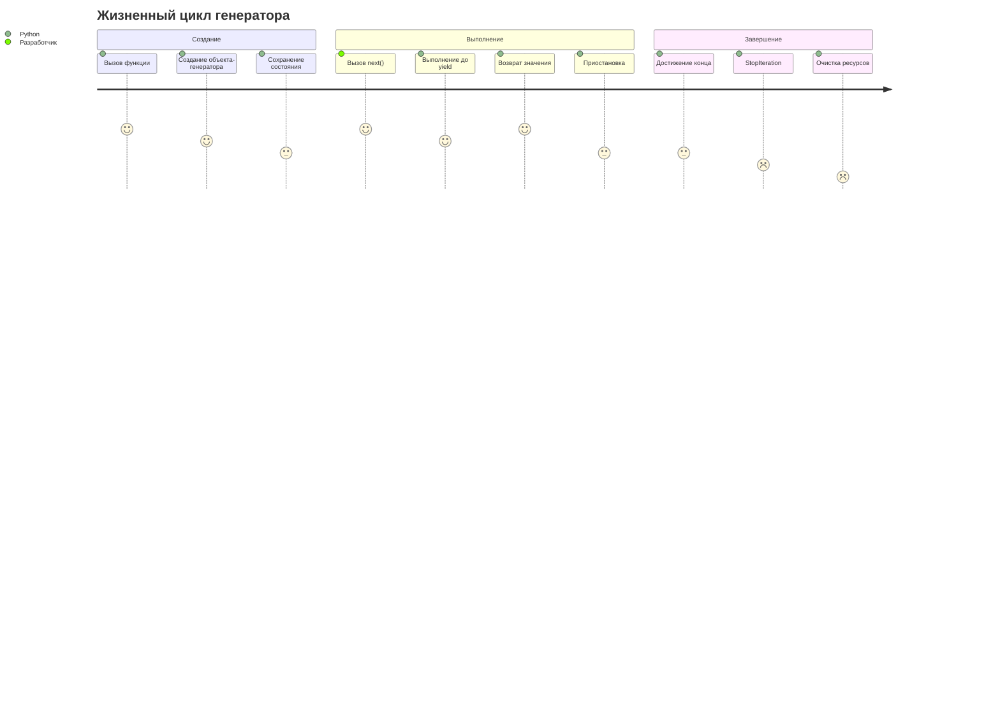

## 🎯 Архитектура функционального программирования

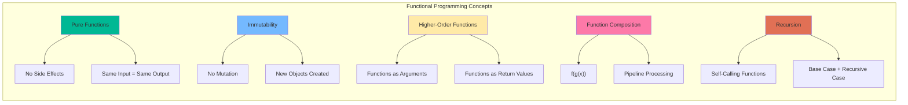

## 🛠️ Инструменты отладки функций

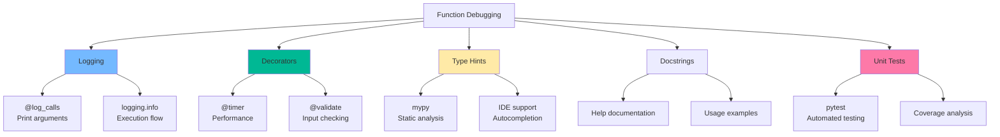
