# Диаграммы: Модули и пакеты Python

## 🏗️ Структура модуля Python

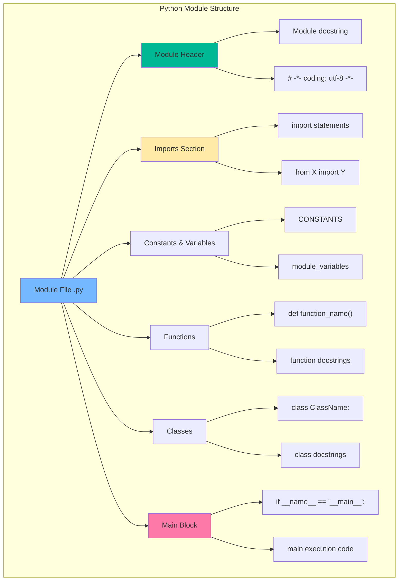

## 📦 Иерархия пакетов

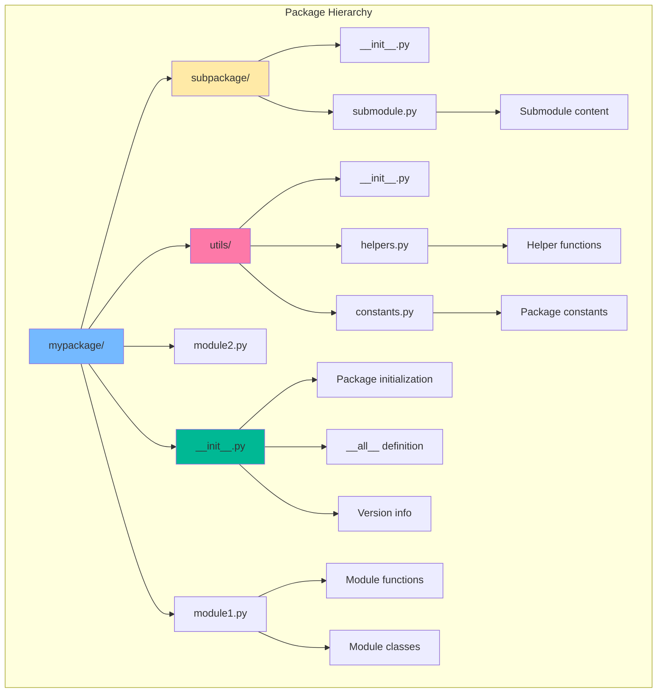

## 🔍 Механизм поиска модулей

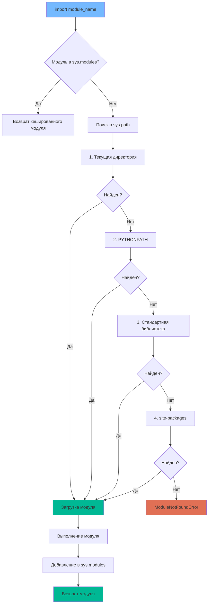

## 🌊 Жизненный цикл импорта

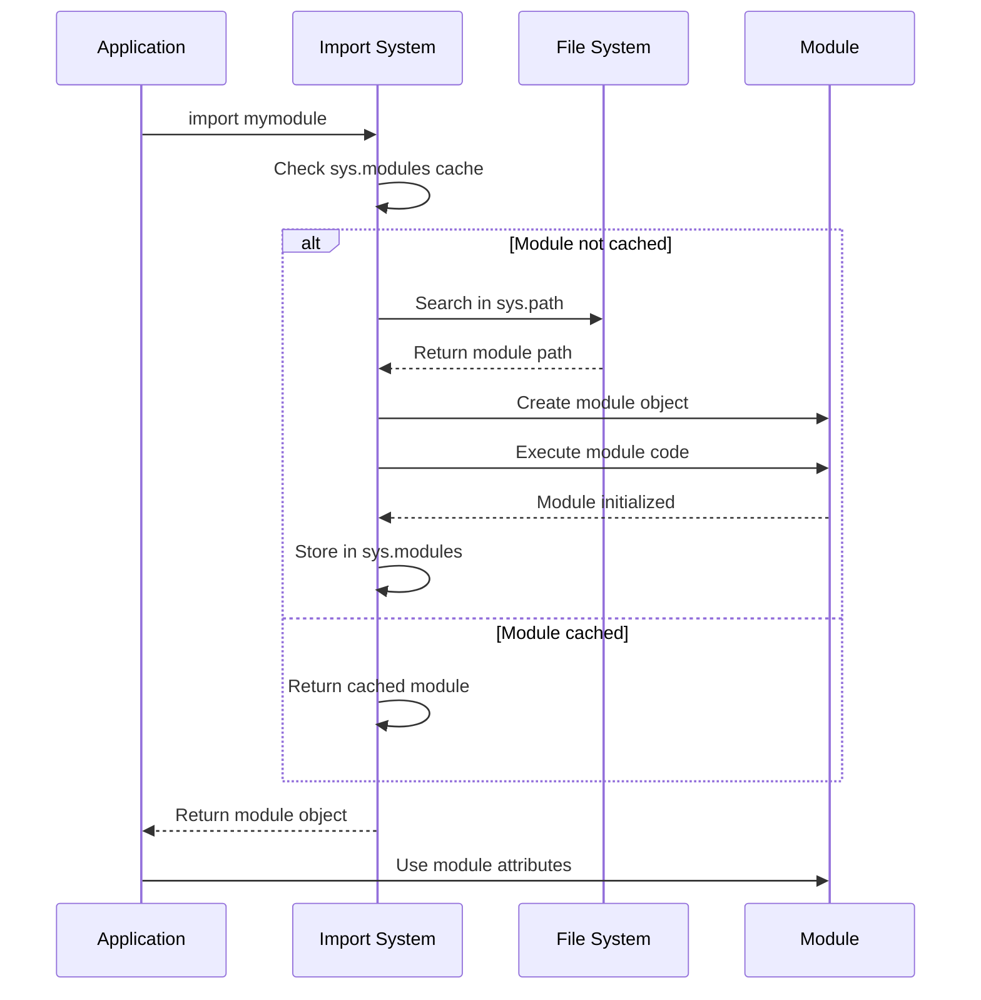

## 🎯 Типы импортов

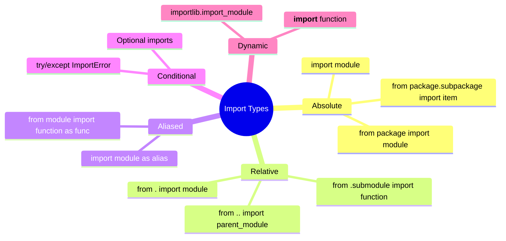

## 🏗️ Архитектура пакета

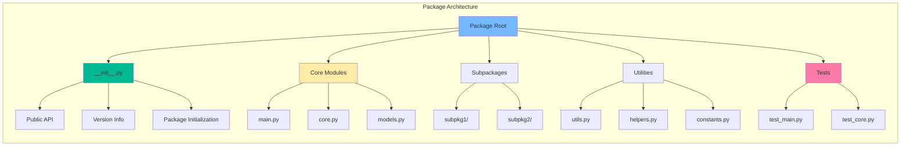

## 🔄 Процесс создания пакета

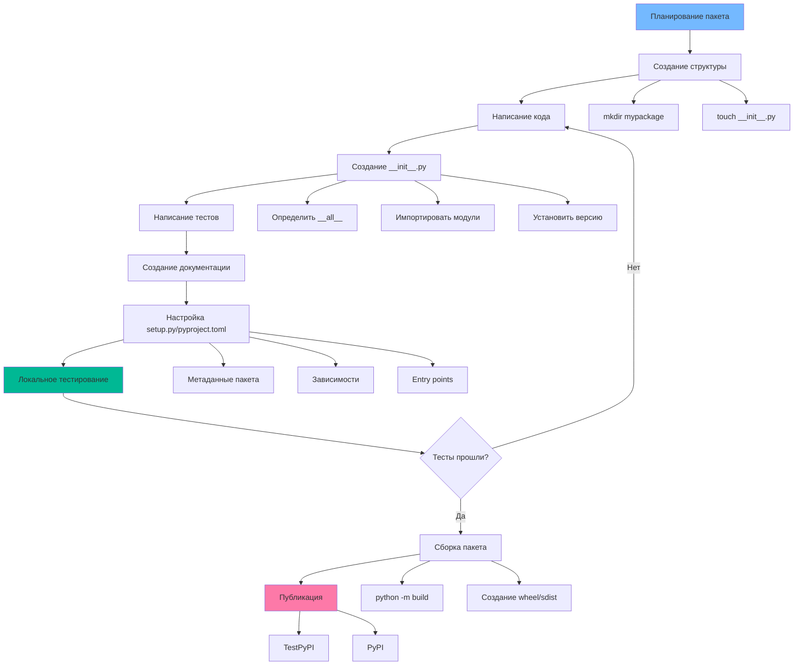

## 📊 Сравнение инструментов управления зависимостями

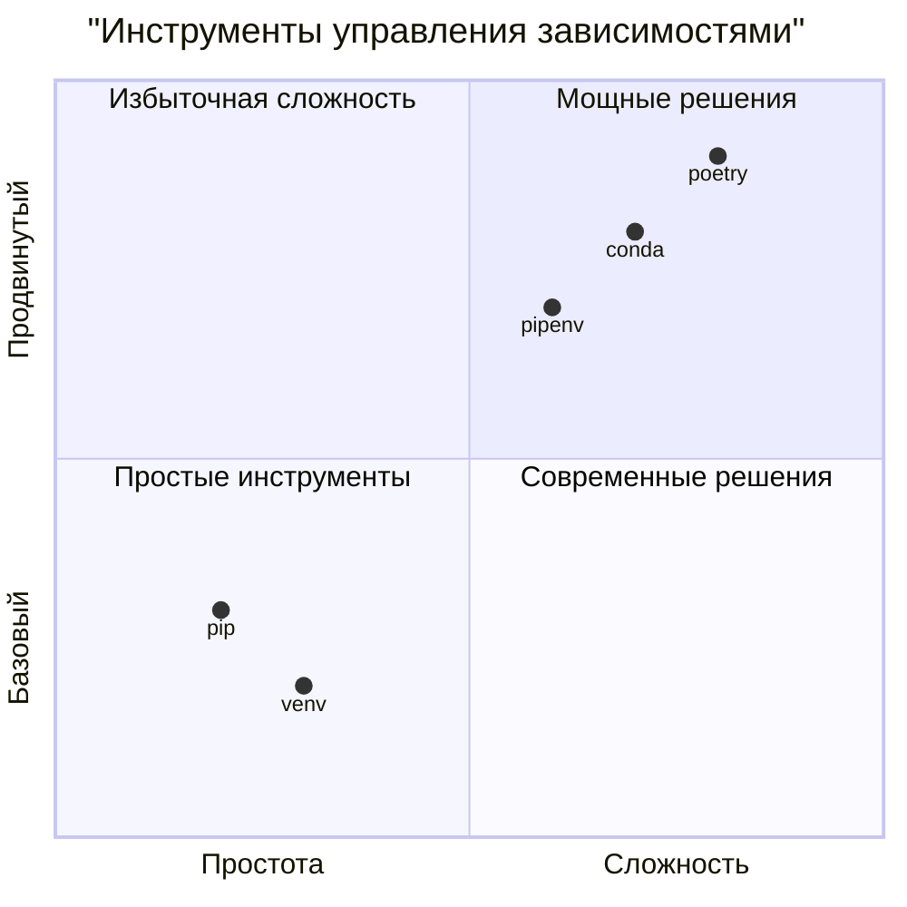

## 🎪 Виртуальные окружения

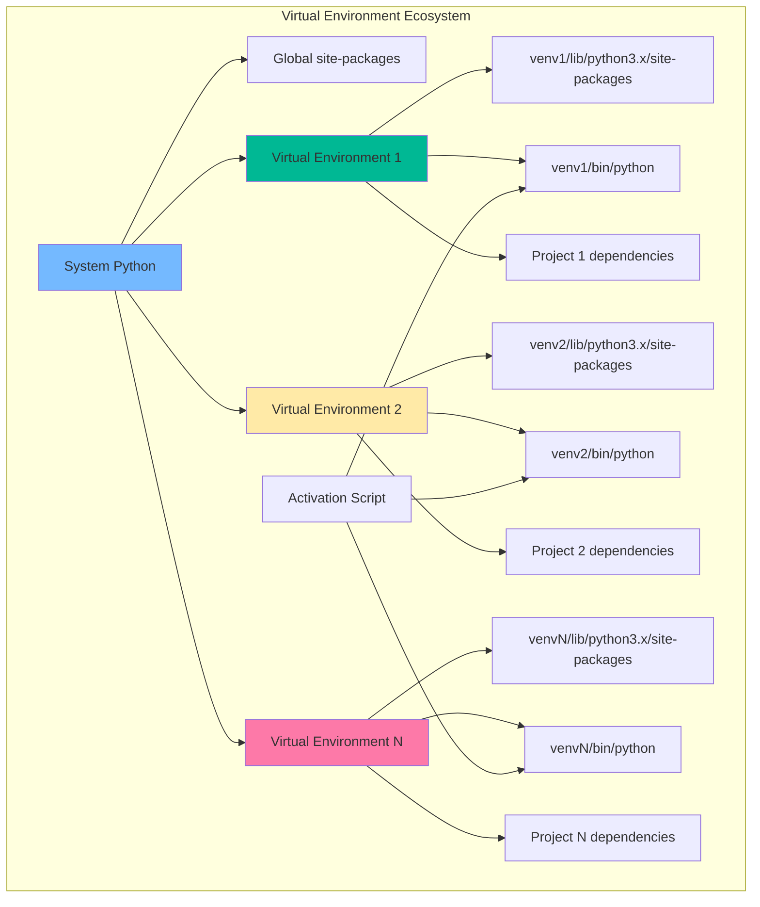

## 🔗 Зависимости пакетов

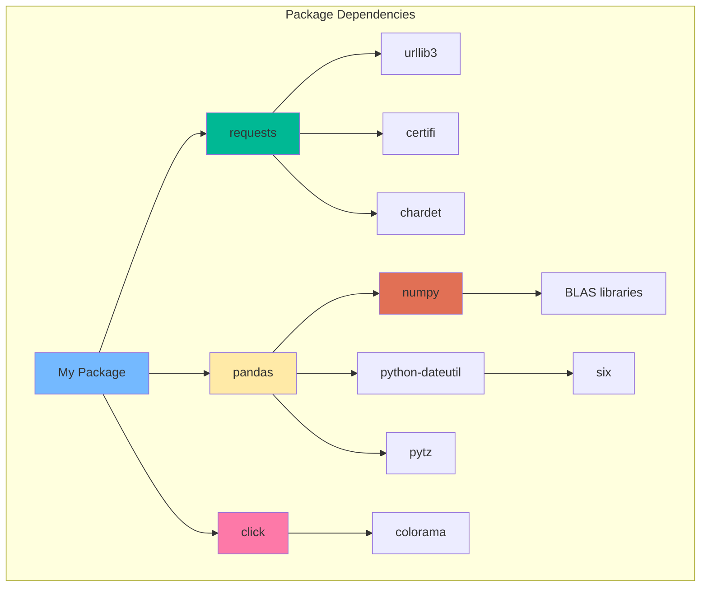

## 🏭 Фабрика модулей

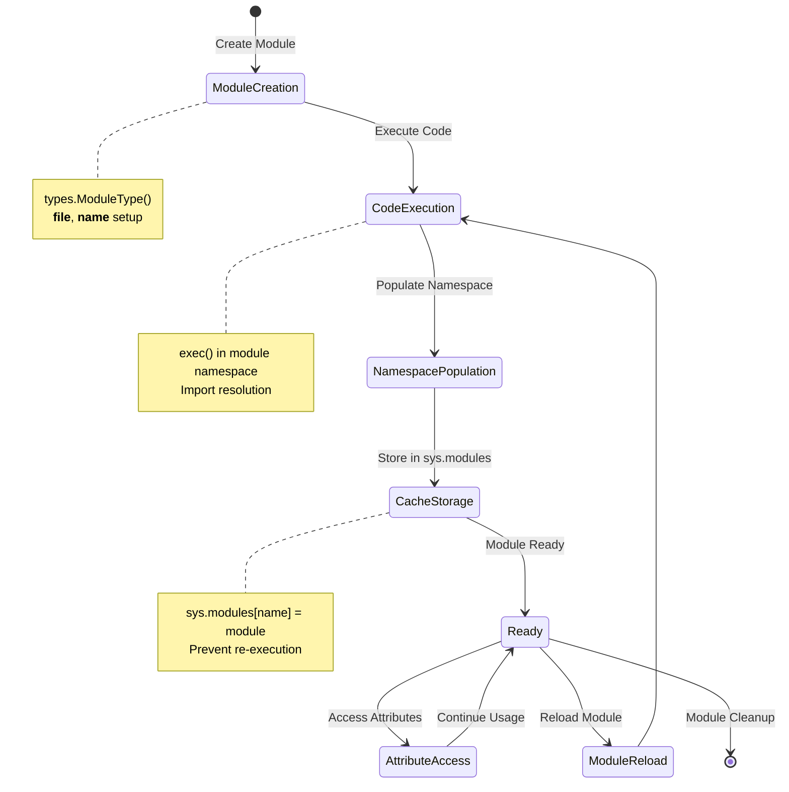

## 🎛️ Конфигурация пакета

```mermaid
graph LR
    subgraph "Package Configuration"
        A[setup.py] --> A1[Metadata]
        A --> A2[Dependencies]
        A --> A3[Entry Points]
        A --> A4[Classifiers]
        
        B[pyproject.toml] --> B1[Build System]
        B --> B2[Project Info]
        B --> B3[Tool Config]
        
        C[requirements.txt] --> C1[Production Deps]
        C --> C2[Version Specs]
        
        D[Pipfile] --> D1[Package Sources]
        D --> D2[Dev Dependencies]
        D --> D3[Scripts]
        
        E[poetry.lock] --> E1[Exact Versions]
        E --> E2[Dependency Graph]
        
        F[conda.yml] --> F1[Conda Channels]
        F --> F2[Environment Specs]
    end
    
    style A fill:#74b9ff
    style B fill:#00b894
    style C fill:#ffeaa7
    style D fill:#fd79a8
```

## 🚀 Жизненный цикл пакета

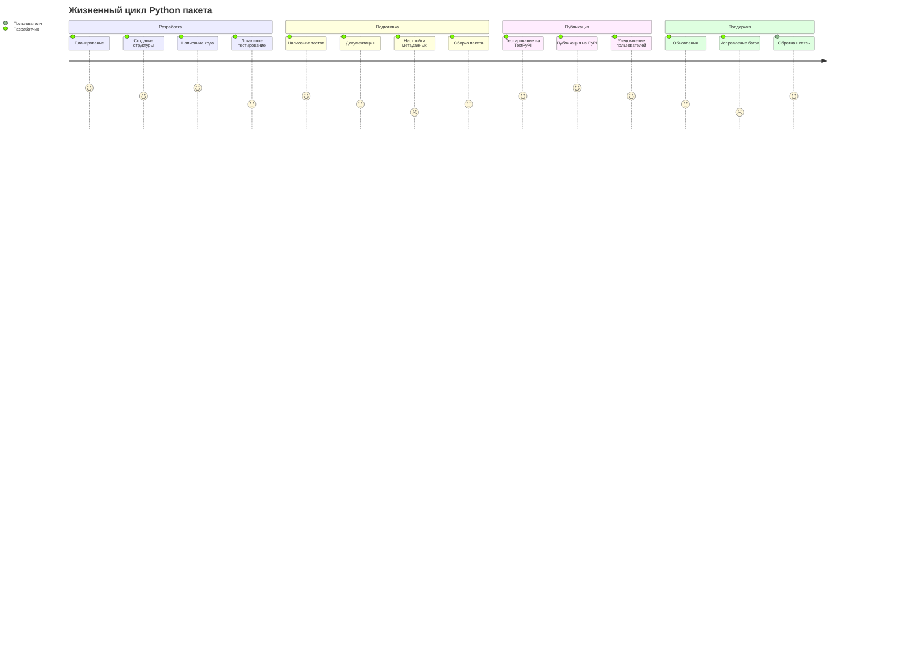

## 🔧 Инструменты сборки

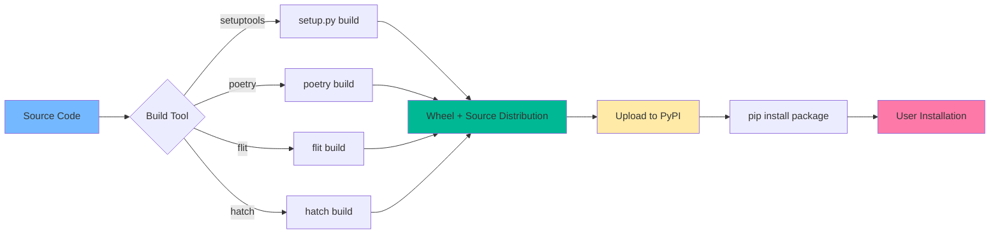

## 📈 Эволюция управления пакетами

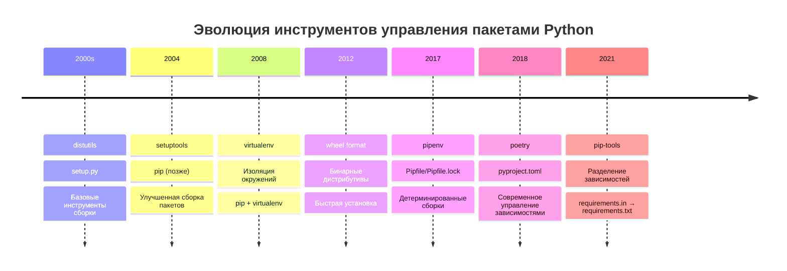

## 🎯 Лучшие практики структуры

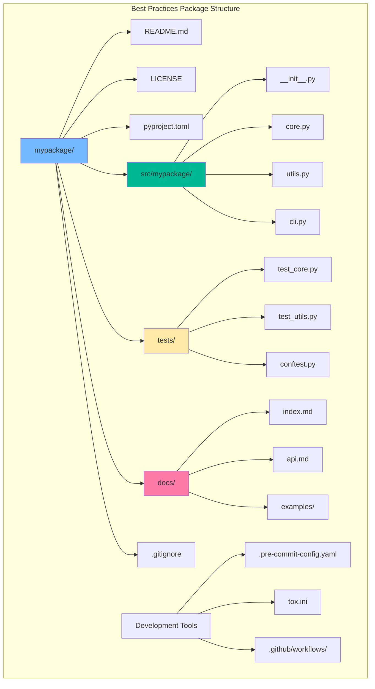