# Диаграммы: Работа с файлами Python

## 🏗️ Иерархия файловых объектов

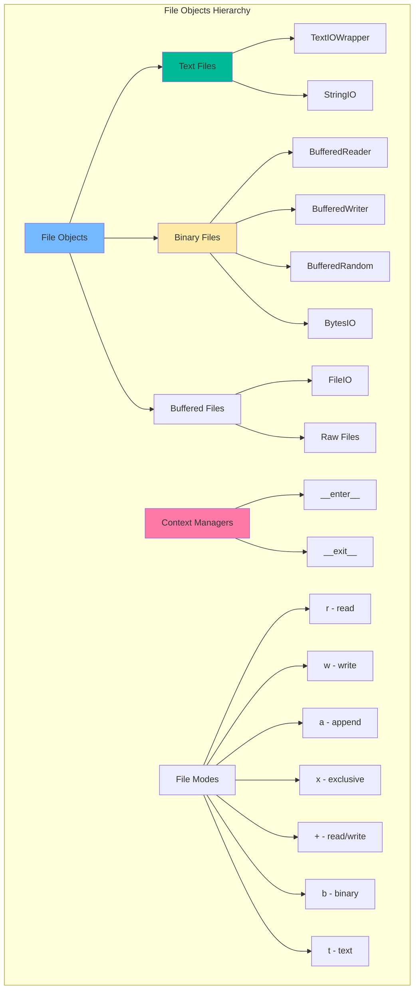

## 📖 Процесс открытия файла

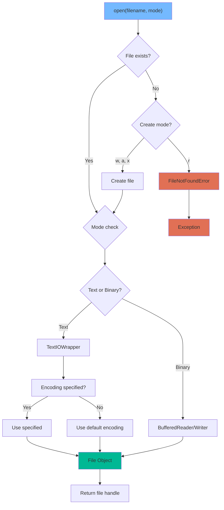

## 🔄 Жизненный цикл файла

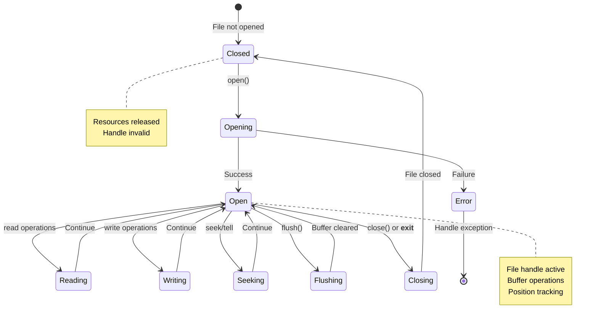

## 🎯 Режимы работы с файлами

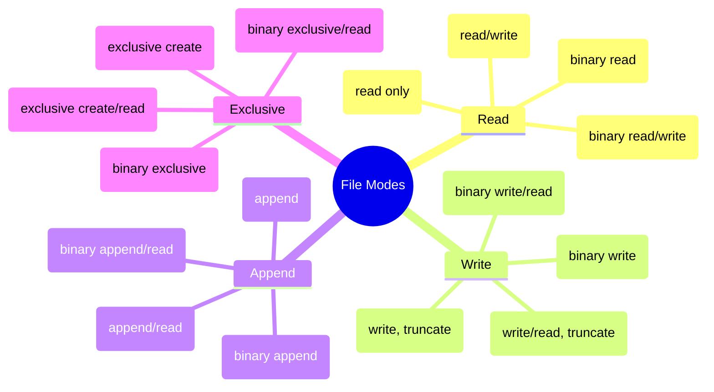

## 🌐 Обработка кодировок

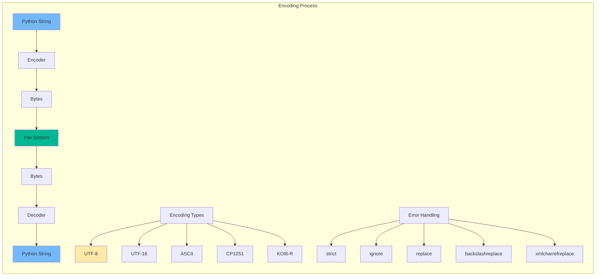

## 🗂️ Работа с путями

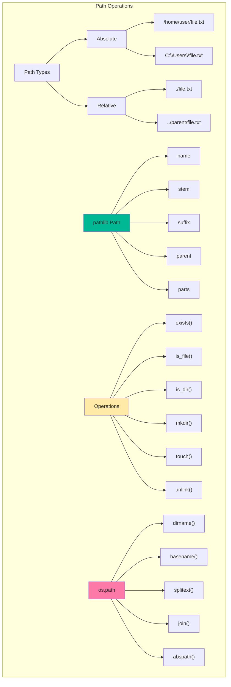

## 📊 Сравнение методов чтения

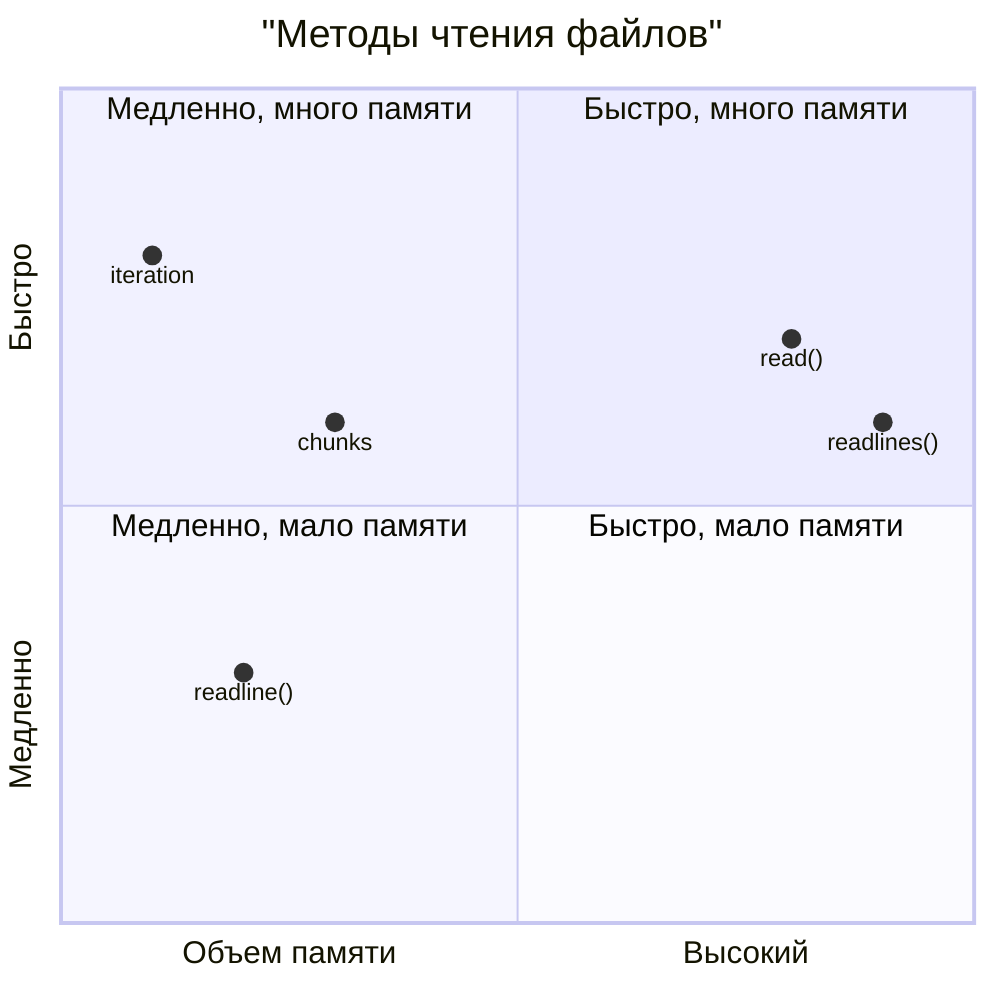

## 🔄 Контекстные менеджеры

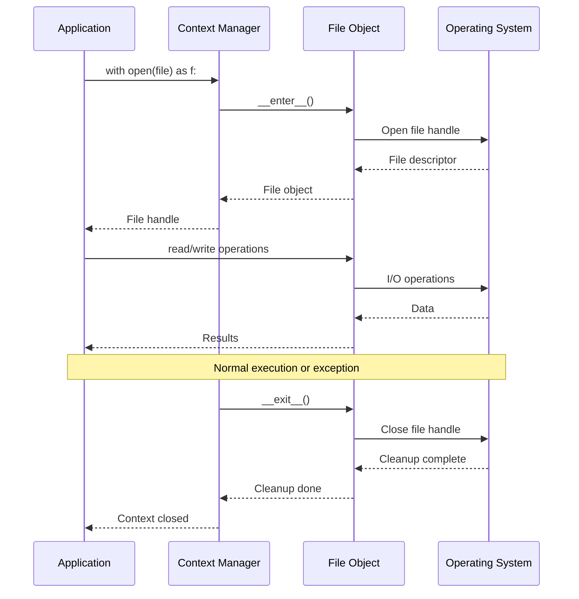

## 📂 Структура директорий

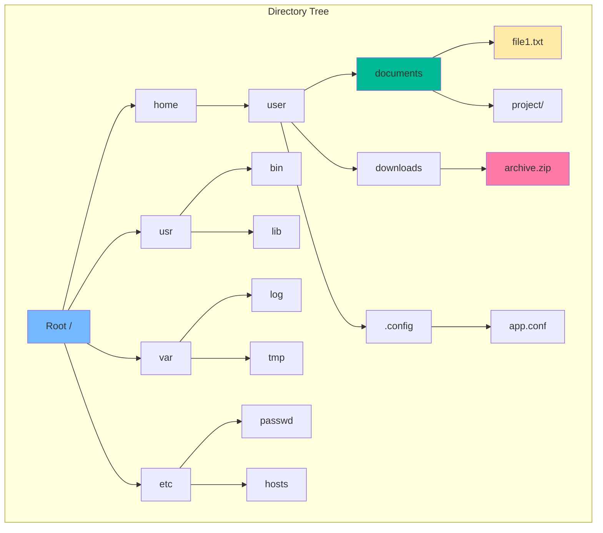

## 🔍 Поиск файлов

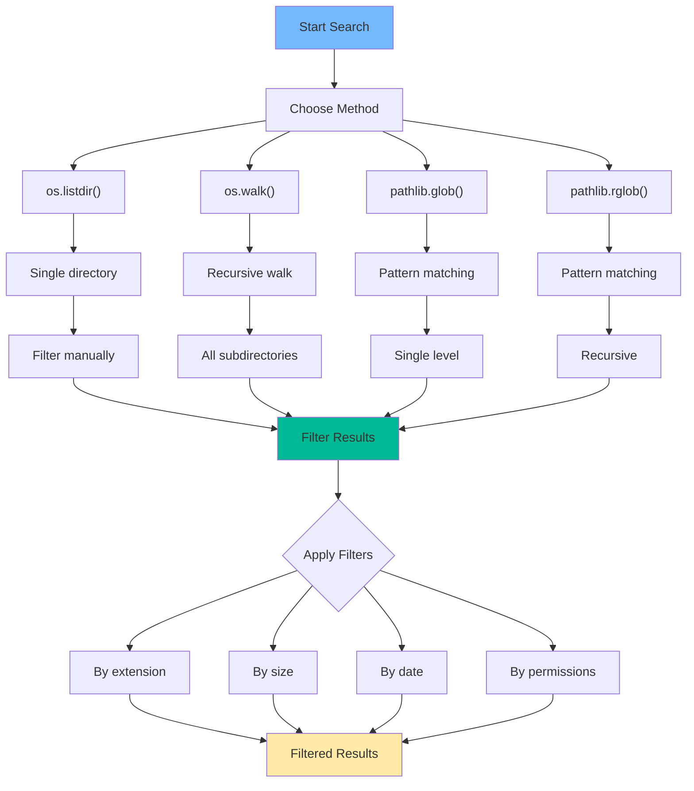

## 📄 Форматы файлов

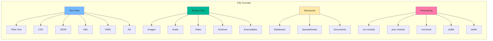

## 🗜️ Архивы и сжатие

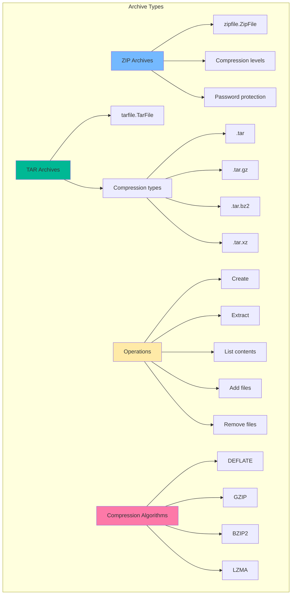

## 🔄 Временные файлы

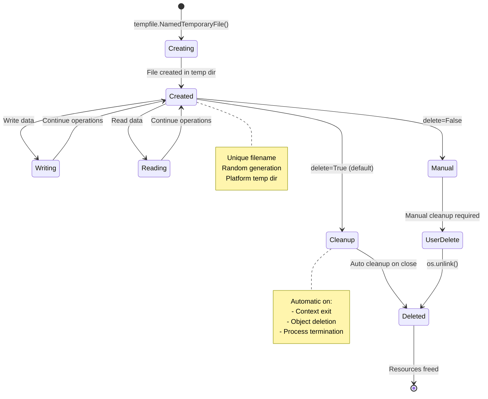

## 🎯 Стратегии чтения больших файлов

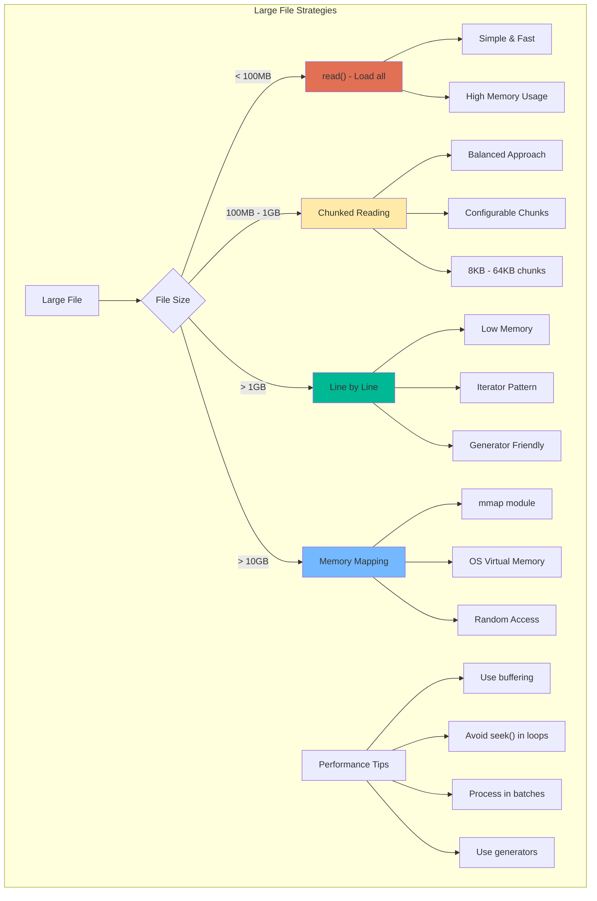

## 🔐 Безопасность файлов

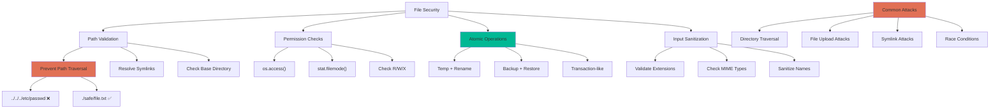

## 📊 Производительность I/O

```mermaid
graph LR
    subgraph "I/O Performance"
        A[Buffer Sizes] --> A1[No Buffer: 0]
        A --> A2[Line Buffer: 1]
        A --> A3[Custom: 8192]
        A --> A4[Default: -1]
        
        B[Read Strategies] --> B1["read()"]
        B --> B2["readline()"]
        B --> B3["readlines()"]
        B --> B4[iteration]
        
        C[Write Strategies] --> C1["write()"]
        C --> C2["writelines()"]
        C --> C3["print()"]
        C --> C4["flush()"]
        
        D[Optimization] --> D1[Batch Operations]
        D --> D2[Avoid Seek]
        D --> D3[Use Generators]
        D --> D4[Memory Mapping]
        
        E[Measurements] --> E1[timeit]
        E --> E2[cProfile]
        E --> E3[memory_profiler]
        E --> E4[psutil]
    end
    
    style A4 fill:#00b894
    style B4 fill:#00b894
    style D fill:#ffeaa7
    style E fill:#fd79a8
```

## 🔍 Мониторинг файловой системы

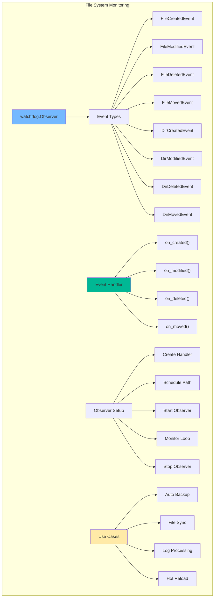

## 🎭 Паттерны работы с файлами

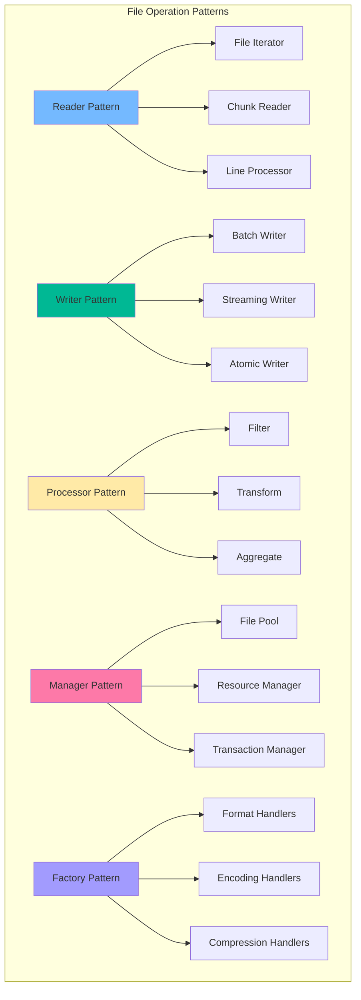

## 🔧 Лучшие практики

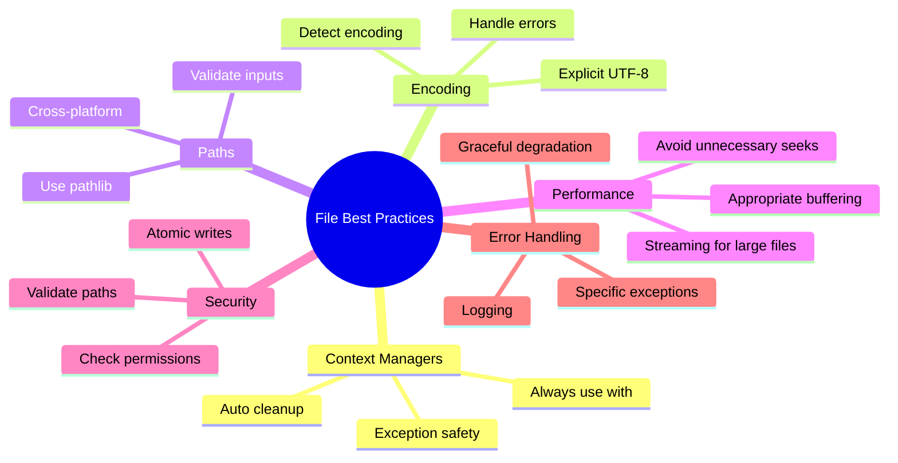