# Диаграммы: Исключения в Python

## 🏗️ Иерархия исключений Python

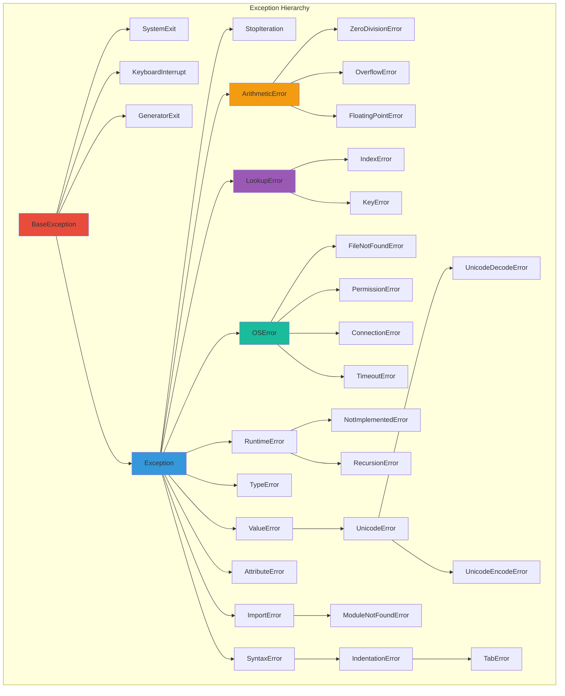

## 🔄 Жизненный цикл исключения

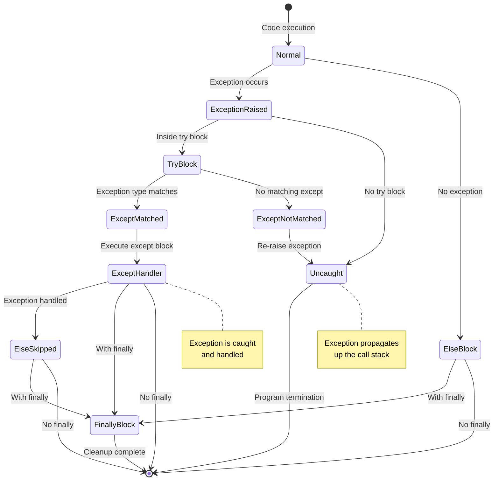

## 📊 Структура try-except блока

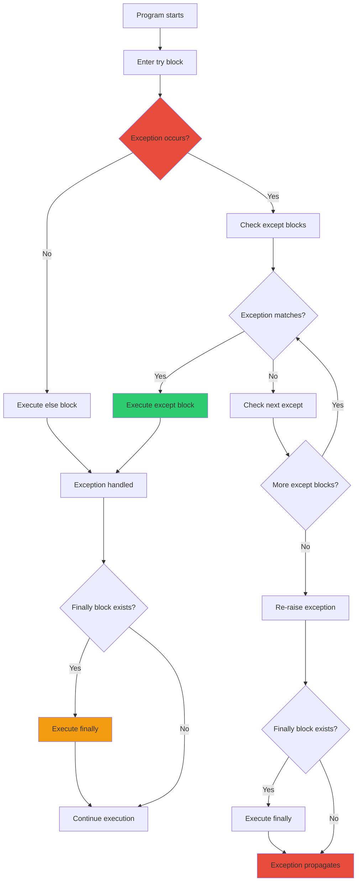

## 🎯 Обработка множественных исключений

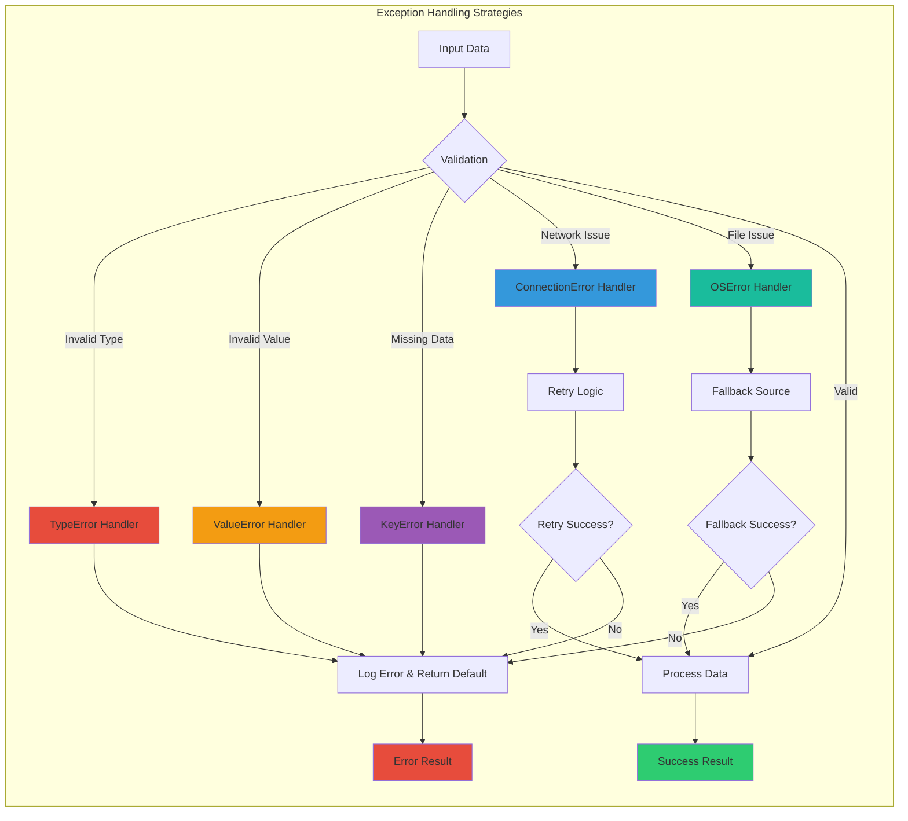

## 🔍 Трассировка стека (Stack Trace)

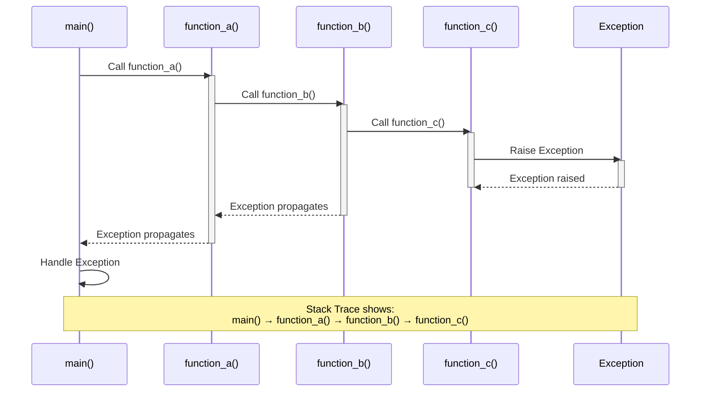

## 🛡️ Контекстные менеджеры и исключения

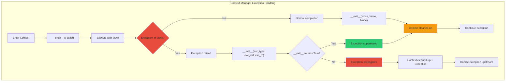

## 📈 Стратегии восстановления после ошибок

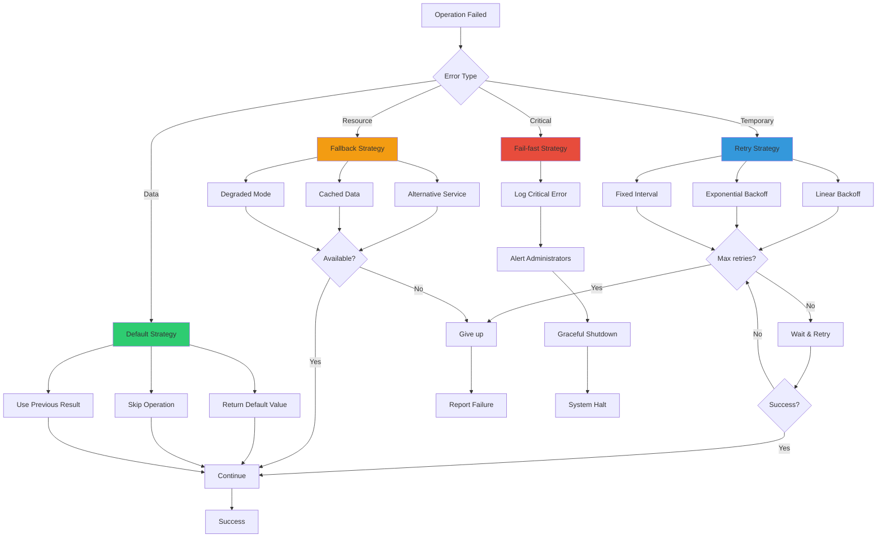

## 🔧 Создание пользовательских исключений

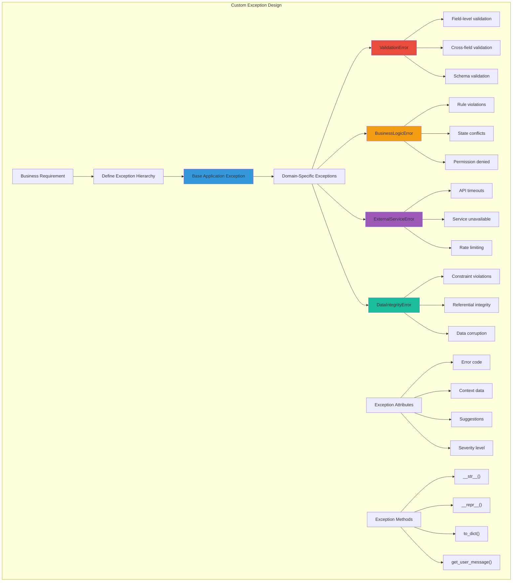

## 🎬 Декораторы для обработки исключений

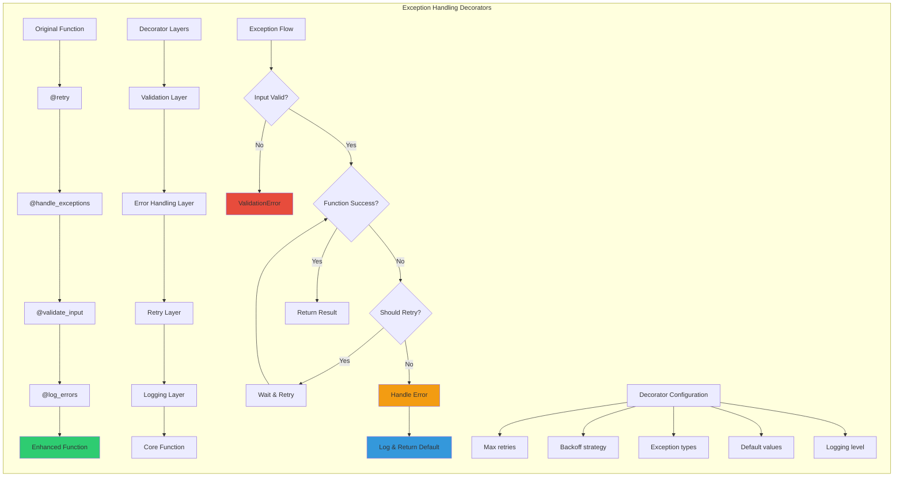

## 🌐 Асинхронная обработка исключений

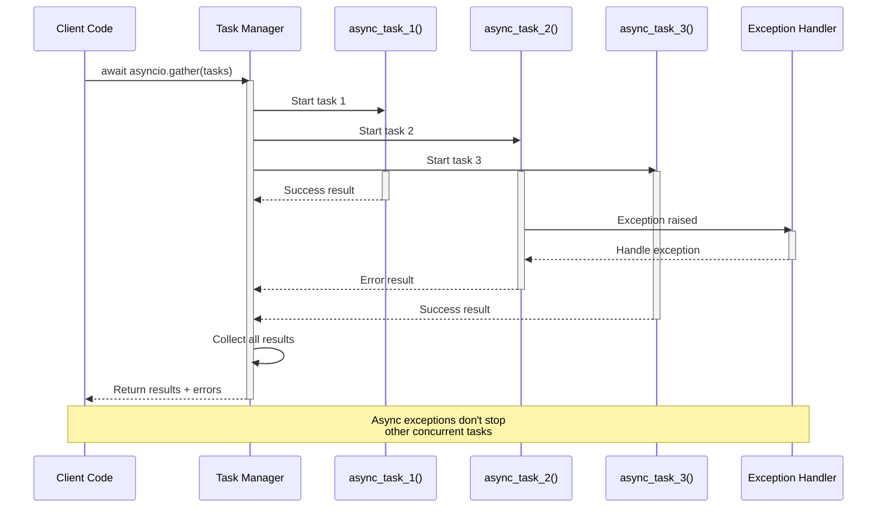

## 📊 Метрики и мониторинг исключений

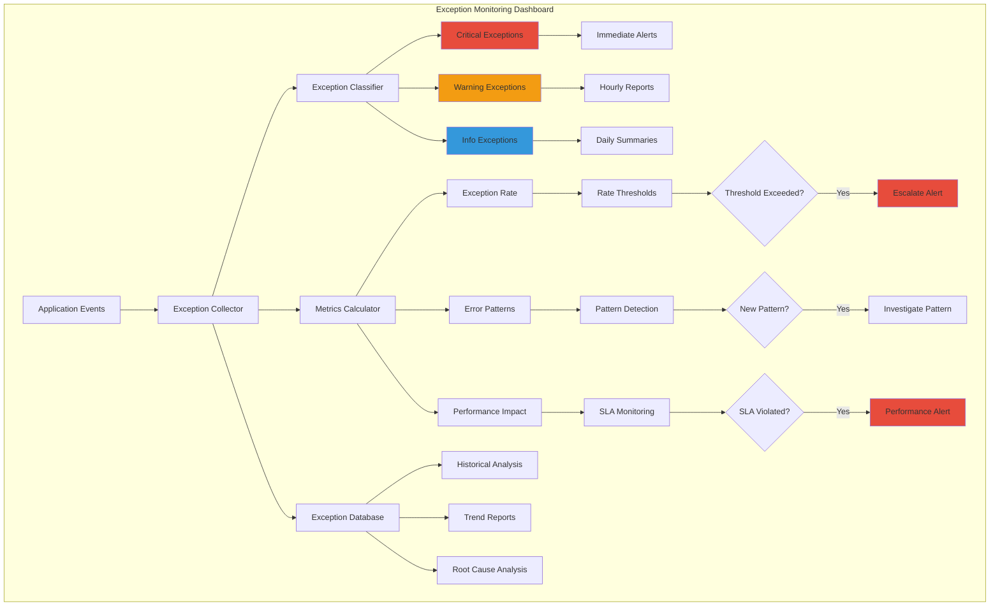

## 🔄 Паттерны обработки ошибок

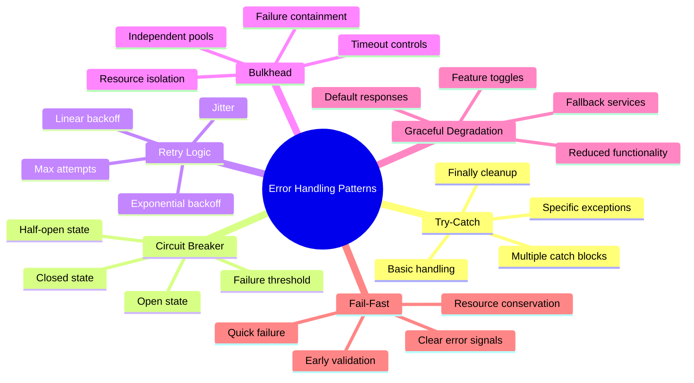

## 📋 Чек-лист обработки исключений

```mermaid
flowchart TD
    A[Exception Handling Checklist] --> B[Design Phase]
    A --> C[Implementation Phase]
    A --> D[Testing Phase]
    A --> E[Monitoring Phase]
    
    B --> B1[✓ Define exception hierarchy]
    B --> B2[✓ Identify failure modes]
    B --> B3[✓ Plan recovery strategies]
    B --> B4[✓ Design error contracts]
    
    C --> C1[✓ Use specific exceptions]
    C --> C2[✓ Provide context]
    C --> C3[✓ Clean up resources]
    C --> C4[✓ Log appropriately]
    C --> C5[✓ Avoid bare except]
    
    D --> D1[✓ Test happy path]
    D --> D2[✓ Test error paths]
    D --> D3[✓ Test edge cases]
    D --> D4[✓ Test recovery]
    D --> D5[✓ Test timeouts]
    
    E --> E1[✓ Monitor error rates]
    E --> E2[✓ Track patterns]
    E --> E3[✓ Set up alerts]
    E --> E4[✓ Analyze trends]
    E --> E5[✓ Review regularly]
    
    style B1 fill:#2ecc71
    style C1 fill:#2ecc71
    style D1 fill:#2ecc71
    style E1 fill:#2ecc71
```

## 🎯 Исключения в различных архитектурных слоях

```mermaid
graph TD
    subgraph "Layered Exception Handling"
        A[Presentation Layer] --> A1[UI Exceptions]
        A1 --> A11[Validation errors]
        A1 --> A12[Display errors]
        A1 --> A13[User input errors]
        
        B[Business Logic Layer] --> B1[Domain Exceptions]
        B1 --> B11[Business rule violations]
        B1 --> B12[State transition errors]
        B1 --> B13[Authorization errors]
        
        C[Service Layer] --> C1[Service Exceptions]
        C1 --> C11[External API errors]
        C1 --> C12[Integration failures]
        C1 --> C13[Timeout errors]
        
        D[Data Layer] --> D1[Data Exceptions]
        D1 --> D11[Connection errors]
        D1 --> D12[Query failures]
        D1 --> D13[Constraint violations]
        
        E[Infrastructure Layer] --> E1[System Exceptions]
        E1 --> E11[Network errors]
        E1 --> E12[File system errors]
        E1 --> E13[Resource exhaustion]
        
        F[Exception Translation] --> F1[Layer boundaries]
        F1 --> F11[Wrap low-level exceptions]
        F1 --> F12[Add business context]
        F1 --> F13[Preserve stack trace]
    end
    
    style A fill:#e74c3c
    style B fill:#f39c12
    style C fill:#9b59b6
    style D fill:#3498db
    style E fill:#1abc9c
    style F fill:#34495e
```

## 🔬 Отладка исключений

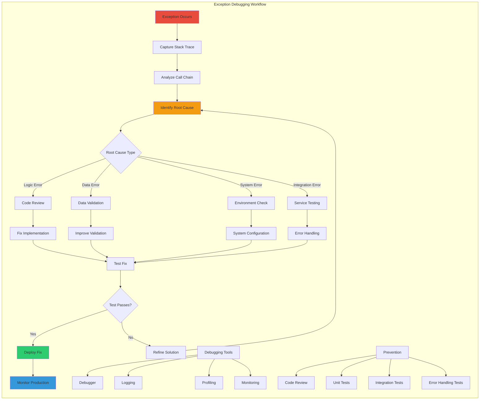