# Диаграммы: Модули и пакеты в Python

## 📦 Структура модулей и пакетов

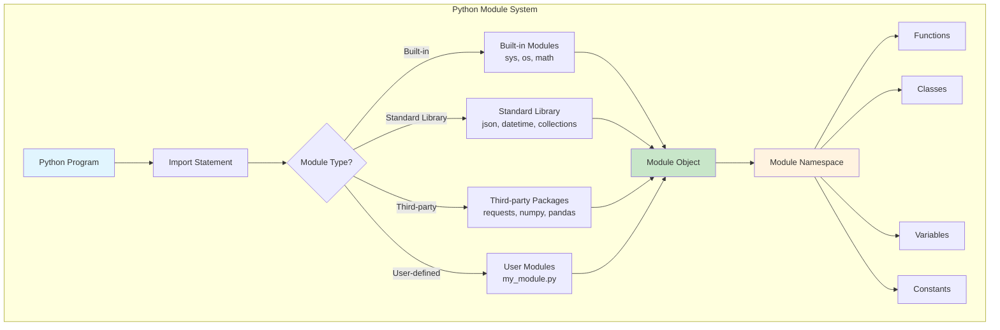

## 🔍 Процесс поиска и загрузки модулей

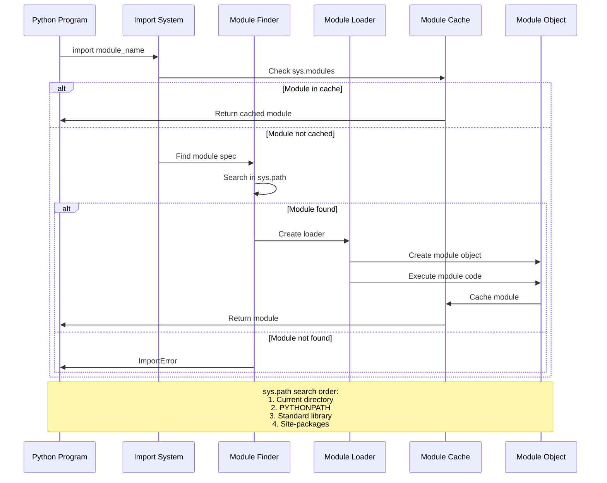

## 📁 Структура пакета

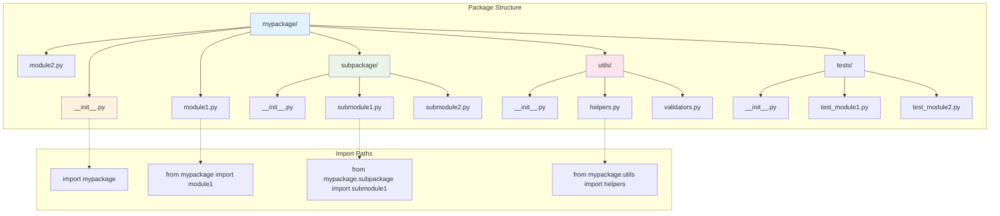

## 🔄 Типы импортов

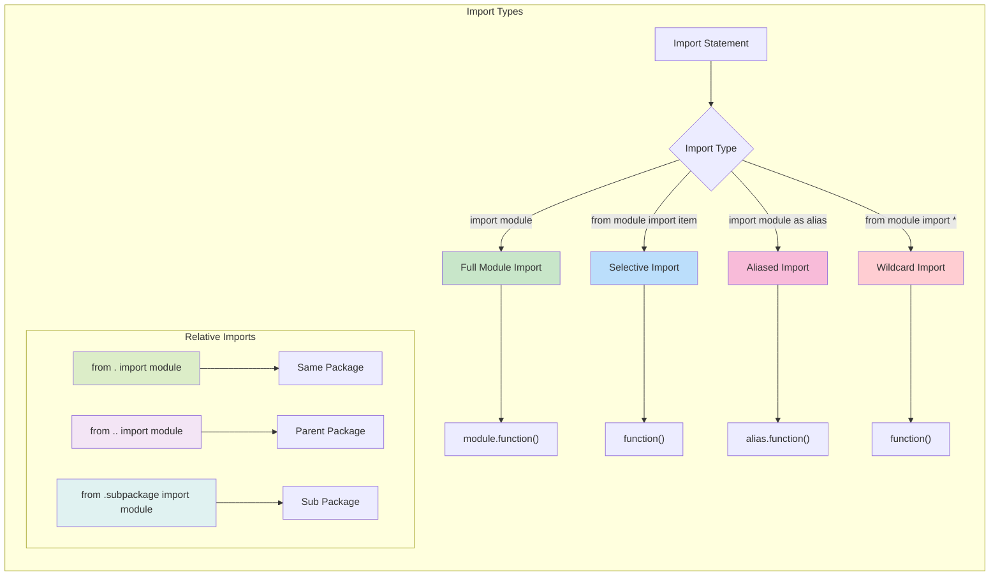

## 🚀 Динамический импорт

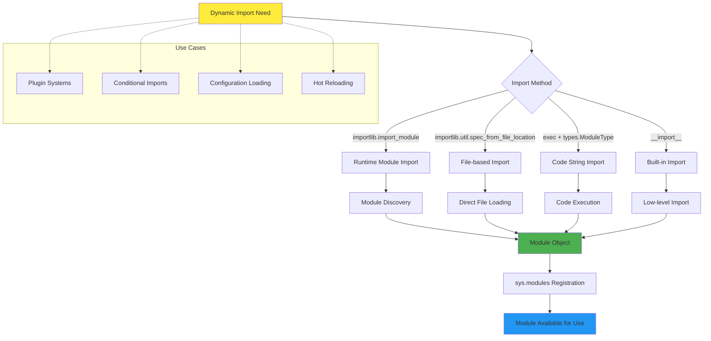

## 🎯 Система путей поиска (sys.path)

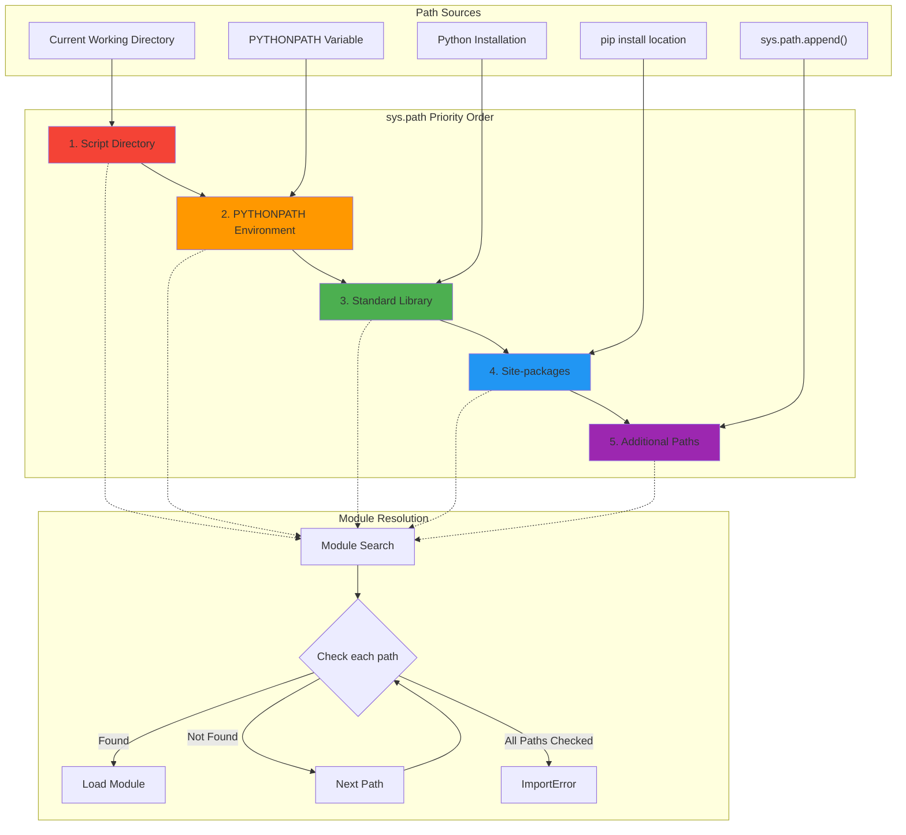

## 🔧 Атрибуты модулей

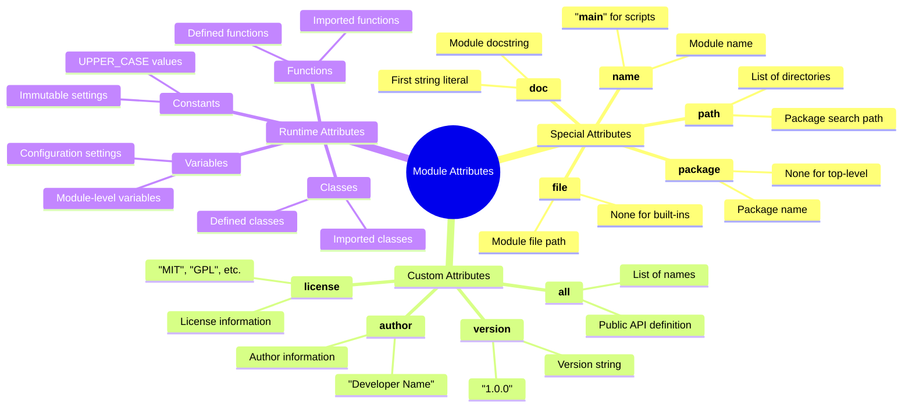

## 📋 Жизненный цикл модуля

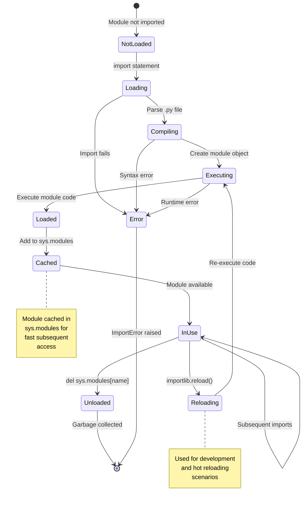

## 🏗️ Структура проекта

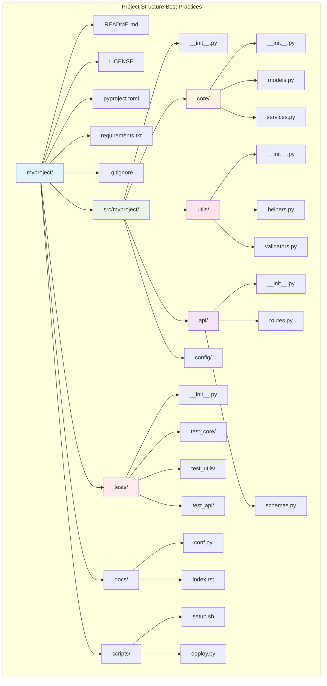

## 🔄 Система плагинов

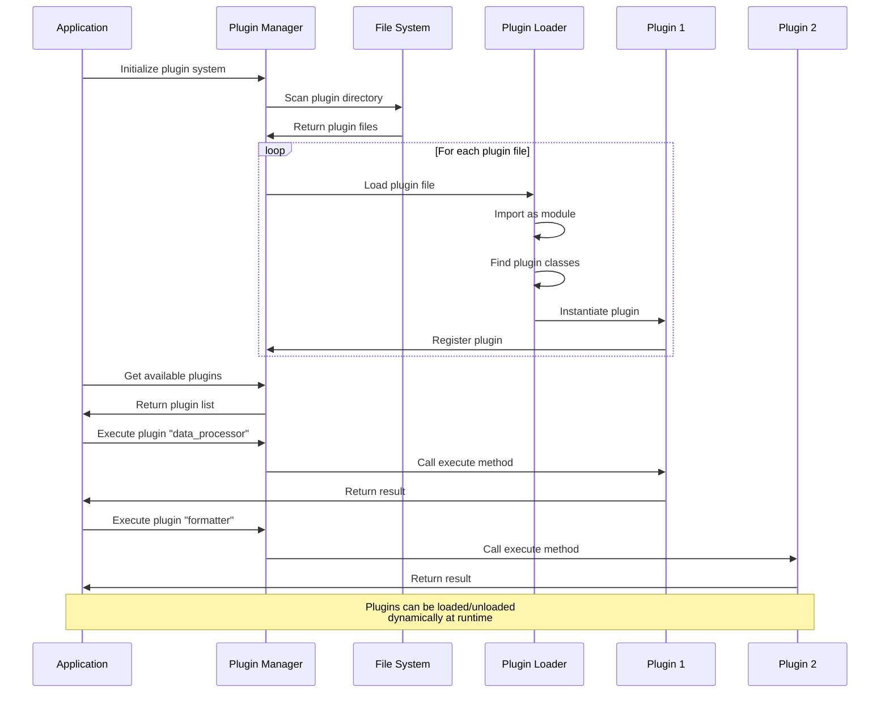

## 📦 Управление зависимостями

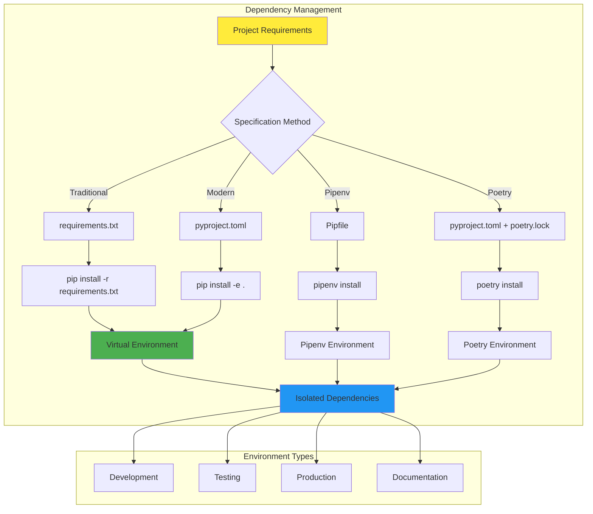

## 🔍 Импорт по условию

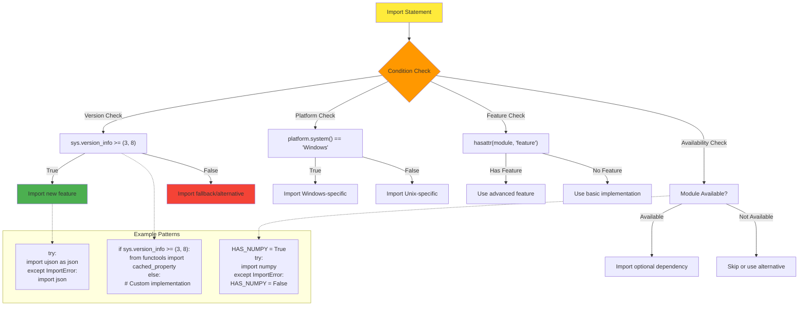

## 🎨 Namespace пакеты

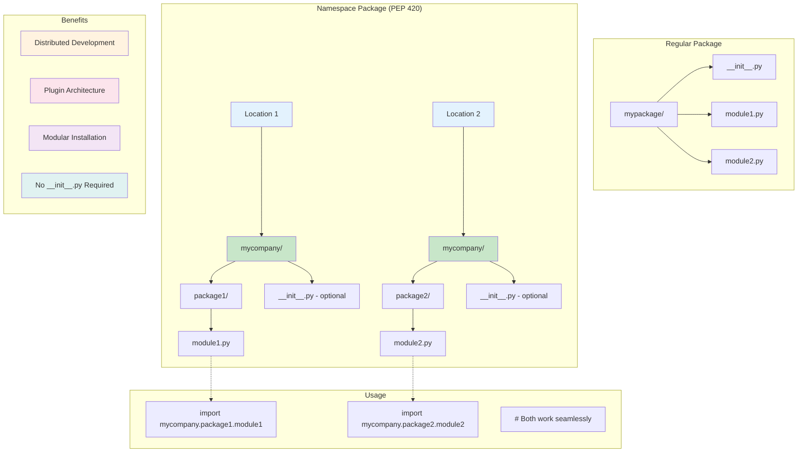

## 📊 Производительность импортов

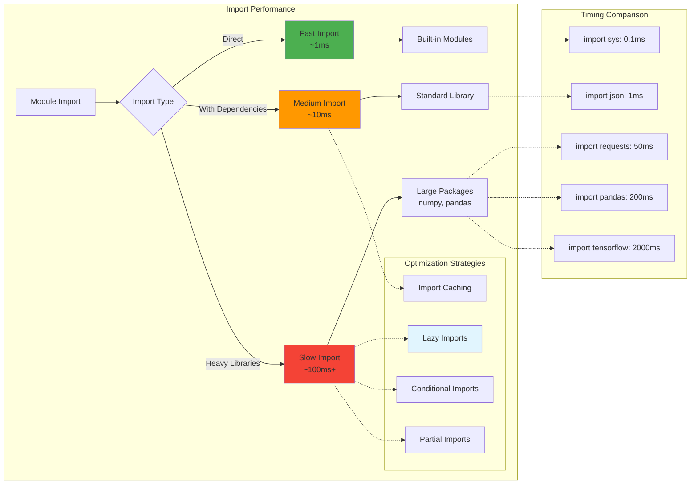

## 🔄 Циклические импорты

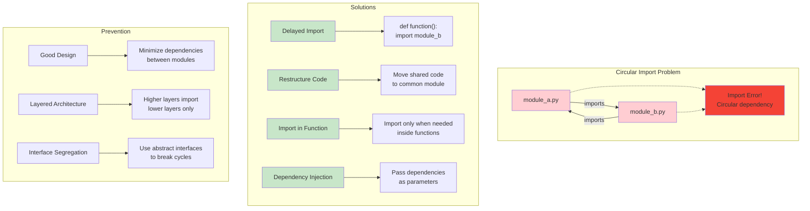

## 📚 Эволюция системы модулей

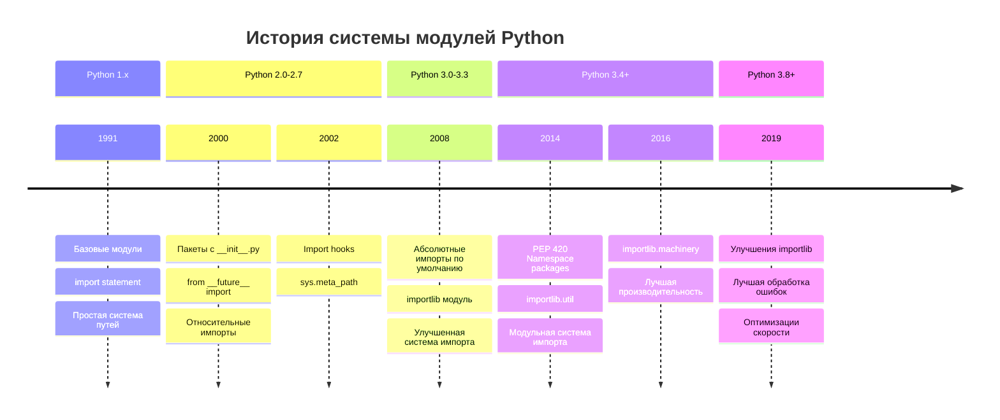

## 🎯 Лучшие практики импортов

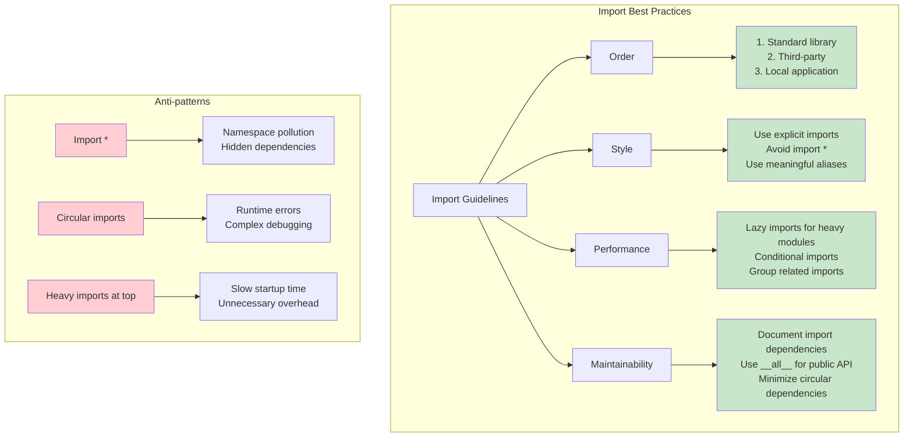