# Диаграммы: Работа с файлами в Python

## 📁 Жизненный цикл файла

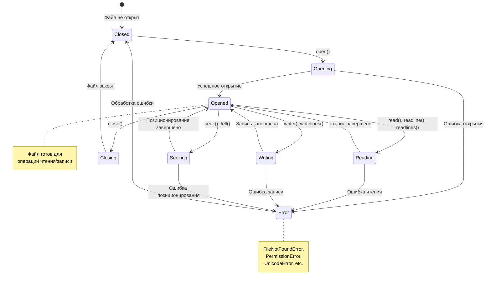
```mermaid
stateDiagram-v2
    [*] --> Closed: Файл не открыт
    
    Closed --> Opening: open()
    Opening --> Opened: Успешное открытие
    Opening --> Error: Ошибка открытия
    
    Opened --> Reading: read(), readline(), readlines()
    Opened --> Writing: write(), writelines()
    Opened --> Seeking: seek(), tell()
    
    Reading --> Opened: Чтение завершено
    Writing --> Opened: Запись завершена
    Seeking --> Opened: Позиционирование завершено
    
    Reading --> Error: Ошибка чтения
    Writing --> Error: Ошибка записи
    Seeking --> Error: Ошибка позиционирования
    
    Opened --> Closing: close()
    Closing --> Closed: Файл закрыт
    
    Error --> Closed: Обработка ошибки
    
    note right of Opened
        Файл готов для
        операций чтения/записи
    end note
    
    note right of Error
        FileNotFoundError,
        PermissionError,
        UnicodeError, etc.
    end note
```

## 🔧 Режимы открытия файлов

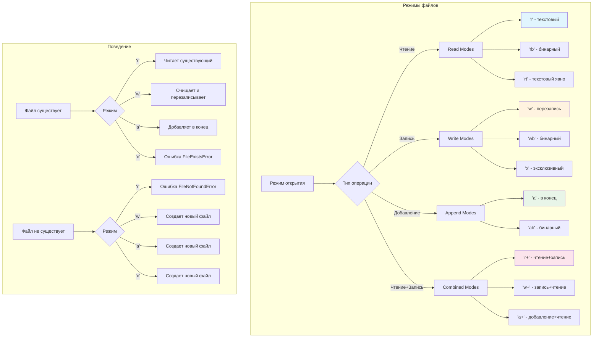
```mermaid
graph TD
    subgraph "Режимы файлов"
        A[Режим открытия] --> B{Тип операции}
        
        B -->|Чтение| C[Read Modes]
        B -->|Запись| D[Write Modes]
        B -->|Добавление| E[Append Modes]
        B -->|Чтение+Запись| F[Combined Modes]
        
        C --> C1['r' - текстовый]
        C --> C2['rb' - бинарный]
        C --> C3['rt' - текстовый явно]
        
        D --> D1['w' - перезапись]
        D --> D2['wb' - бинарный]
        D --> D3['x' - эксклюзивный]
        
        E --> E1['a' - в конец]
        E --> E2['ab' - бинарный]
        
        F --> F1['r+' - чтение+запись]
        F --> F2['w+' - запись+чтение]
        F --> F3['a+' - добавление+чтение]
    end
    
    subgraph "Поведение"
        G[Файл существует] --> H{Режим}
        H -->|'r'| I[Читает существующий]
        H -->|'w'| J[Очищает и перезаписывает]
        H -->|'a'| K[Добавляет в конец]
        H -->|'x'| L[Ошибка FileExistsError]
        
        M[Файл не существует] --> N{Режим}
        N -->|'r'| O[Ошибка FileNotFoundError]
        N -->|'w'| P[Создает новый файл]
        N -->|'a'| Q[Создает новый файл]
        N -->|'x'| R[Создает новый файл]
    end
    
    style C1 fill:#e1f5fe
    style D1 fill:#fff3e0
    style E1 fill:#e8f5e8
    style F1 fill:#fce4ec
```

## 📖 Методы чтения файлов

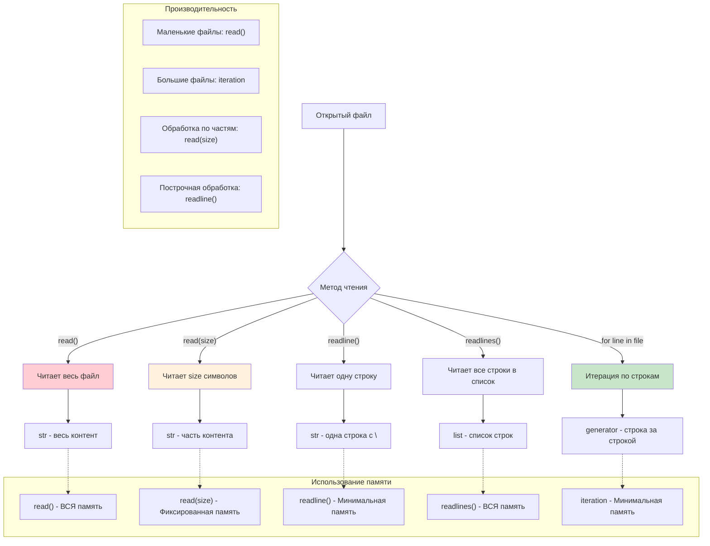
```mermaid
flowchart TD
    A[Открытый файл] --> B{Метод чтения}
    
    B -->|"read()"| C[Читает весь файл]
    B -->|"read(size)"| D[Читает size символов]
    B -->|"readline()"| E[Читает одну строку]
    B -->|"readlines()"| F[Читает все строки в список]
    B -->|"for line in file"| G[Итерация по строкам]
    
    C --> H[str - весь контент]
    D --> I[str - часть контента]
    E --> J[str - одна строка с \\n]
    F --> K[list - список строк]
    G --> L[generator - строка за строкой]
    
    subgraph "Использование памяти"
        M["read() - ВСЯ память"]
        N["read(size) - Фиксированная память"]
        O["readline() - Минимальная память"]
        P["readlines() - ВСЯ память"]
        Q[iteration - Минимальная память]
    end
    
    subgraph "Производительность"
        R["Маленькие файлы: read()"]
        S[Большие файлы: iteration]
        T["Обработка по частям: read(size)"]
        U["Построчная обработка: readline()"]
    end
    
    H -.-> M
    I -.-> N
    J -.-> O
    K -.-> P
    L -.-> Q
    
    style C fill:#ffcdd2
    style G fill:#c8e6c9
    style D fill:#fff3e0
```

## ✍️ Методы записи файлов

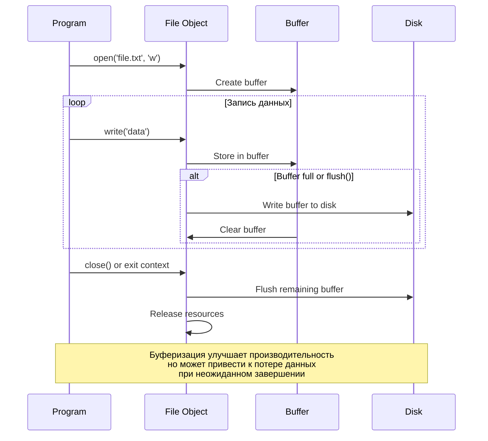
```mermaid
sequenceDiagram
    participant P as Program
    participant F as File Object
    participant B as Buffer
    participant D as Disk
    
    P->>F: open('file.txt', 'w')
    F->>B: Create buffer
    
    loop Запись данных
        P->>F: write('data')
        F->>B: Store in buffer
        
        alt Buffer full or flush()
            F->>D: Write buffer to disk
            B->>F: Clear buffer
        end
    end
    
    P->>F: close() or exit context
    F->>D: Flush remaining buffer
    F->>F: Release resources
    
    Note over P,D: Буферизация улучшает производительность<br/>но может привести к потере данных<br/>при неожиданном завершении
```

## 🔒 Контекстные менеджеры

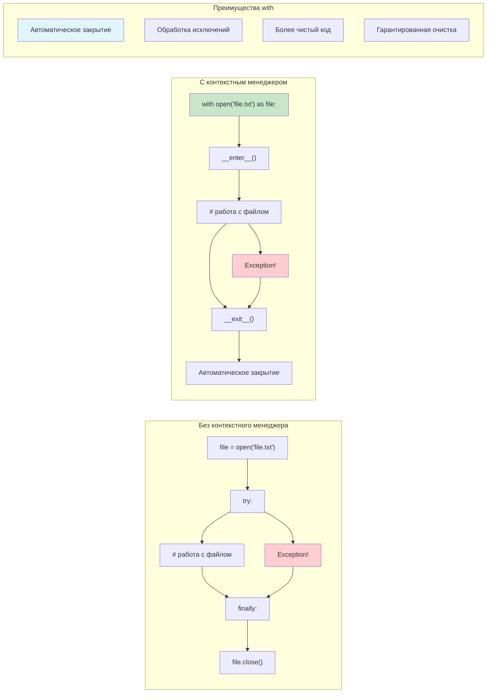
```mermaid
graph LR
    subgraph "Без контекстного менеджера"
        A1["file = open('file.txt')"] --> A2[try:]
        A2 --> A3[# работа с файлом]
        A3 --> A4[finally:]
        A4 --> A5["file.close()"]
        
        A2 --> A6[Exception!]
        A6 --> A4
    end
    
    subgraph "С контекстным менеджером"
        B1["with open('file.txt') as file:"] --> B2["__enter__()"]
        B2 --> B3[# работа с файлом]
        B3 --> B4["__exit__()"]
        B4 --> B5[Автоматическое закрытие]
        
        B3 --> B6[Exception!]
        B6 --> B4
    end
    
    subgraph "Преимущества with"
        C1[Автоматическое закрытие]
        C2[Обработка исключений]
        C3[Более чистый код]
        C4[Гарантированная очистка]
    end
    
    style A6 fill:#ffcdd2
    style B6 fill:#ffcdd2
    style B1 fill:#c8e6c9
    style C1 fill:#e1f5fe
```

## 🌐 Кодировки и Unicode

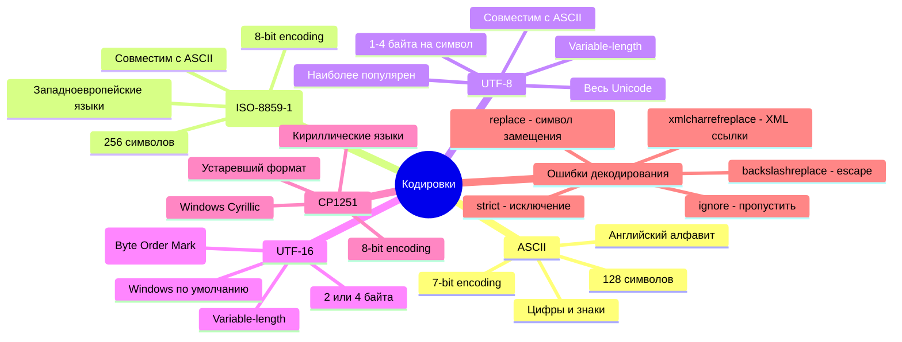
```mermaid
mindmap
  root((Кодировки))
    ASCII
      7-bit encoding
      128 символов
      Английский алфавит
      Цифры и знаки
    
    Latin-1 (ISO-8859-1)
      8-bit encoding
      256 символов
      Западноевропейские языки
      Совместим с ASCII
    
    UTF-8
      Variable-length
      1-4 байта на символ
      Совместим с ASCII
      Весь Unicode
      Наиболее популярен
    
    UTF-16
      Variable-length
      2 или 4 байта
      BOM (Byte Order Mark)
      Windows по умолчанию
    
    CP1251
      Windows Cyrillic
      8-bit encoding
      Кириллические языки
      Устаревший формат
    
    Ошибки декодирования
      strict - исключение
      ignore - пропустить
      replace - символ замещения
      xmlcharrefreplace - XML ссылки
      backslashreplace - escape
```

## 📊 Сравнение производительности методов чтения

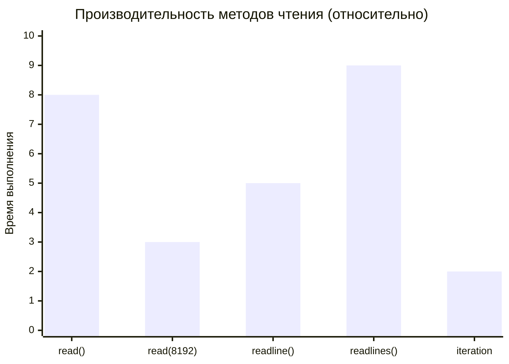
```mermaid
xychart-beta
    title "Производительность методов чтения (относительно)"
    x-axis ["read()", "read(8192)", "readline()", "readlines()", "iteration"]
    y-axis "Время выполнения" 0 --> 10
    bar [8, 3, 5, 9, 2]
```

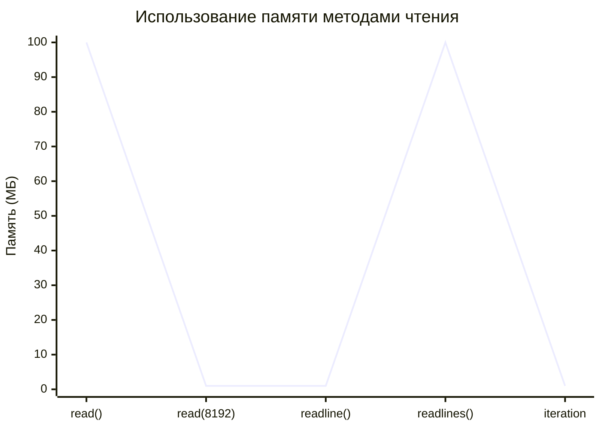
```mermaid
xychart-beta
    title "Использование памяти методами чтения"
    x-axis ["read()", "read(8192)", "readline()", "readlines()", "iteration"]
    y-axis "Память (МБ)" 0 --> 100
    line [100, 1, 1, 100, 1]
```

## 🔄 Процесс обработки кодировок

```mermaid
flowchart TD
    A["Текст в памяти\nUnicode строка"] --> B{Операция}
    
    B -->|Запись в файл| C[Кодирование]
    B -->|Чтение из файла| D[Декодирование]
    
    C --> E["str.encode(encoding)"]
    E --> F[Байты]
    F --> G[Запись в файл]
    
    D --> H[Чтение байтов из файла]
    H --> I["bytes.decode(encoding)"]
    I --> J[Unicode строка]
    
    subgraph "Возможные ошибки"
        K["UnicodeEncodeError\nСимвол нельзя закодировать"]
        L["UnicodeDecodeError\nБайты не валидны для кодировки"]
    end
    
    E -.-> K
    I -.-> L
    
    subgraph "Обработка ошибок"
        M[strict - исключение]
        N[ignore - пропустить]
        O[replace - заменить на ?]
        P[xmlcharrefreplace - &#123;num&#125;]
        Q[backslashreplace - \\uXXXX]
    end
    
    K --> M
    L --> M
    M --> N
    N --> O
    O --> P
    P --> Q
    
    style A fill:#e1f5fe
    style F fill:#fff3e0
    style J fill:#e8f5e8
    style K fill:#ffcdd2
    style L fill:#ffcdd2
```

## 📁 Работа с путями файлов

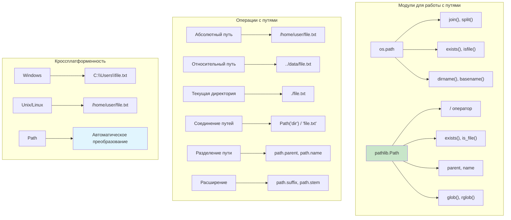
```mermaid
graph TD
    subgraph "Модули для работы с путями"
        A[os.path] --> A1["join(), split()"]
        A --> A2["exists(), isfile()"]
        A --> A3["dirname(), basename()"]
        
        B[pathlib.Path] --> B1["/ оператор"]
        B --> B2["exists(), is_file()"]
        B --> B3[parent, name]
        B --> B4["glob(), rglob()"]
    end
    
    subgraph "Операции с путями"
        C[Абсолютный путь] --> C1["/home/user/file.txt"]
        D[Относительный путь] --> D1["../data/file.txt"]
        E[Текущая директория] --> E1["./file.txt"]
        
        F[Соединение путей] --> F1["Path('dir') / 'file.txt'"]
        G[Разделение пути] --> G1["path.parent, path.name"]
        H[Расширение] --> H1["path.suffix, path.stem"]
    end
    
    subgraph "Кроссплатформенность"
        I[Windows] --> I1["C:\\Users\\file.txt"]
        J[Unix/Linux] --> J1["/home/user/file.txt"]
        K[Path] --> K1[Автоматическое преобразование]
    end
    
    style B fill:#c8e6c9
    style K1 fill:#e1f5fe
```

## 🗂️ Файловые операции

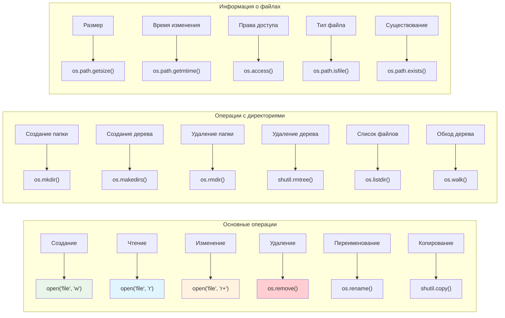
```mermaid
flowchart LR
    subgraph "Основные операции"
        A[Создание] --> A1["open('file', 'w')"]
        B[Чтение] --> B1["open('file', 'r')"]
        C[Изменение] --> C1["open('file', 'r+')"]
        D[Удаление] --> D1["os.remove()"]
        E[Переименование] --> E1["os.rename()"]
        F[Копирование] --> F1["shutil.copy()"]
    end
    
    subgraph "Операции с директориями"
        G[Создание папки] --> G1["os.mkdir()"]
        H[Создание дерева] --> H1["os.makedirs()"]
        I[Удаление папки] --> I1["os.rmdir()"]
        J[Удаление дерева] --> J1["shutil.rmtree()"]
        K[Список файлов] --> K1["os.listdir()"]
        L[Обход дерева] --> L1["os.walk()"]
    end
    
    subgraph "Информация о файлах"
        M[Размер] --> M1["os.path.getsize()"]
        N[Время изменения] --> N1["os.path.getmtime()"]
        O[Права доступа] --> O1["os.access()"]
        P[Тип файла] --> P1["os.path.isfile()"]
        Q[Существование] --> Q1["os.path.exists()"]
    end
    
    style A1 fill:#e8f5e8
    style B1 fill:#e1f5fe
    style C1 fill:#fff3e0
    style D1 fill:#ffcdd2
```

## 📄 Форматы файлов

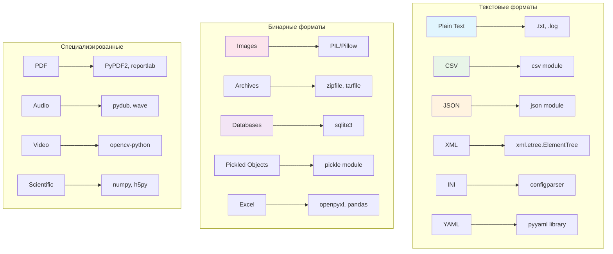
```mermaid
graph TD
    subgraph "Текстовые форматы"
        A[Plain Text] --> A1[.txt, .log]
        B[CSV] --> B1[csv module]
        C[JSON] --> C1[json module]
        D[XML] --> D1[xml.etree.ElementTree]
        E[INI] --> E1[configparser]
        F[YAML] --> F1[pyyaml library]
    end
    
    subgraph "Бинарные форматы"
        G[Images] --> G1[PIL/Pillow]
        H[Archives] --> H1[zipfile, tarfile]
        I[Databases] --> I1[sqlite3]
        J[Pickled Objects] --> J1[pickle module]
        K[Excel] --> K1[openpyxl, pandas]
    end
    
    subgraph "Специализированные"
        L[PDF] --> L1[PyPDF2, reportlab]
        M[Audio] --> M1[pydub, wave]
        N[Video] --> N1[opencv-python]
        O[Scientific] --> O1[numpy, h5py]
    end
    
    style A fill:#e1f5fe
    style B fill:#e8f5e8
    style C fill:#fff3e0
    style G fill:#fce4ec
    style I fill:#f3e5f5
```

## 🔄 Потоки данных и буферизация

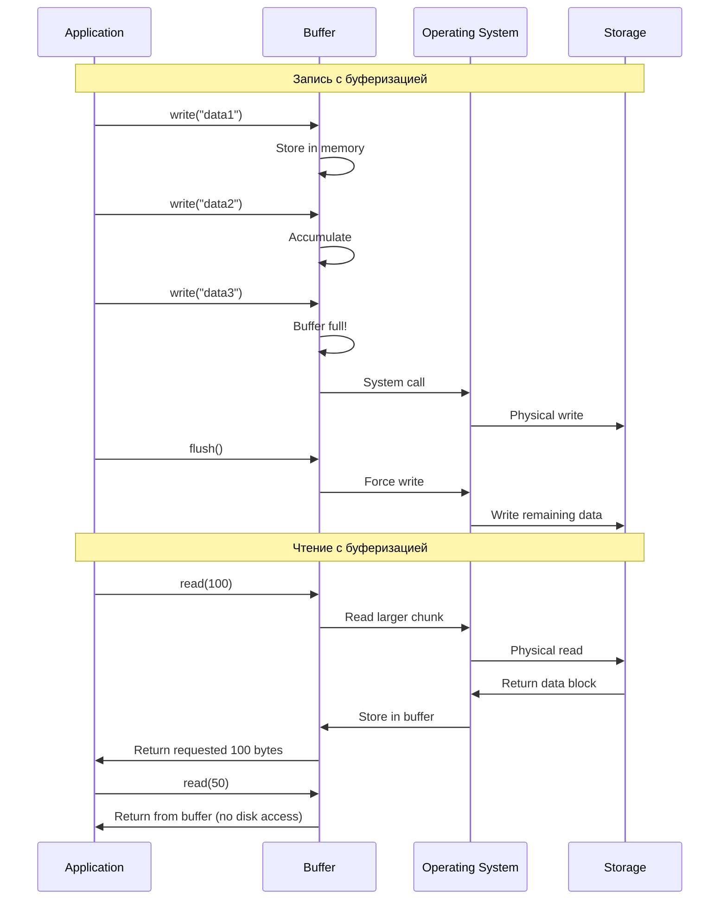
```mermaid
sequenceDiagram
    participant App as Application
    participant Buf as Buffer
    participant OS as Operating System
    participant Disk as Storage
    
    Note over App,Disk: Запись с буферизацией
    
    App->>Buf: write("data1")
    Buf->>Buf: Store in memory
    
    App->>Buf: write("data2")
    Buf->>Buf: Accumulate
    
    App->>Buf: write("data3")
    Buf->>Buf: Buffer full!
    Buf->>OS: System call
    OS->>Disk: Physical write
    
    App->>Buf: flush()
    Buf->>OS: Force write
    OS->>Disk: Write remaining data
    
    Note over App,Disk: Чтение с буферизацией
    
    App->>Buf: read(100)
    Buf->>OS: Read larger chunk
    OS->>Disk: Physical read
    Disk->>OS: Return data block
    OS->>Buf: Store in buffer
    Buf->>App: Return requested 100 bytes
    
    App->>Buf: read(50)
    Buf->>App: Return from buffer (no disk access)
```

## 🔧 Временные файлы и контекстное управление

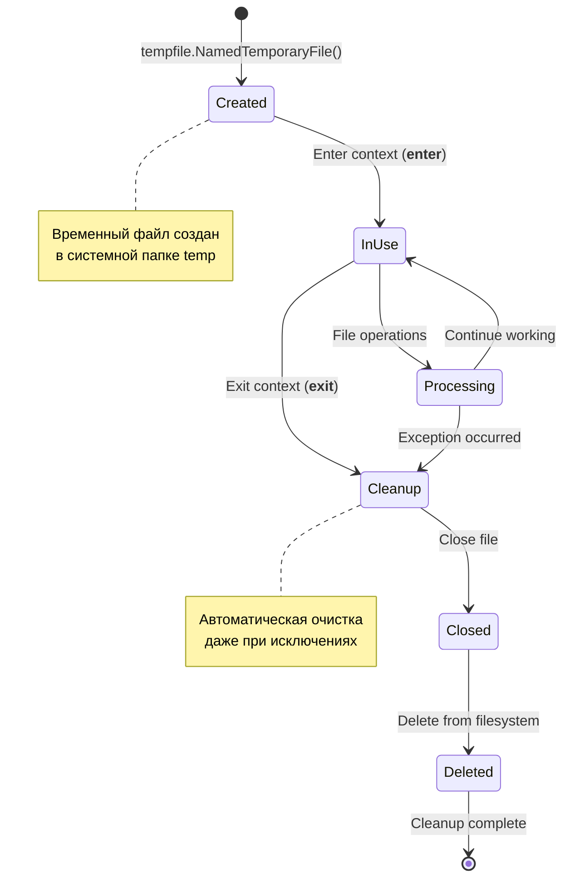
```mermaid
stateDiagram-v2
    [*] --> Created: tempfile.NamedTemporaryFile()
    
    Created --> InUse: Enter context (__enter__)
    InUse --> Processing: File operations
    Processing --> InUse: Continue working
    
    InUse --> Cleanup: Exit context (__exit__)
    Processing --> Cleanup: Exception occurred
    
    Cleanup --> Closed: Close file
    Closed --> Deleted: Delete from filesystem
    Deleted --> [*]: Cleanup complete
    
    note right of Created
        Временный файл создан
        в системной папке temp
    end note
    
    note right of Cleanup
        Автоматическая очистка
        даже при исключениях
    end note
```

## 📊 Диаграмма принятия решений для работы с файлами

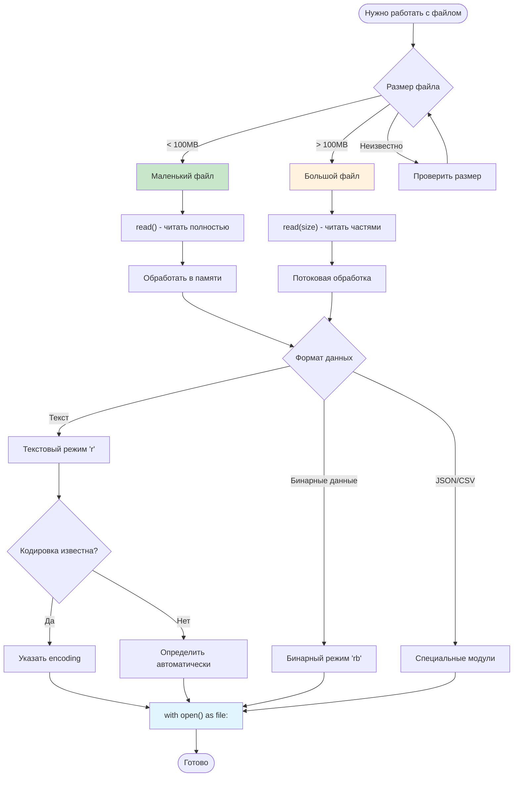
```mermaid
flowchart TD
    Start([Нужно работать с файлом]) --> Size{Размер файла}
    
    Size -->|< 100MB| Small[Маленький файл]
    Size -->|> 100MB| Large[Большой файл]
    Size -->|Неизвестно| Check[Проверить размер]
    
    Small --> ReadAll["read() - читать полностью"]
    Large --> ReadChunks["read(size) - читать частями"]
    Check --> Size
    
    ReadAll --> Process1[Обработать в памяти]
    ReadChunks --> Process2[Потоковая обработка]
    
    Process1 --> Format{Формат данных}
    Process2 --> Format
    
    Format -->|Текст| Text["Текстовый режим 'r'"]
    Format -->|Бинарные данные| Binary["Бинарный режим 'rb'"]
    Format -->|JSON/CSV| Structured[Специальные модули]
    
    Text --> Encoding{Кодировка известна?}
    Encoding -->|Да| UseEncoding[Указать encoding]
    Encoding -->|Нет| DetectEncoding[Определить автоматически]
    
    UseEncoding --> Context["with open() as file:"]
    DetectEncoding --> Context
    Binary --> Context
    Structured --> Context
    
    Context --> End([Готово])
    
    style Small fill:#c8e6c9
    style Large fill:#fff3e0
    style Context fill:#e1f5fe
```

## 🛡️ Безопасность файловых операций

```mermaid
graph TD
    subgraph "Угрозы безопасности"
        A[Path Traversal] --> A1["../../../etc/passwd"]
        B[Symlink Attack] --> B1[Символические ссылки]
        C[Race Conditions] --> C1[TOCTOU атаки]
        D[Injection] --> D1[Инъекции в имена файлов]
        E[Resource Exhaustion] --> E1[Переполнение диска]
    end
    
    subgraph "Защитные меры"
        F[Валидация путей] --> F1["os.path.commonpath()"]
        G[Безопасные временные файлы] --> G1["tempfile.mkstemp()"]
        H[Атомарные операции] --> H1[Запись через temp + rename]
        I[Ограничения ресурсов] --> I1[Проверка размеров]
        J[Проверка прав] --> J1["os.access()"]
    end
    
    subgraph "Лучшие практики"
        K[Принцип минимальных привилегий]
        L[Валидация входных данных]
        M[Использование контекстных менеджеров]
        N[Обработка исключений]
        O[Логирование операций]
    end
    
    A --> F
    B --> G
    C --> H
    D --> L
    E --> I
    
    style A fill:#ffcdd2
    style B fill:#ffcdd2
    style C fill:#ffcdd2
    style F fill:#c8e6c9
    style G fill:#c8e6c9
    style H fill:#c8e6c9
```

## 📈 Мониторинг файловых операций

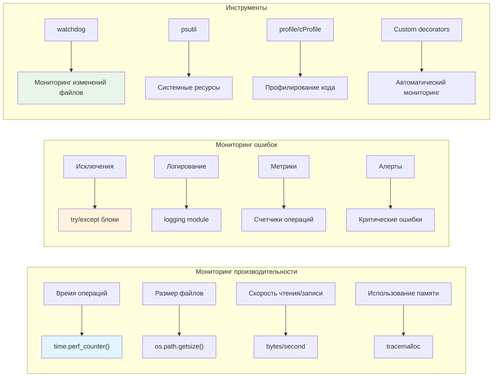
```mermaid
graph LR
    subgraph "Мониторинг производительности"
        A[Время операций] --> A1["time.perf_counter()"]
        B[Размер файлов] --> B1["os.path.getsize()"]
        C[Скорость чтения/записи] --> C1[bytes/second]
        D[Использование памяти] --> D1[tracemalloc]
    end
    
    subgraph "Мониторинг ошибок"
        E[Исключения] --> E1[try/except блоки]
        F[Логирование] --> F1[logging module]
        G[Метрики] --> G1[Счетчики операций]
        H[Алерты] --> H1[Критические ошибки]
    end
    
    subgraph "Инструменты"
        I[watchdog] --> I1[Мониторинг изменений файлов]
        J[psutil] --> J1[Системные ресурсы]
        K[profile/cProfile] --> K1[Профилирование кода]
        L[Custom decorators] --> L1[Автоматический мониторинг]
    end
    
    style A1 fill:#e1f5fe
    style E1 fill:#fff3e0
    style I1 fill:#e8f5e8
``` 