# Диаграммы: Внешние библиотеки в Python

## 📦 Экосистема Python пакетов

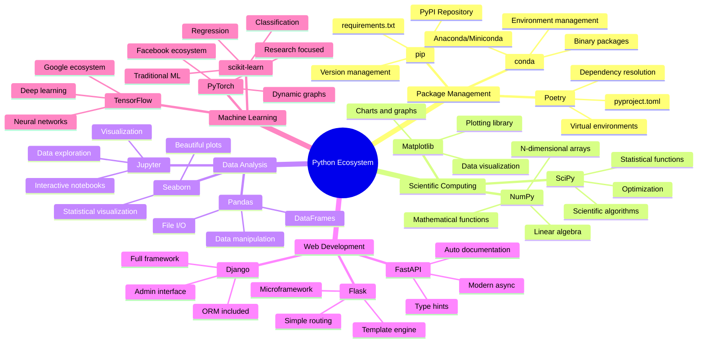

## 🔄 Управление зависимостями

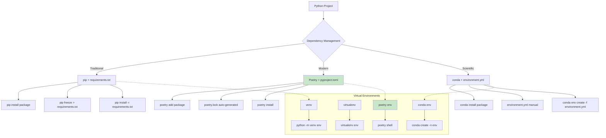

## 🧪 Научные библиотеки - иерархия

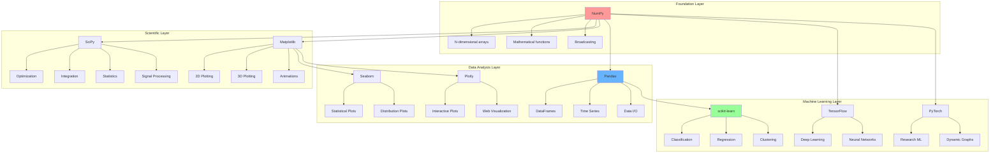

## 📊 Pandas DataFrame операции

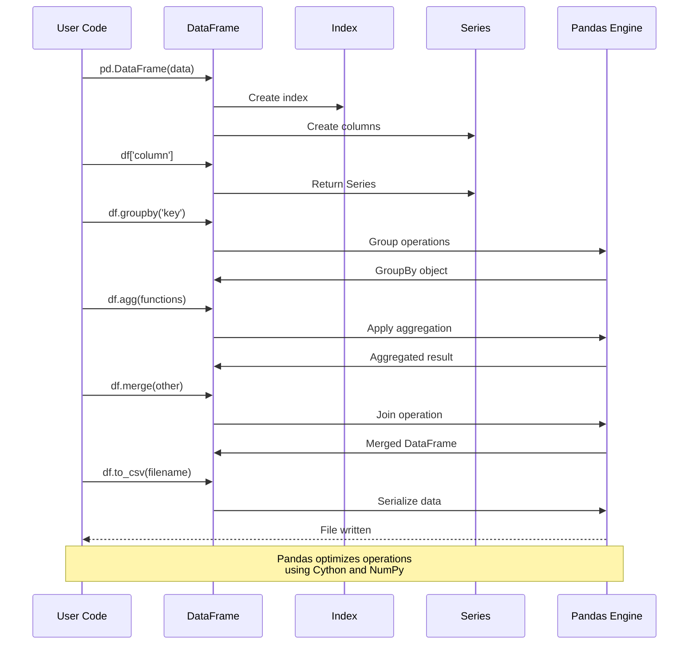

## 🌐 Веб-фреймворки сравнение

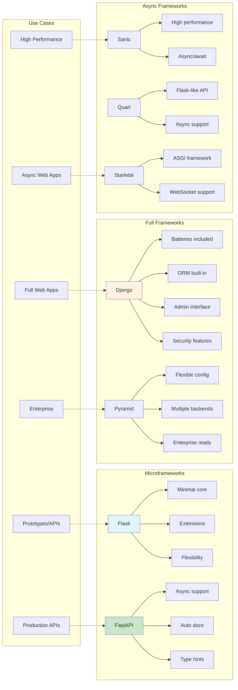

## 🔍 HTTP библиотеки

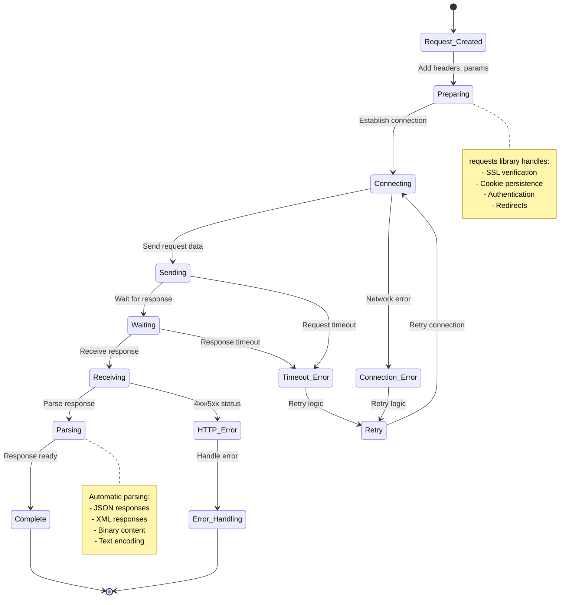

## 📈 NumPy массивы - архитектура

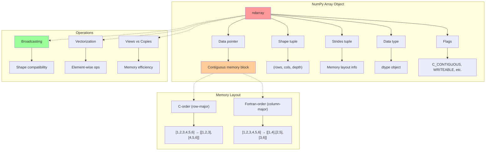

## 🗄️ Работа с базами данных

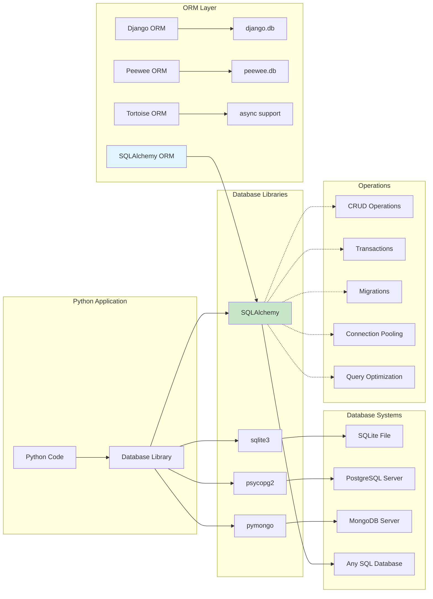

## 🔧 Установка и управление пакетами

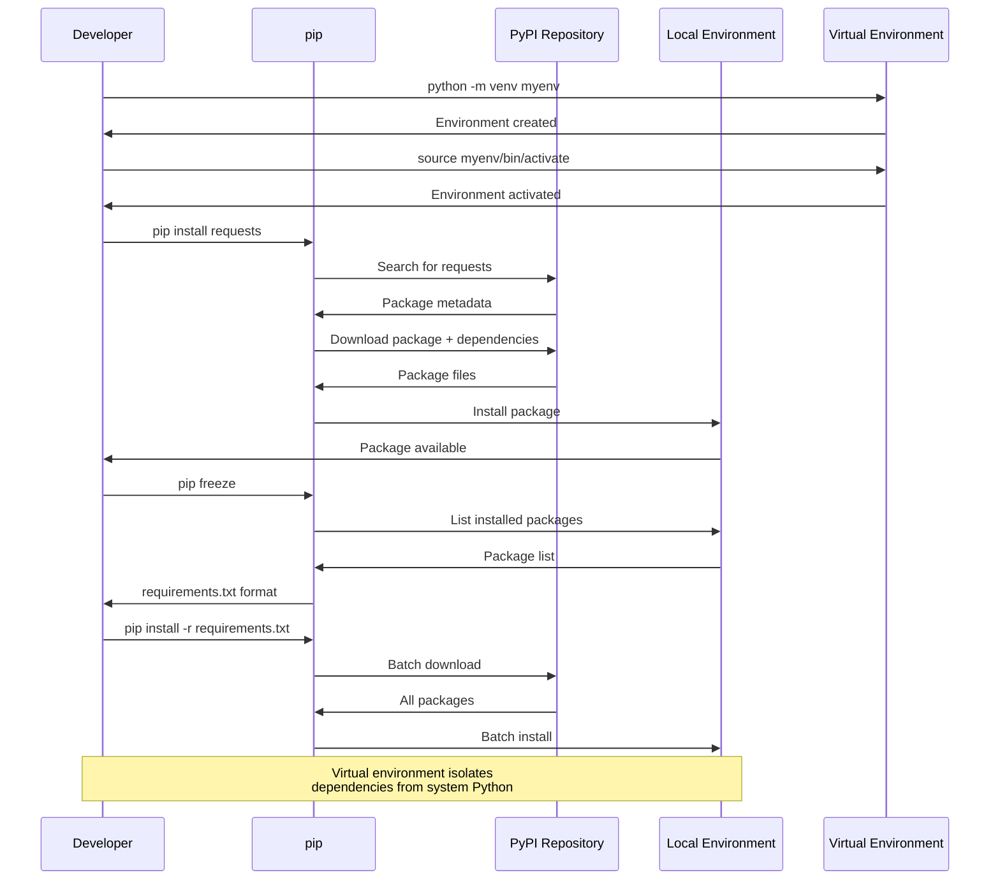

## 📊 Matplotlib архитектура

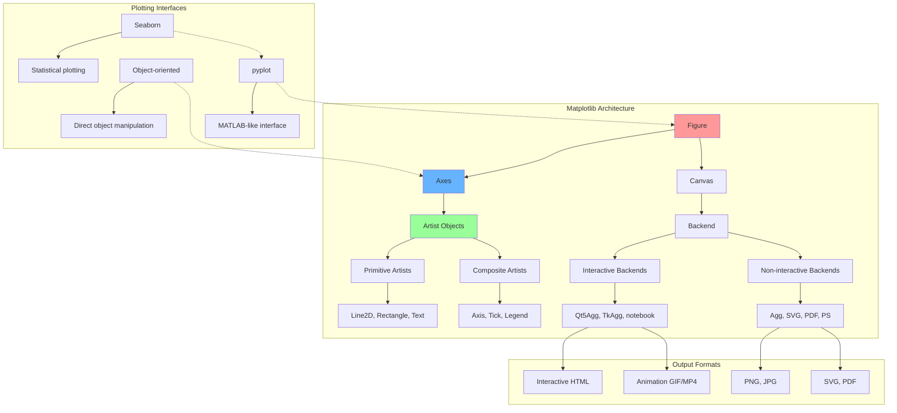

## 🤖 Машинное обучение - workflow

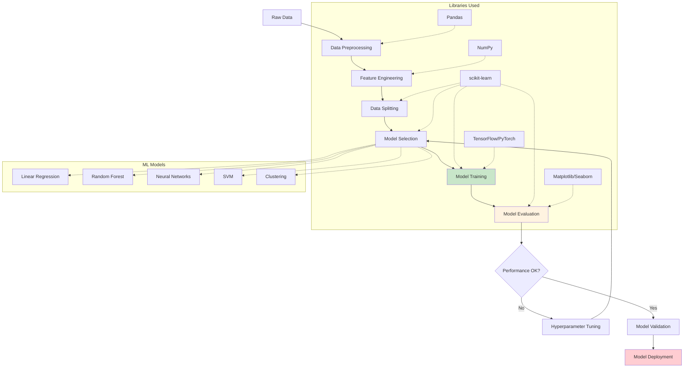

## 🔄 Асинхронное программирование

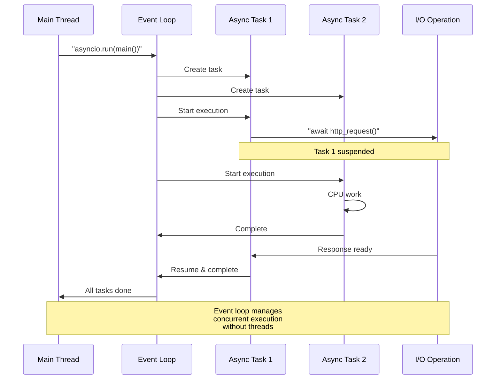

## 📦 Популярные библиотеки по категориям

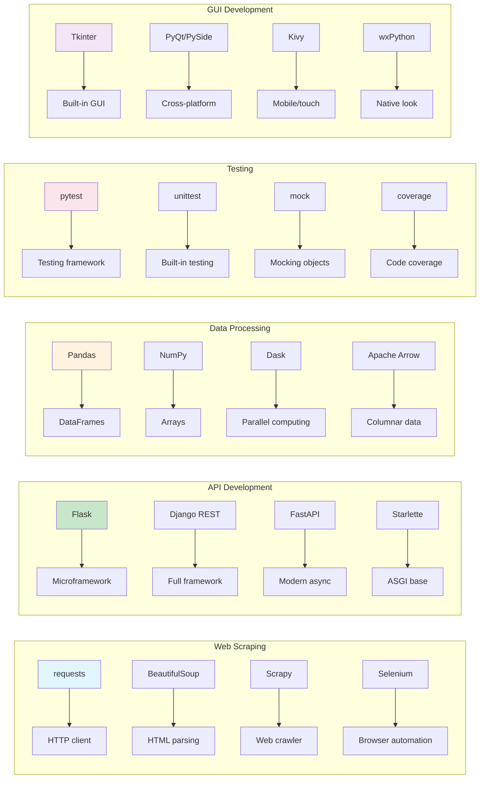

## ⚡ Производительность библиотек

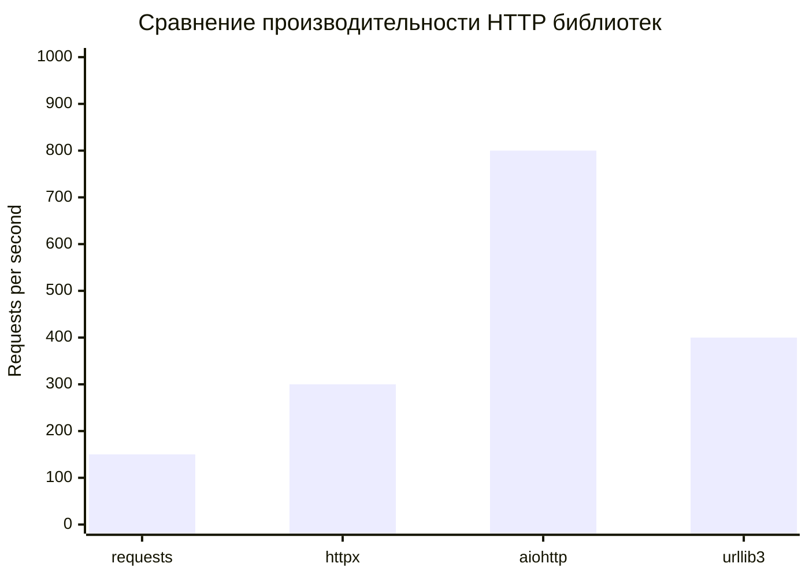

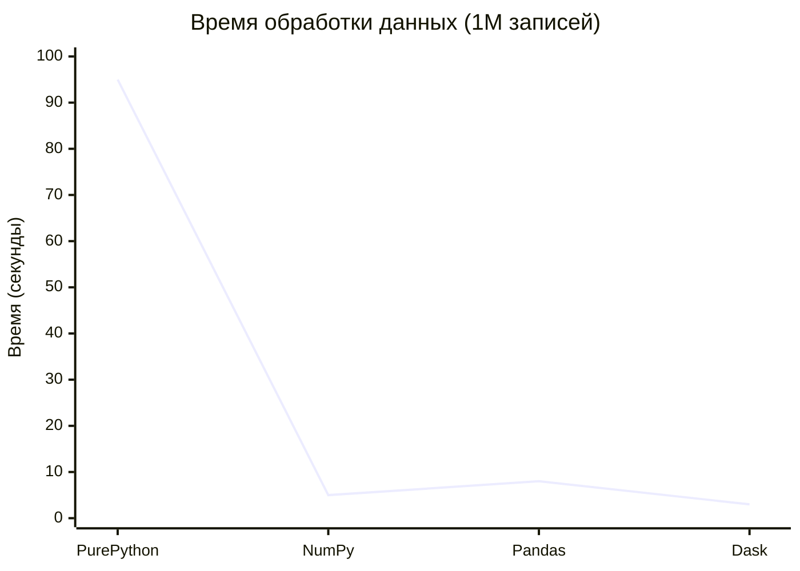

## 🔐 Безопасность внешних библиотек

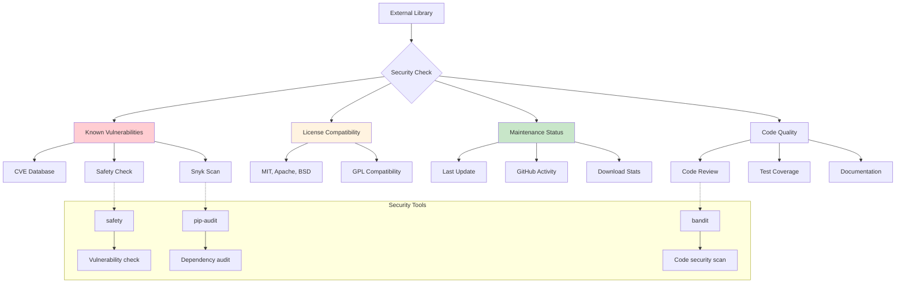

## 📈 Тренды популярности библиотек

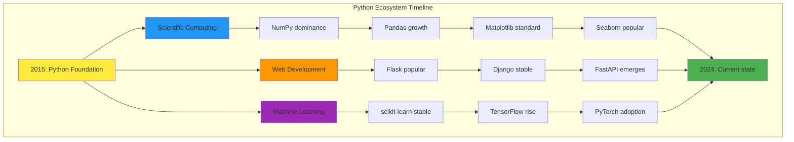

## 🔄 Управление версиями пакетов

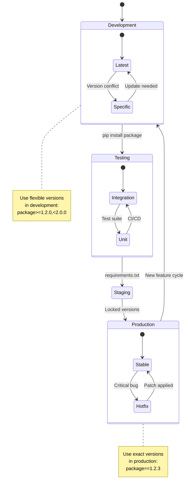