# Диаграммы: Типизация и аннотации типов в Python

## 🏷️ Эволюция системы типов Python

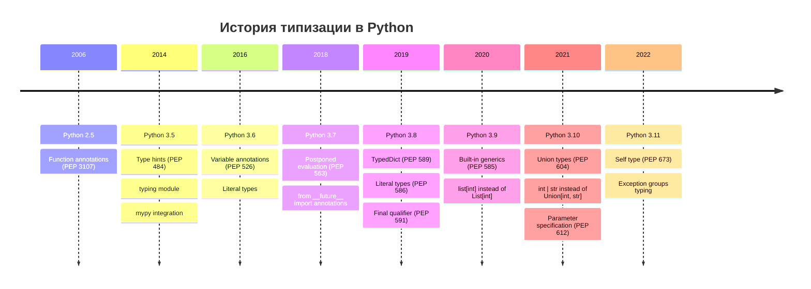

## 🎯 Система типов Python

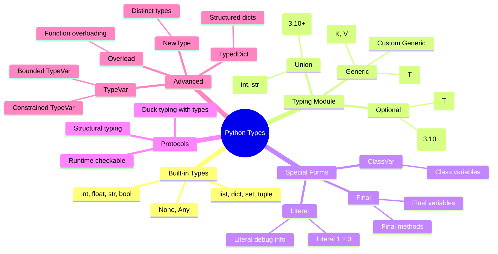

## 🔄 Градуальная типизация

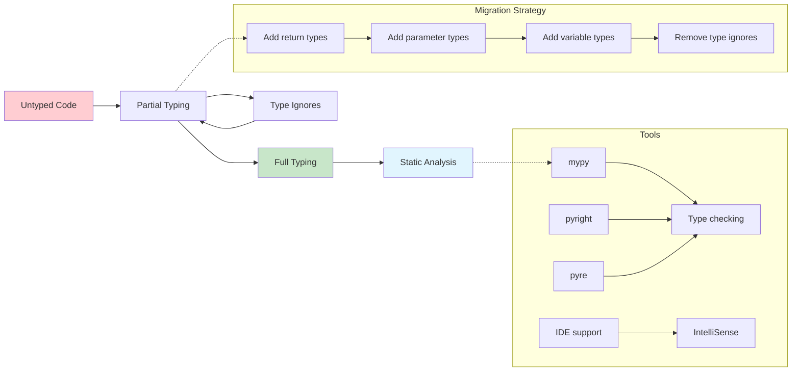

## 📦 Структура модуля typing

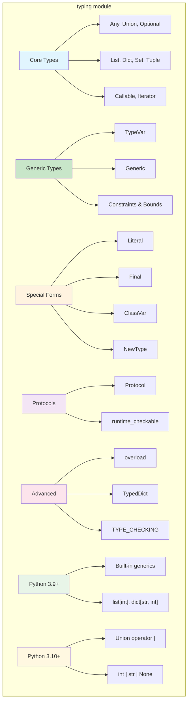

## 🎭 Протоколы vs Абстракции

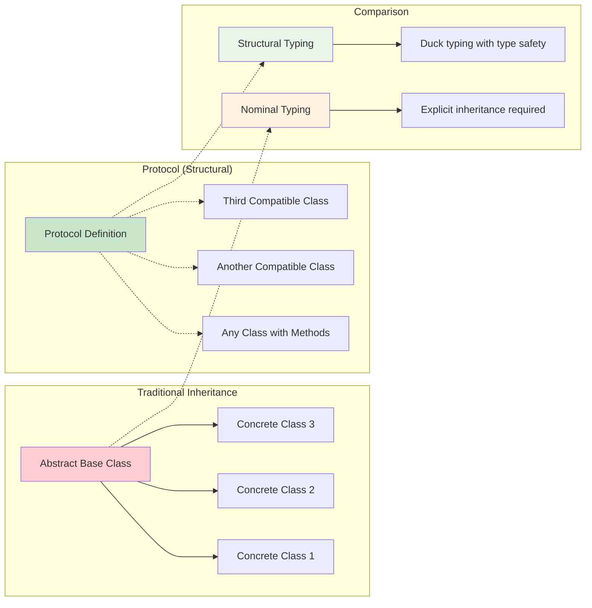

## 🔗 TypeVar и Generic классы

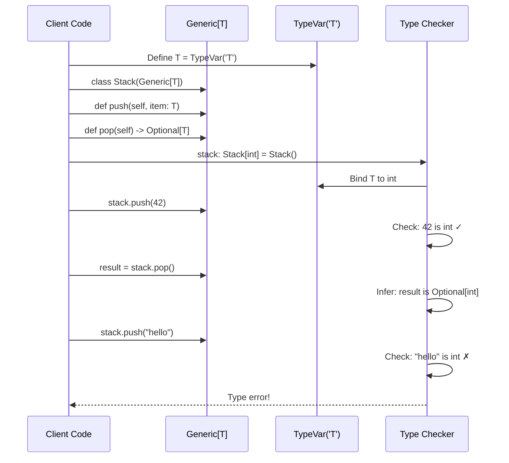

## 📊 Dataclasses архитектура

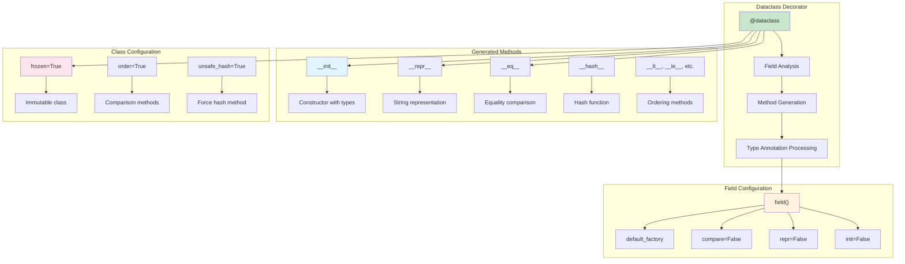

## 🔍 Статический анализ workflow

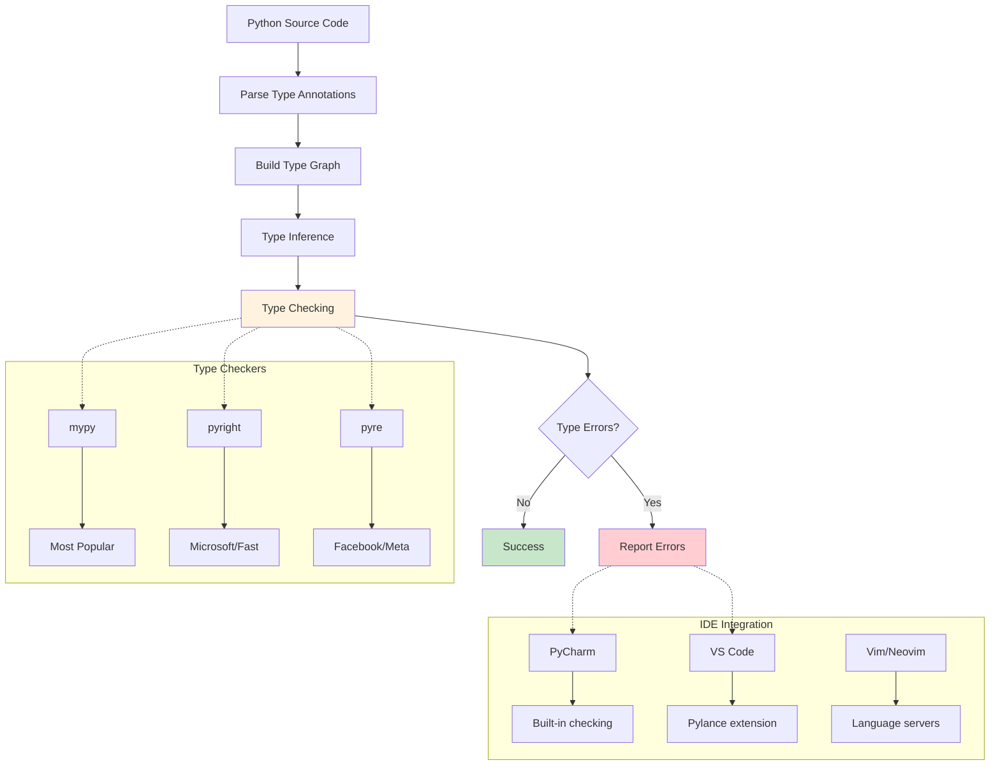

## 🎯 Литералы и перечисления

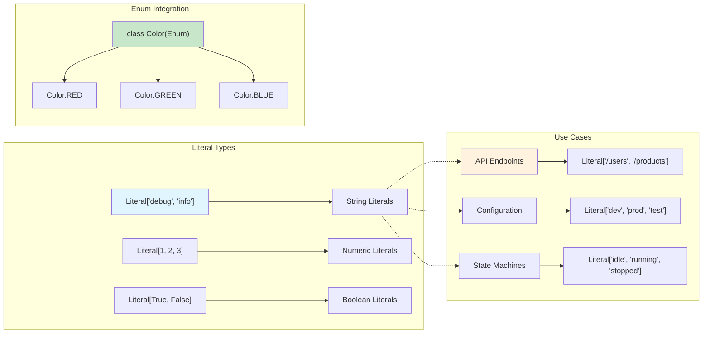

## 🔄 Overload демонстрация

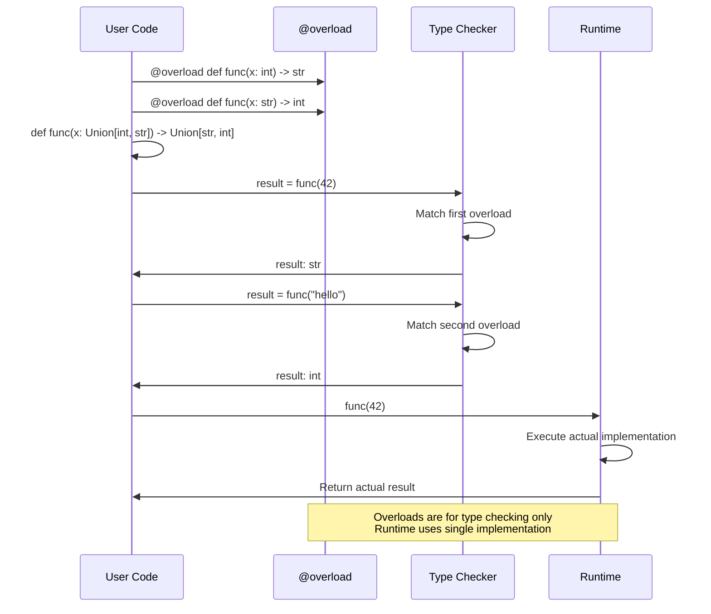

## 📚 TypedDict структура

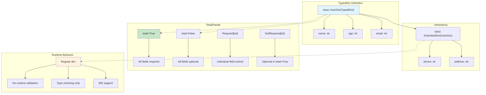

## 🔧 Type checking конфигурация

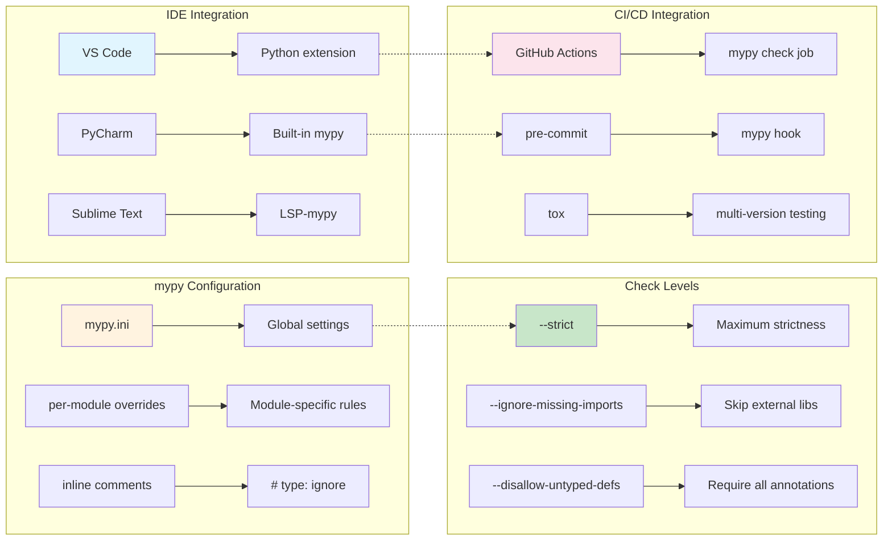

## 🎨 Performance impact of typing

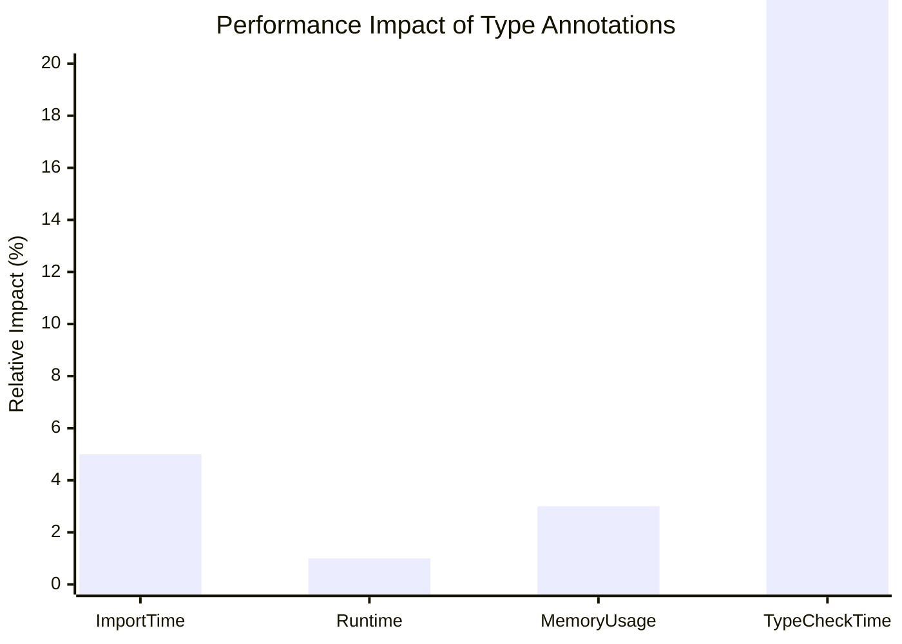

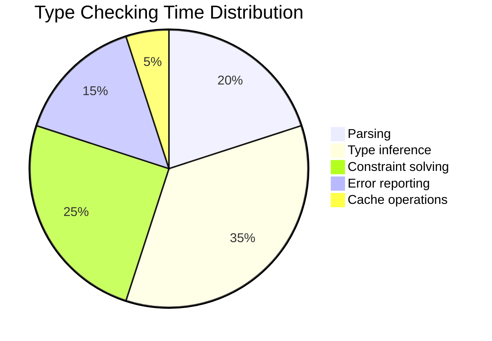

## 🚀 Best practices workflow

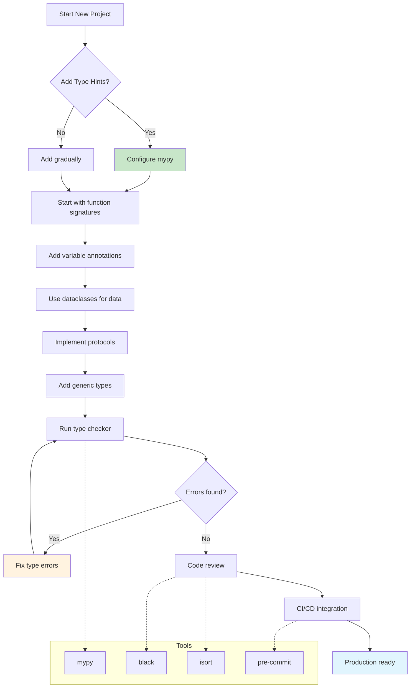

## 🔬 Advanced typing patterns

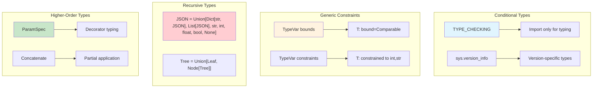

## 📈 Typing adoption timeline

```mermaid
gantt
    title Python Typing Adoption in Projects
    dateFormat  X
    axisFormat %s
    
    section Early (2015-2017)
    Experimental usage    :a1, 0, 2
    Basic annotations     :a2, 1, 3
    
    section Growth (2018-2020)
    Library adoption      :b1, 2, 5
    Tool maturation       :b2, 3, 6
    Community acceptance  :b3, 4, 7
    
    section Mainstream (2021+)
    Standard practice     :c1, 6, 8
    Advanced patterns     :c2, 7, 9
    Performance tools     :c3, 8, 10
``` 