# Диаграммы: Архитектура и CS фундамент в Python

## 📊 Сложность алгоритмов (Big O)

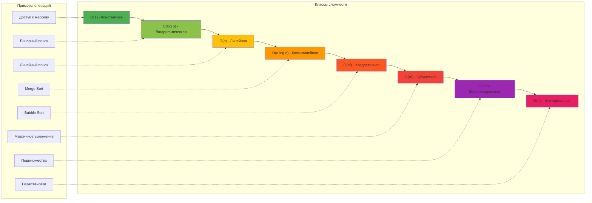
```mermaid
graph LR
    subgraph "Классы сложности"
        A["O(1) - Константная"] --> B["O(log n) - Логарифмическая"]
        B --> C["O(n) - Линейная"]
        C --> D["O(n log n) - Квазилинейная"]
        D --> E["O(n²) - Квадратичная"]
        E --> F["O(n³) - Кубическая"]
        F --> G["O(2^n) - Экспоненциальная"]
        G --> H["O(n!) - Факториальная"]
    end
    
    subgraph "Примеры операций"
        I[Доступ к массиву] -.-> A
        J[Бинарный поиск] -.-> B
        K[Линейный поиск] -.-> C
        L[Merge Sort] -.-> D
        M[Bubble Sort] -.-> E
        N[Матричное умножение] -.-> F
        O[Подмножества] -.-> G
        P[Перестановки] -.-> H
    end
    
    style A fill:#4CAF50
    style B fill:#8BC34A
    style C fill:#FFC107
    style D fill:#FF9800
    style E fill:#FF5722
    style F fill:#F44336
    style G fill:#9C27B0
    style H fill:#E91E63
```

## 🏗️ Сравнение сложности алгоритмов

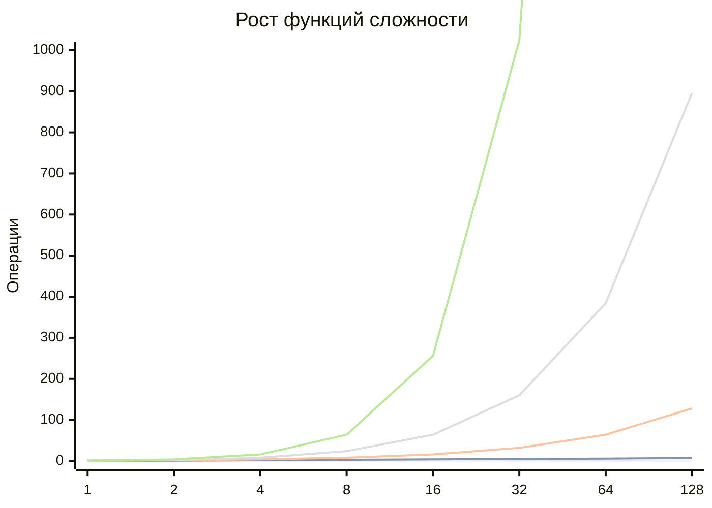
```mermaid
xychart-beta
    title "Рост функций сложности"
    x-axis [1, 2, 4, 8, 16, 32, 64, 128]
    y-axis "Операции" 0 --> 1000
    line [1, 1, 1, 1, 1, 1, 1, 1]
    line [1, 1, 2, 3, 4, 5, 6, 7]
    line [1, 2, 4, 8, 16, 32, 64, 128]
    line [1, 2, 8, 24, 64, 160, 384, 896]
    line [1, 4, 16, 64, 256, 1024, 4096, 16384]
```

## 🌳 Структуры данных и их сложность

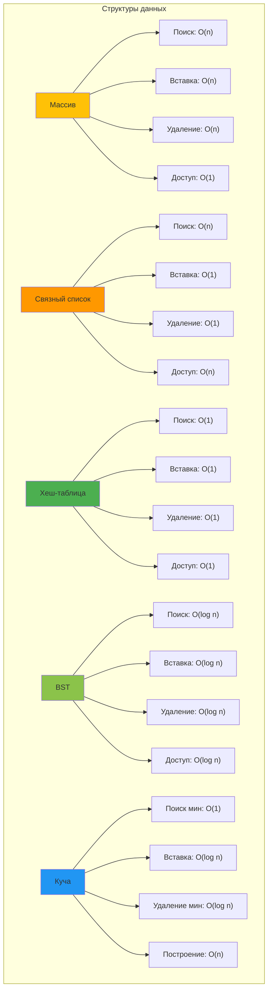
```mermaid
graph TD
    subgraph "Структуры данных"
        A[Массив] --> A1["Поиск: O(n)"]
        A --> A2["Вставка: O(n)"]
        A --> A3["Удаление: O(n)"]
        A --> A4["Доступ: O(1)"]
        
        B[Связный список] --> B1["Поиск: O(n)"]
        B --> B2["Вставка: O(1)"]
        B --> B3["Удаление: O(1)"]
        B --> B4["Доступ: O(n)"]
        
        C[Хеш-таблица] --> C1["Поиск: O(1)"]
        C --> C2["Вставка: O(1)"]
        C --> C3["Удаление: O(1)"]
        C --> C4["Доступ: O(1)"]
        
        D[BST] --> D1["Поиск: O(log n)"]
        D --> D2["Вставка: O(log n)"]
        D --> D3["Удаление: O(log n)"]
        D --> D4["Доступ: O(log n)"]
        
        E[Куча] --> E1["Поиск мин: O(1)"]
        E --> E2["Вставка: O(log n)"]
        E --> E3["Удаление мин: O(log n)"]
        E --> E4["Построение: O(n)"]
    end
    
    style C fill:#4CAF50
    style D fill:#8BC34A
    style A fill:#FFC107
    style B fill:#FF9800
    style E fill:#2196F3
```

## 🎯 Паттерны проектирования - обзор

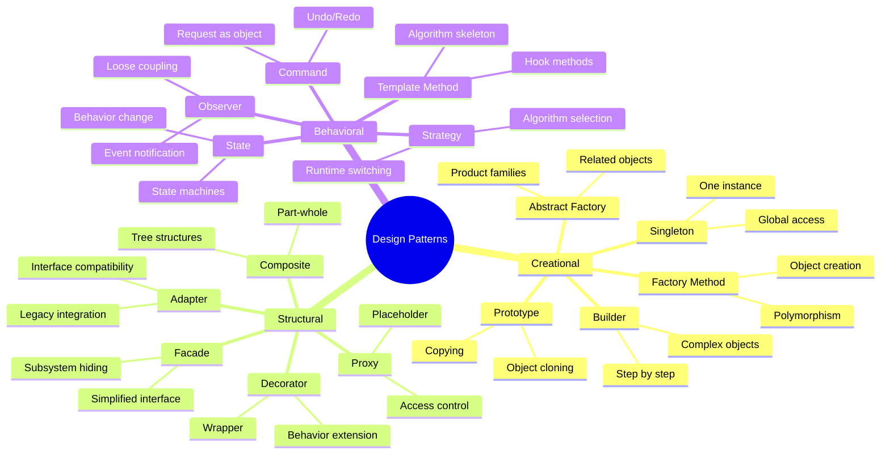
```mermaid
mindmap
  root((Design Patterns))
    Creational
      Singleton
        Global access
        One instance
      Factory Method
        Object creation
        Polymorphism
      Builder
        Complex objects
        Step by step
      Abstract Factory
        Related objects
        Product families
      Prototype
        Object cloning
        Copying
    
    Structural
      Adapter
        Interface compatibility
        Legacy integration
      Decorator
        Behavior extension
        Wrapper
      Facade
        Simplified interface
        Subsystem hiding
      Composite
        Tree structures
        Part-whole
      Proxy
        Placeholder
        Access control
      
    Behavioral
      Observer
        Event notification
        Loose coupling
      Strategy
        Algorithm selection
        Runtime switching
      Command
        Request as object
        Undo/Redo
      State
        Behavior change
        State machines
      Template Method
        Algorithm skeleton
        Hook methods
```

## 🏭 Порождающие паттерны

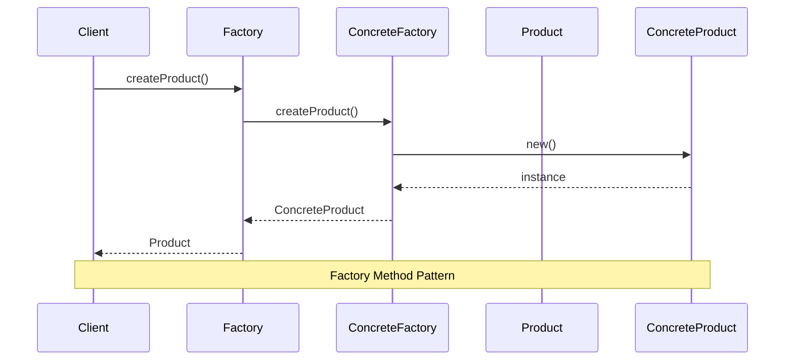
```mermaid
sequenceDiagram
    participant Client
    participant Factory
    participant ConcreteFactory
    participant Product
    participant ConcreteProduct
    
    Client->>Factory: createProduct()
    Factory->>ConcreteFactory: createProduct()
    ConcreteFactory->>ConcreteProduct: new()
    ConcreteProduct-->>ConcreteFactory: instance
    ConcreteFactory-->>Factory: ConcreteProduct
    Factory-->>Client: Product
    
    Note over Client,ConcreteProduct: Factory Method Pattern
```

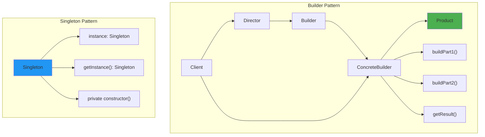
```mermaid
graph TD
    subgraph "Builder Pattern"
        A[Director] --> B[Builder]
        B --> C[ConcreteBuilder]
        C --> D[Product]
        
        E[Client] --> A
        E --> C
        C --> F["buildPart1()"]
        C --> G["buildPart2()"]
        C --> H["getResult()"]
    end
    
    subgraph "Singleton Pattern"
        I[Singleton] --> J[instance: Singleton]
        I --> K["getInstance(): Singleton"]
        I --> L["private constructor()"]
    end
    
    style D fill:#4CAF50
    style I fill:#2196F3
```

## 🔗 Структурные паттерны

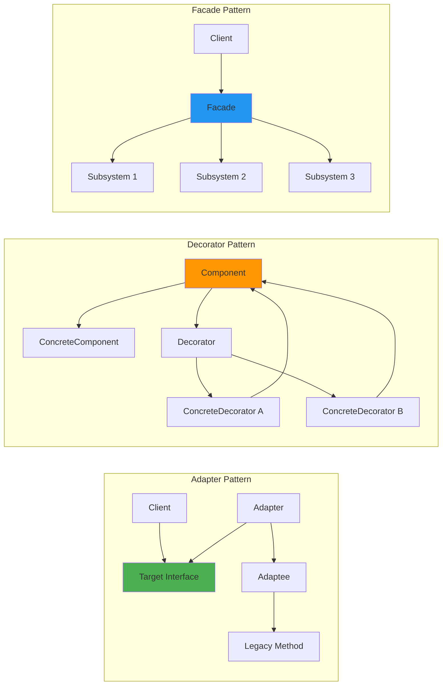
```mermaid
graph LR
    subgraph "Adapter Pattern"
        A[Client] --> B[Target Interface]
        C[Adapter] --> B
        C --> D[Adaptee]
        D --> E[Legacy Method]
    end
    
    subgraph "Decorator Pattern"
        F[Component] --> G[ConcreteComponent]
        F --> H[Decorator]
        H --> I[ConcreteDecorator A]
        H --> J[ConcreteDecorator B]
        I --> F
        J --> F
    end
    
    subgraph "Facade Pattern"
        K[Client] --> L[Facade]
        L --> M[Subsystem 1]
        L --> N[Subsystem 2]
        L --> O[Subsystem 3]
    end
    
    style B fill:#4CAF50
    style L fill:#2196F3
    style F fill:#FF9800
```

## 🎭 Поведенческие паттерны

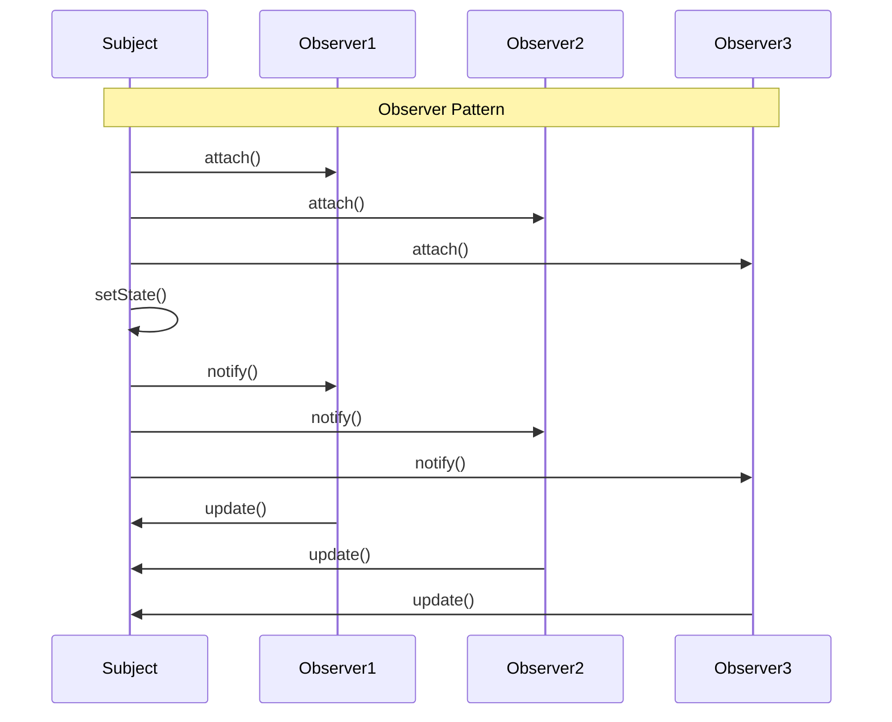
```mermaid
sequenceDiagram
    participant Subject
    participant Observer1
    participant Observer2
    participant Observer3
    
    Note over Subject,Observer3: Observer Pattern
    
    Subject->>Observer1: attach()
    Subject->>Observer2: attach()
    Subject->>Observer3: attach()
    
    Subject->>Subject: setState()
    Subject->>Observer1: notify()
    Subject->>Observer2: notify()
    Subject->>Observer3: notify()
    
    Observer1->>Subject: update()
    Observer2->>Subject: update()
    Observer3->>Subject: update()
```

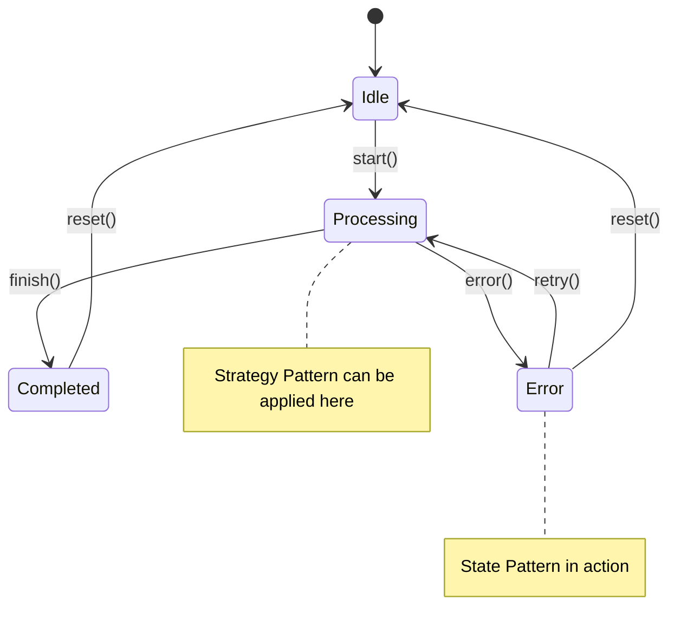
```mermaid
stateDiagram-v2
    [*] --> Idle
    
    Idle --> Processing : start()
    Processing --> Completed : finish()
    Processing --> Error : error()
    Error --> Processing : retry()
    Error --> Idle : reset()
    Completed --> Idle : reset()
    
    note right of Processing : Strategy Pattern can be applied here
    note right of Error : State Pattern in action
```

## 🏛️ SOLID принципы

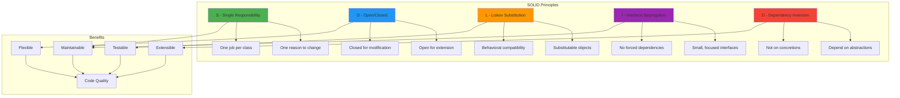
```mermaid
graph TD
    subgraph "SOLID Principles"
        A[S - Single Responsibility] --> A1[One reason to change]
        A --> A2[One job per class]
        
        B[O - Open/Closed] --> B1[Open for extension]
        B --> B2[Closed for modification]
        
        C[L - Liskov Substitution] --> C1[Substitutable objects]
        C --> C2[Behavioral compatibility]
        
        D[I - Interface Segregation] --> D1[Small, focused interfaces]
        D --> D2[No forced dependencies]
        
        E[D - Dependency Inversion] --> E1[Depend on abstractions]
        E --> E2[Not on concretions]
    end
    
    subgraph "Benefits"
        F[Maintainable] --> G[Code Quality]
        H[Testable] --> G
        I[Flexible] --> G
        J[Extensible] --> G
    end
    
    A --> F
    B --> I
    C --> H
    D --> F
    E --> J
    
    style A fill:#4CAF50
    style B fill:#2196F3
    style C fill:#FF9800
    style D fill:#9C27B0
    style E fill:#F44336
```

## ⚡ Параллелизм vs Асинхронность

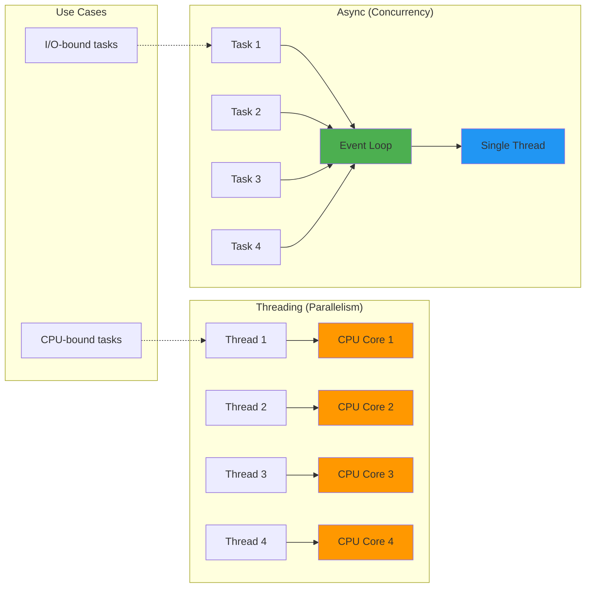
```mermaid
graph LR
    subgraph "Threading (Parallelism)"
        A[Thread 1] --> A1[CPU Core 1]
        B[Thread 2] --> B1[CPU Core 2]
        C[Thread 3] --> C1[CPU Core 3]
        D[Thread 4] --> D1[CPU Core 4]
    end
    
    subgraph "Async (Concurrency)"
        E[Task 1] --> F[Event Loop]
        G[Task 2] --> F
        H[Task 3] --> F
        I[Task 4] --> F
        F --> J[Single Thread]
    end
    
    subgraph "Use Cases"
        K[CPU-bound tasks] -.-> A
        L[I/O-bound tasks] -.-> E
    end
    
    style F fill:#4CAF50
    style J fill:#2196F3
    style A1 fill:#FF9800
    style B1 fill:#FF9800
    style C1 fill:#FF9800
    style D1 fill:#FF9800
```

## 🔄 Асинхронный поток выполнения

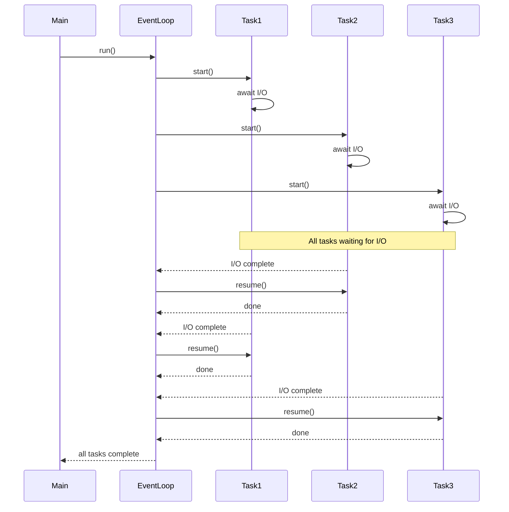
```mermaid
sequenceDiagram
    participant Main
    participant EventLoop
    participant Task1
    participant Task2
    participant Task3
    
    Main->>EventLoop: run()
    
    EventLoop->>Task1: start()
    Task1->>Task1: await I/O
    EventLoop->>Task2: start()
    Task2->>Task2: await I/O
    EventLoop->>Task3: start()
    Task3->>Task3: await I/O
    
    Note over Task1,Task3: All tasks waiting for I/O
    
    Task2-->>EventLoop: I/O complete
    EventLoop->>Task2: resume()
    Task2-->>EventLoop: done
    
    Task1-->>EventLoop: I/O complete
    EventLoop->>Task1: resume()
    Task1-->>EventLoop: done
    
    Task3-->>EventLoop: I/O complete
    EventLoop->>Task3: resume()
    Task3-->>EventLoop: done
    
    EventLoop-->>Main: all tasks complete
```

## 📈 Производительность Python структур данных

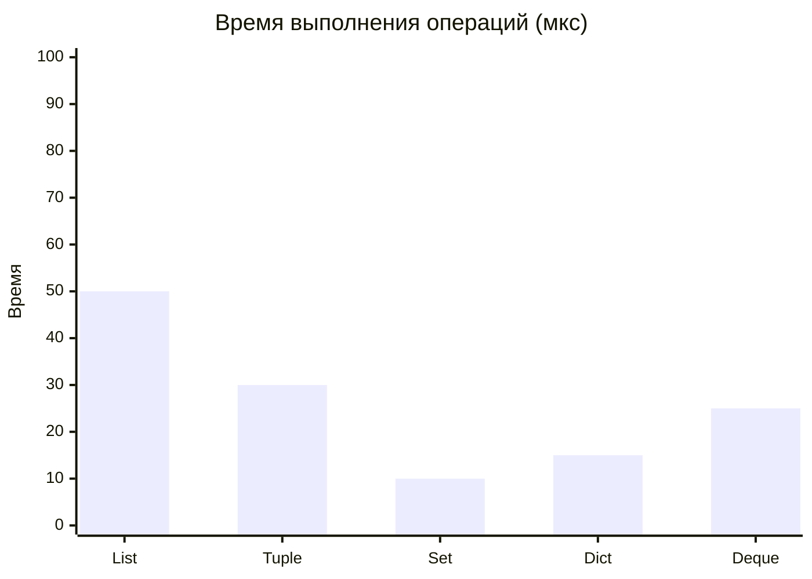
```mermaid
xychart-beta
    title "Время выполнения операций (мкс)"
    x-axis [List, Tuple, Set, Dict, Deque]
    y-axis "Время" 0 --> 100
    bar [50, 30, 10, 15, 25]
```

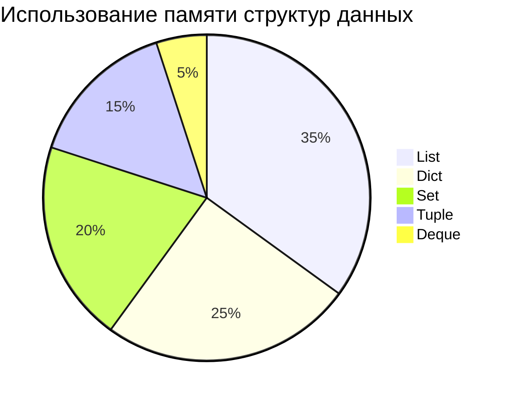
```mermaid
pie title Использование памяти структур данных
    "List" : 35
    "Dict" : 25
    "Set" : 20
    "Tuple" : 15
    "Deque" : 5
```

## 🧮 Алгоритмы сортировки

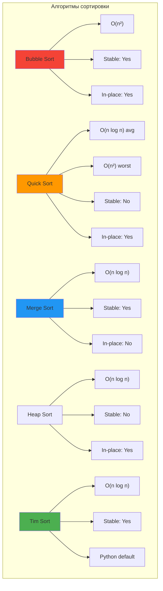
```mermaid
graph TD
    subgraph "Алгоритмы сортировки"
        A[Bubble Sort] --> A1["O(n²)"]
        A --> A2[Stable: Yes]
        A --> A3[In-place: Yes]
        
        B[Quick Sort] --> B1["O(n log n) avg"]
        B --> B2["O(n²) worst"]
        B --> B3[Stable: No]
        B --> B4[In-place: Yes]
        
        C[Merge Sort] --> C1["O(n log n)"]
        C --> C2[Stable: Yes]
        C --> C3[In-place: No]
        
        D[Heap Sort] --> D1["O(n log n)"]
        D --> D2[Stable: No]
        D --> D3[In-place: Yes]
        
        E[Tim Sort] --> E1["O(n log n)"]
        E --> E2[Stable: Yes]
        E --> E3[Python default]
    end
    
    style E fill:#4CAF50
    style C fill:#2196F3
    style B fill:#FF9800
    style A fill:#F44336
```

## 🔍 Алгоритмы поиска

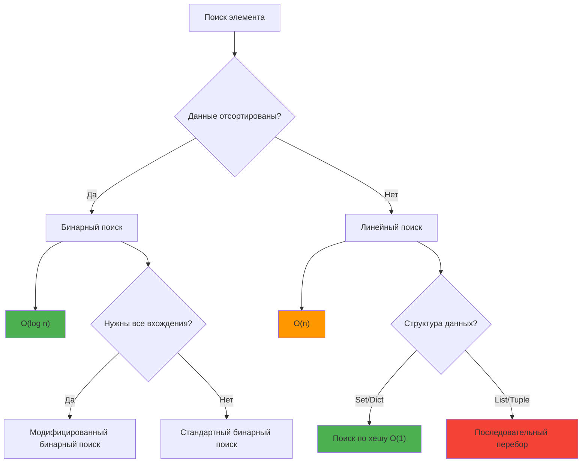
```mermaid
flowchart TD
    A[Поиск элемента] --> B{Данные отсортированы?}
    
    B -->|Да| C[Бинарный поиск]
    B -->|Нет| D[Линейный поиск]
    
    C --> C1["O(log n)"]
    D --> D1["O(n)"]
    
    C --> E{Нужны все вхождения?}
    E -->|Да| F[Модифицированный бинарный поиск]
    E -->|Нет| G[Стандартный бинарный поиск]
    
    D --> H{Структура данных?}
    H -->|Set/Dict| I["Поиск по хешу O(1)"]
    H -->|List/Tuple| J[Последовательный перебор]
    
    style C1 fill:#4CAF50
    style D1 fill:#FF9800
    style I fill:#4CAF50
    style J fill:#F44336
```

## 🌐 Архитектура веб-приложений

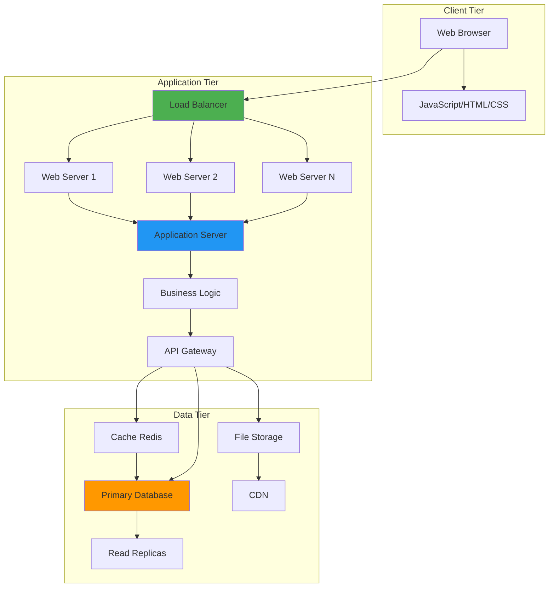
```mermaid
graph TB
    subgraph "Client Tier"
        A[Web Browser] --> B[JavaScript/HTML/CSS]
    end
    
    subgraph "Application Tier"
        C[Load Balancer] --> D[Web Server 1]
        C --> E[Web Server 2]
        C --> F[Web Server N]
        
        D --> G[Application Server]
        E --> G
        F --> G
        
        G --> H[Business Logic]
        H --> I[API Gateway]
    end
    
    subgraph "Data Tier"
        J[Primary Database] --> K[Read Replicas]
        L[Cache Redis] --> J
        M[File Storage] --> N[CDN]
    end
    
    A --> C
    I --> L
    I --> J
    I --> M
    
    style C fill:#4CAF50
    style G fill:#2196F3
    style J fill:#FF9800
```

## 🏗️ Микросервисная архитектура

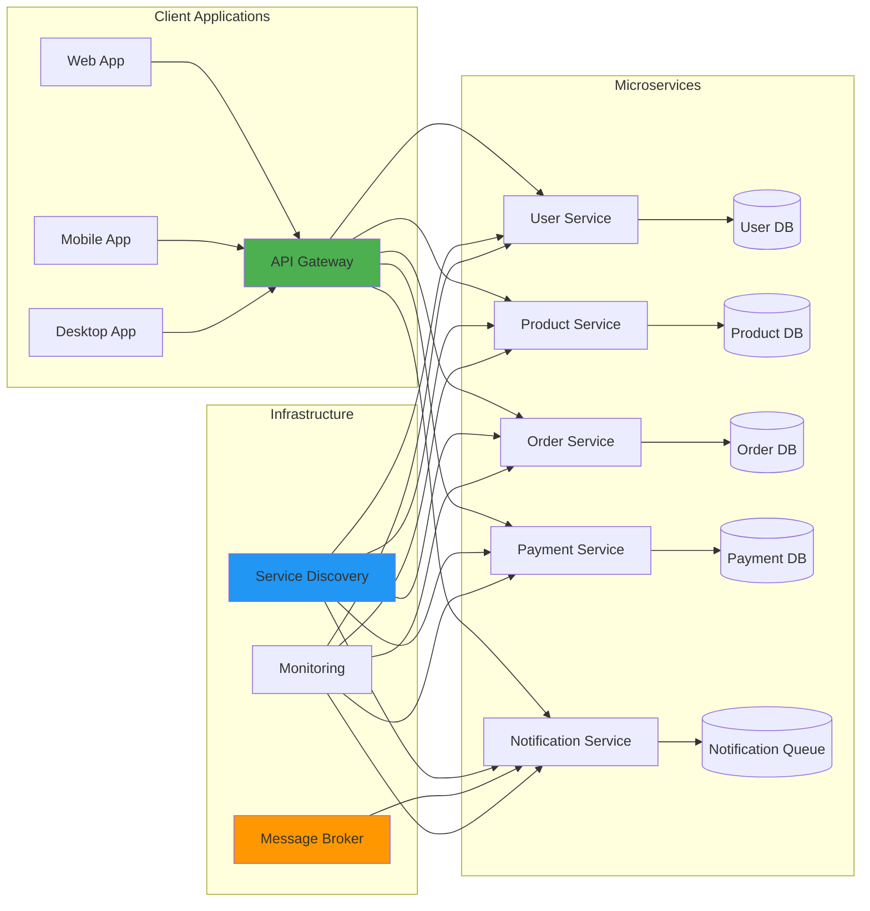
```mermaid
graph LR
    subgraph "Client Applications"
        A[Web App] --> B[API Gateway]
        C[Mobile App] --> B
        D[Desktop App] --> B
    end
    
    subgraph "Microservices"
        B --> E[User Service]
        B --> F[Product Service]
        B --> G[Order Service]
        B --> H[Payment Service]
        B --> I[Notification Service]
        
        E --> E1[(User DB)]
        F --> F1[(Product DB)]
        G --> G1[(Order DB)]
        H --> H1[(Payment DB)]
        I --> I1[(Notification Queue)]
    end
    
    subgraph "Infrastructure"
        J[Service Discovery] --> E
        J --> F
        J --> G
        J --> H
        J --> I
        
        K[Message Broker] --> I
        L[Monitoring] --> E
        L --> F
        L --> G
        L --> H
        L --> I
    end
    
    style B fill:#4CAF50
    style J fill:#2196F3
    style K fill:#FF9800
```

## 📊 Системное проектирование - масштабирование

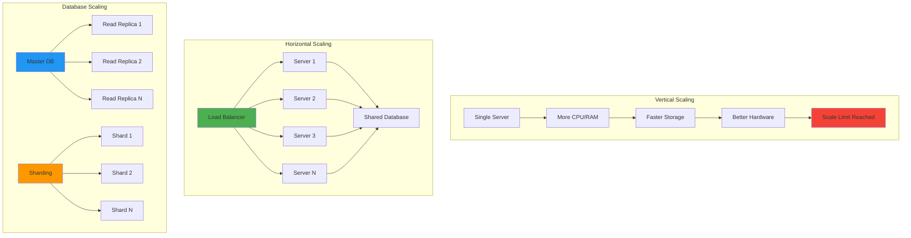
```mermaid
graph TD
    subgraph "Vertical Scaling"
        A[Single Server] --> B[More CPU/RAM]
        B --> C[Faster Storage]
        C --> D[Better Hardware]
        D --> E[Scale Limit Reached]
    end
    
    subgraph "Horizontal Scaling"
        F[Load Balancer] --> G[Server 1]
        F --> H[Server 2]
        F --> I[Server 3]
        F --> J[Server N]
        
        G --> K[Shared Database]
        H --> K
        I --> K
        J --> K
    end
    
    subgraph "Database Scaling"
        L[Master DB] --> M[Read Replica 1]
        L --> N[Read Replica 2]
        L --> O[Read Replica N]
        
        P[Sharding] --> P1[Shard 1]
        P --> P2[Shard 2]
        P --> P3[Shard N]
    end
    
    style F fill:#4CAF50
    style L fill:#2196F3
    style P fill:#FF9800
    style E fill:#F44336
```

## 🔄 CAP теорема

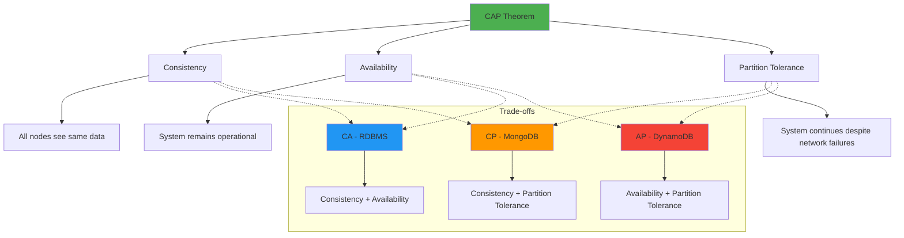
```mermaid
graph TD
    A[CAP Theorem] --> B[Consistency]
    A --> C[Availability]
    A --> D[Partition Tolerance]
    
    B --> E[All nodes see same data]
    C --> F[System remains operational]
    D --> G[System continues despite network failures]
    
    subgraph "Trade-offs"
        H[CA - RDBMS] --> I[Consistency + Availability]
        J[CP - MongoDB] --> K[Consistency + Partition Tolerance]
        L[AP - DynamoDB] --> M[Availability + Partition Tolerance]
    end
    
    B -.-> H
    C -.-> H
    B -.-> J
    D -.-> J
    C -.-> L
    D -.-> L
    
    style A fill:#4CAF50
    style H fill:#2196F3
    style J fill:#FF9800
    style L fill:#F44336
```

## 🎯 Паттерны оптимизации производительности

```mermaid
flowchart TD
    A[Performance Issue] --> B{Type of bottleneck?}
    
    B -->|CPU| C[CPU Optimization]
    B -->|Memory| D[Memory Optimization]
    B -->|I/O| E[I/O Optimization]
    B -->|Network| F[Network Optimization]
    
    C --> C1[Algorithmic improvement]
    C --> C2[Parallelization]
    C --> C3[Caching]
    
    D --> D1[Memory pooling]
    D --> D2[Lazy loading]
    D --> D3[Garbage collection tuning]
    
    E --> E1[Async I/O]
    E --> E2[Buffering]
    E --> E3[Batching]
    
    F --> F1[Connection pooling]
    F --> F2[Compression]
    F --> F3[CDN]
    
    style C1 fill:#4CAF50
    style E1 fill:#2196F3
    style C3 fill:#FF9800
    style F1 fill:#9C27B0
```

## 📈 Жизненный цикл оптимизации

```mermaid
graph LR
    A[Identify] --> B[Measure]
    B --> C[Analyze]
    C --> D[Optimize]
    D --> E[Test]
    E --> F[Deploy]
    F --> B
    
    subgraph "Tools"
        G[Profilers] -.-> B
        H[Benchmarks] -.-> E
        I[Monitoring] -.-> F
    end
    
    subgraph "Metrics"
        J[Response Time] -.-> B
        K[Throughput] -.-> B
        L[Memory Usage] -.-> B
        M[CPU Usage] -.-> B
    end
    
    style D fill:#4CAF50
    style B fill:#2196F3
    style E fill:#FF9800
``` 