# Диаграммы: Продвинутая типизация и аннотации

## 🎯 Архитектура системы типов Python

### Эволюция типизации в Python

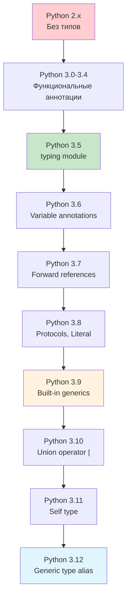

### Иерархия системы типов

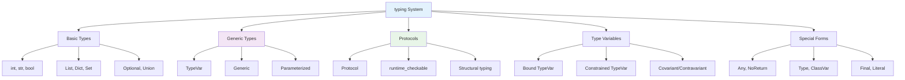

## 🔧 TypeVar и ограничения

### TypeVar с ограничениями

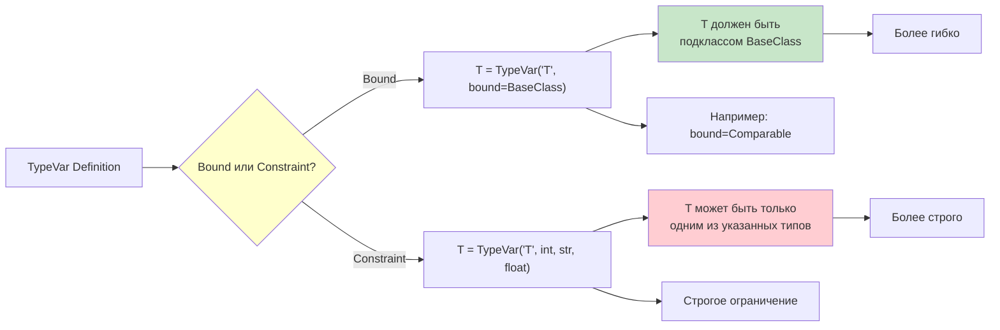

### Ковариантность и контравариантность

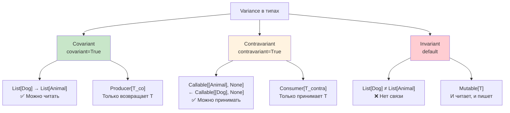

## 🏛️ Протоколы и структурная типизация

### Протоколы vs Наследование

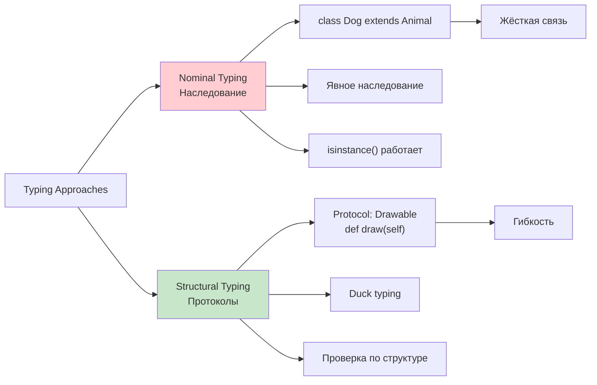

### Runtime проверяемые протоколы

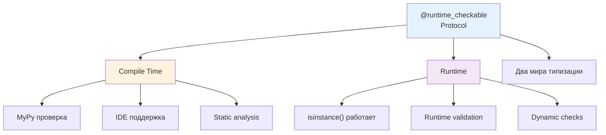

## 🎯 Условная типизация

### Type Guards и сужение типов

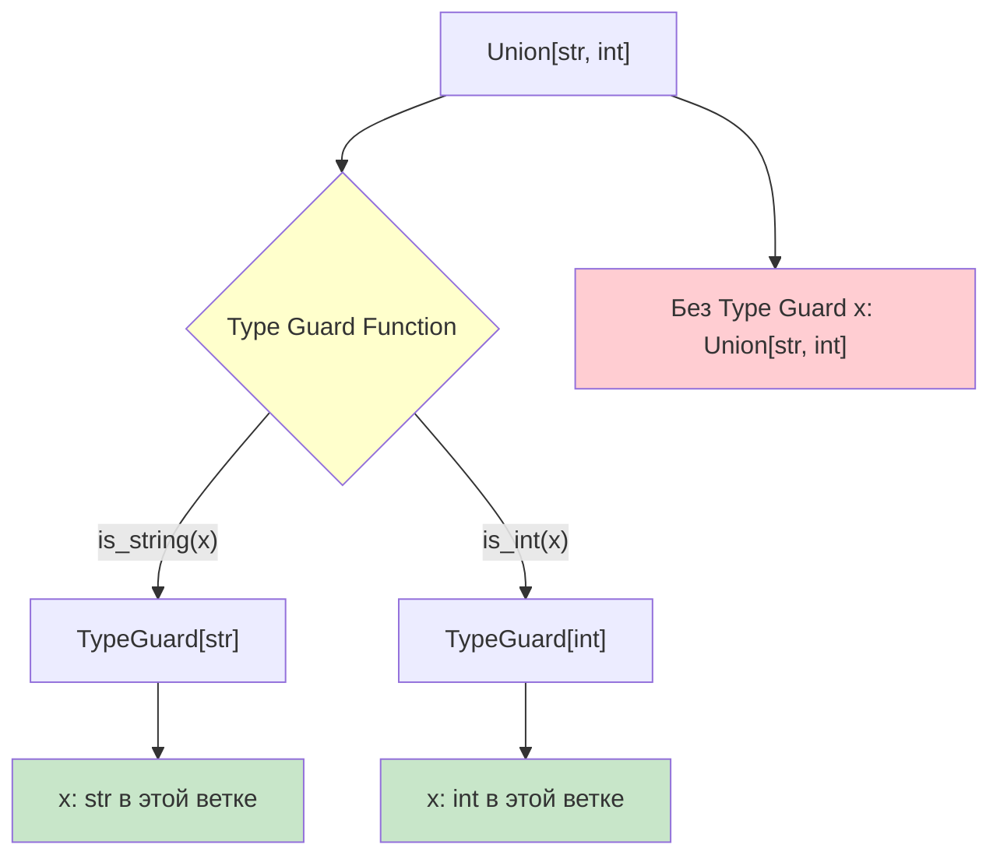

### Overload и множественные сигнатуры

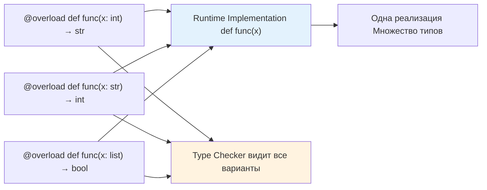

## 📦 Интеграция с Pydantic

### Pydantic модели и типизация

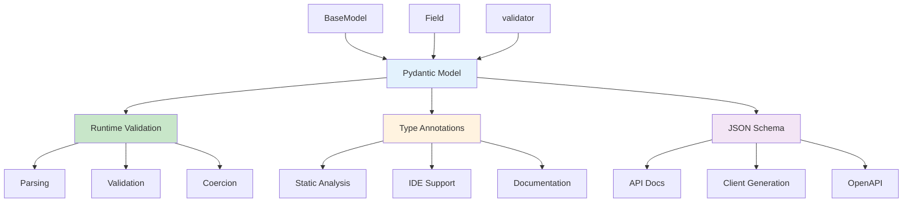

### Валидация и типы

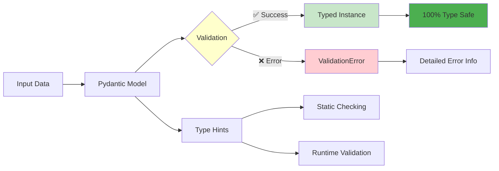

## 🚀 Продвинутые Generic типы

### Сложные Generic конструкции

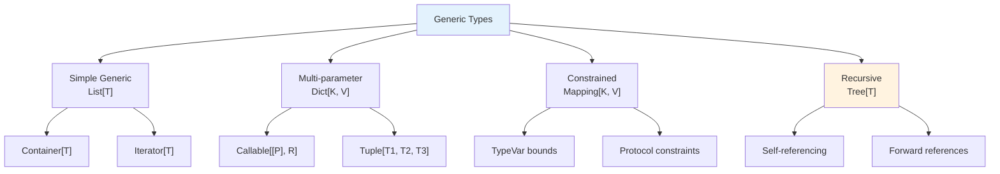

### Generic классы в действии

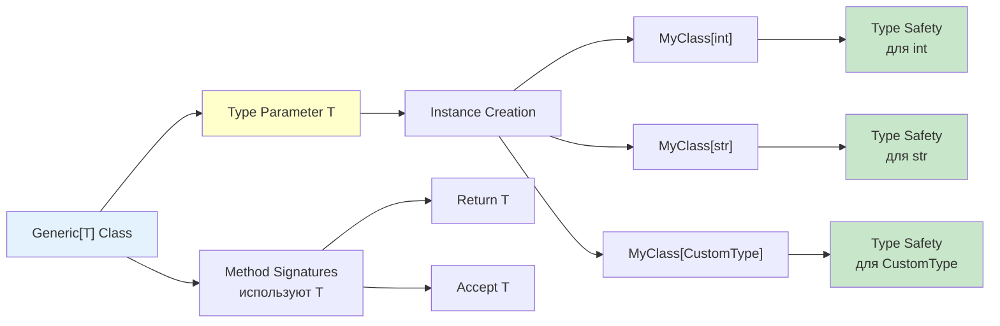

## 🔍 Static Analysis Tools

### Экосистема инструментов

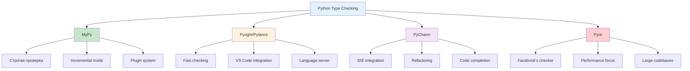

### Настройка и конфигурация

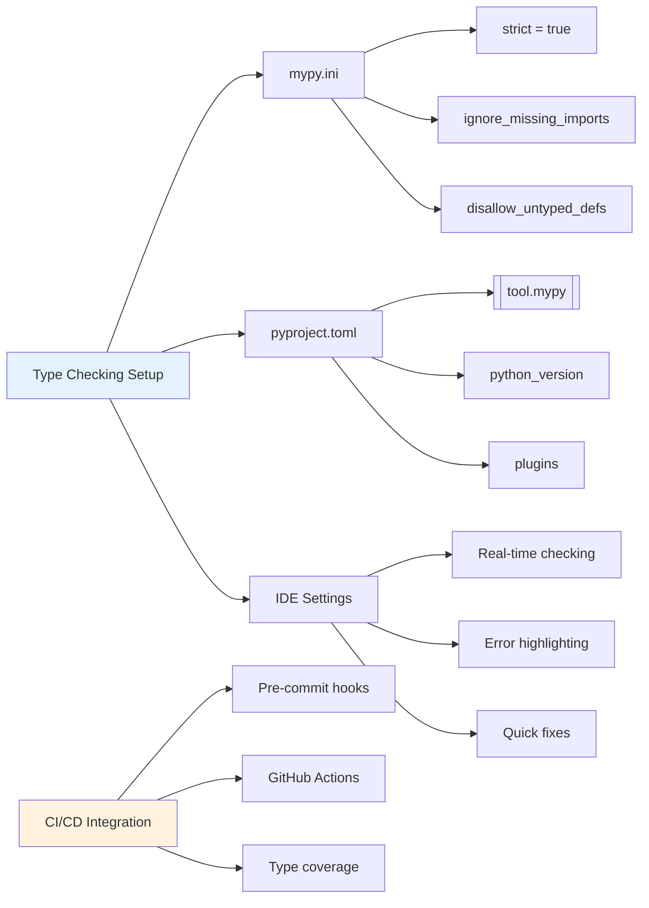

## 📈 Прогрессивная типизация

### Стратегия внедрения типов

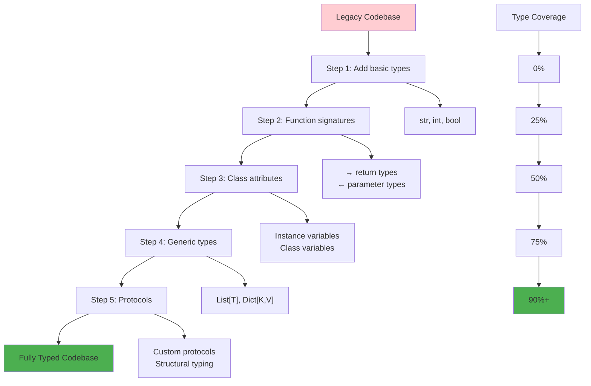

Эти диаграммы показывают полную картину продвинутой типизации в Python, от базовых концепций до сложных паттернов и инструментов. 