# Диаграммы: Современный Python (3.8+)

## 🎯 Эволюция современного Python

### Timeline новых возможностей

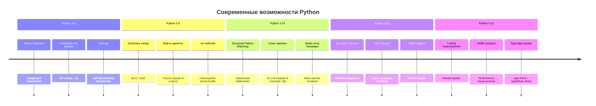

## 🎯 Walrus Operator (:=)

### Применение в различных конструкциях

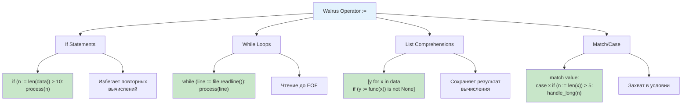

### Производительность и читаемость

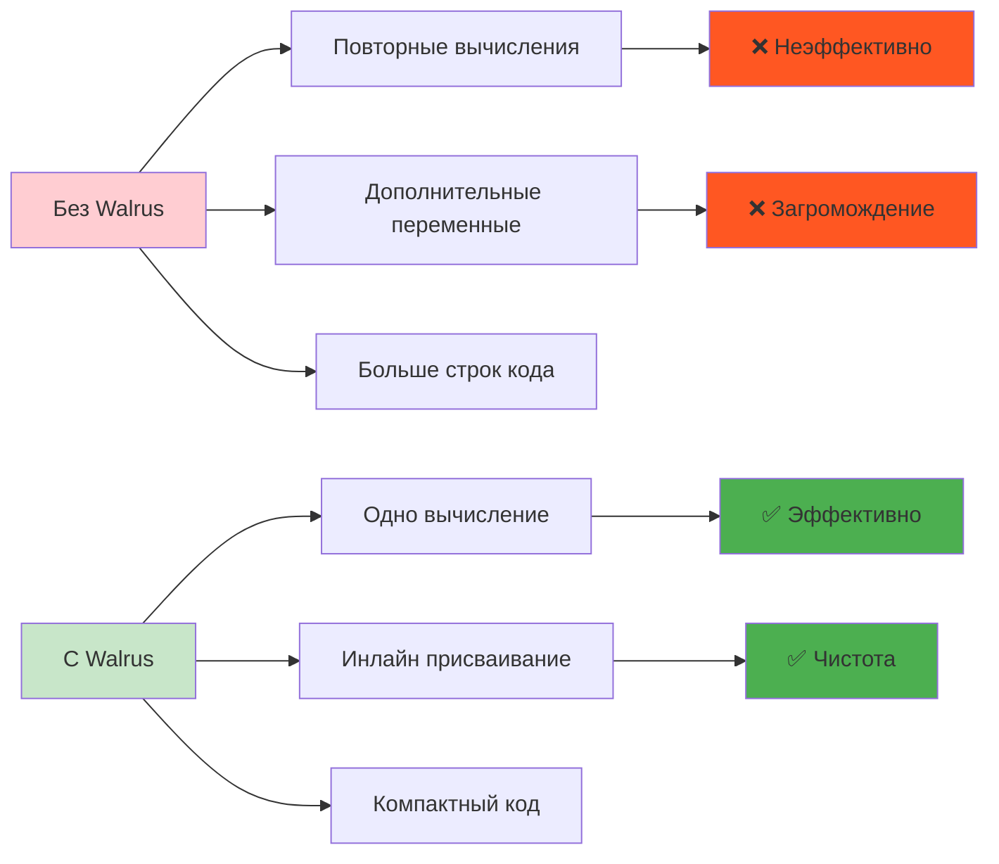

## 🔄 Structural Pattern Matching

### Архитектура match/case

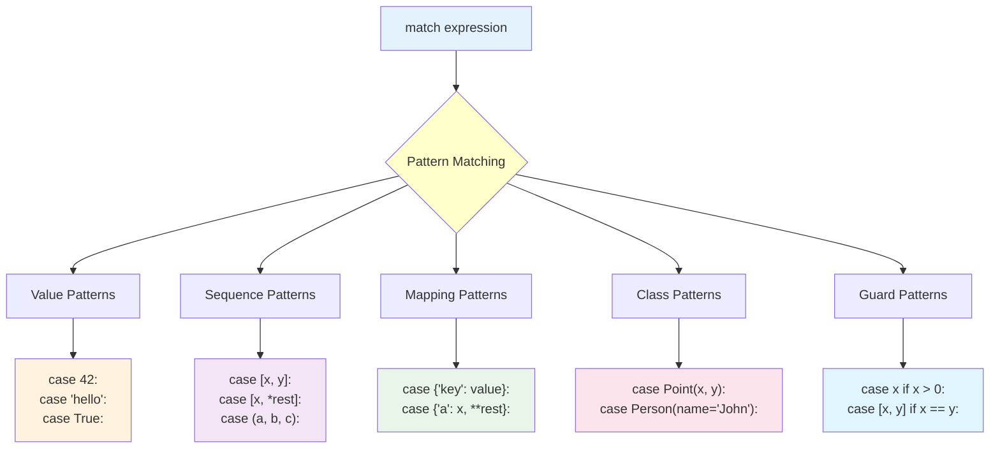

### Сравнение с if/elif

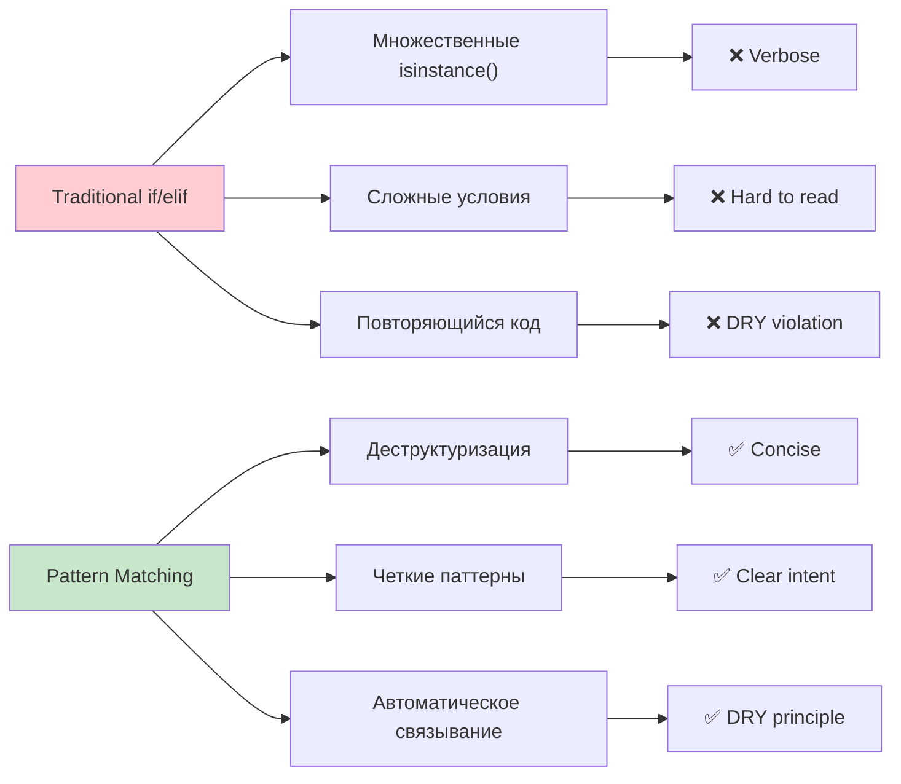

### Практические паттерны

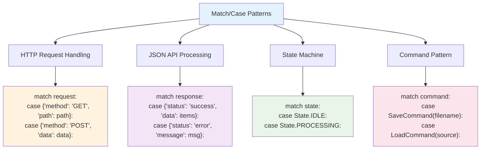

## 📍 Positional-Only Parameters

### Синтаксис и применение

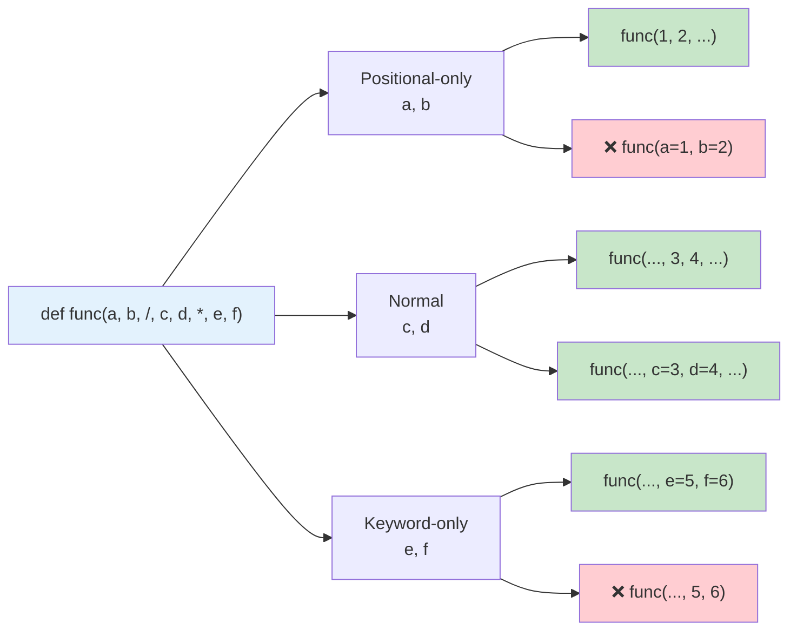

### Преимущества для API дизайна

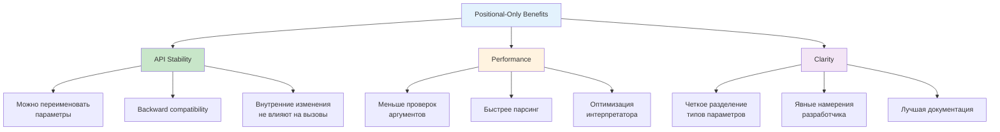

## 📝 Улучшения f-strings

### Новые возможности отладки

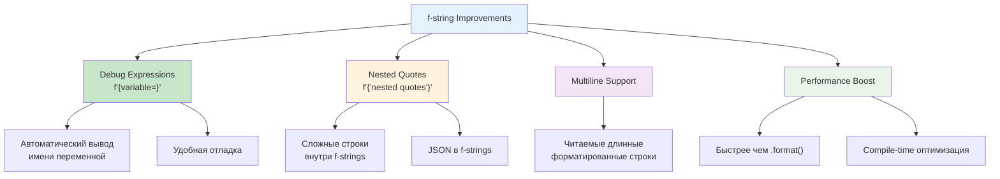

## 🔧 Операторы слияния словарей

### Dictionary merge operators

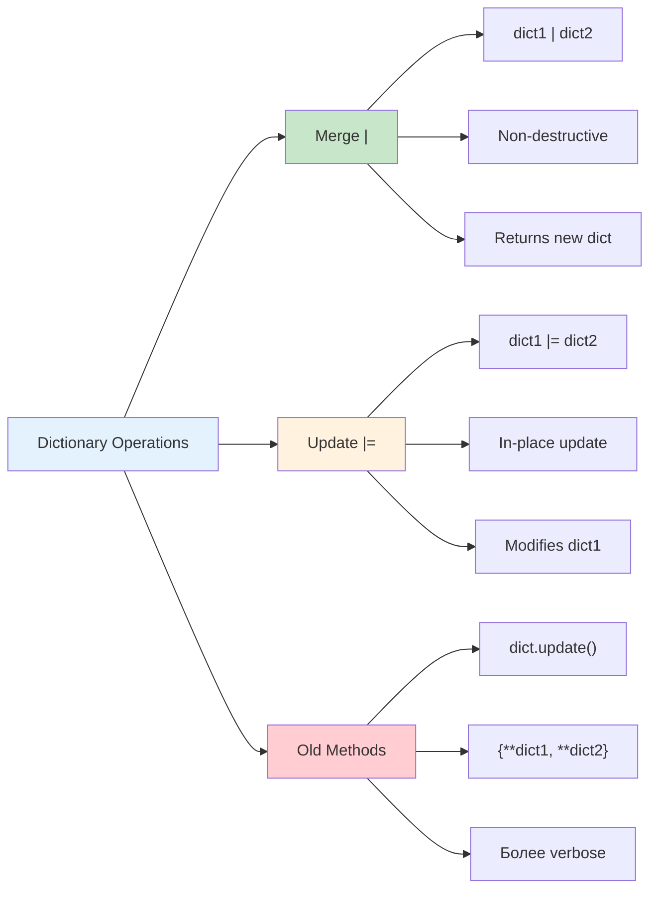

### Производительность операций

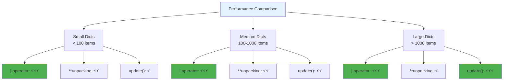

## 🏗️ Новые встроенные generics

### Упрощение типизации

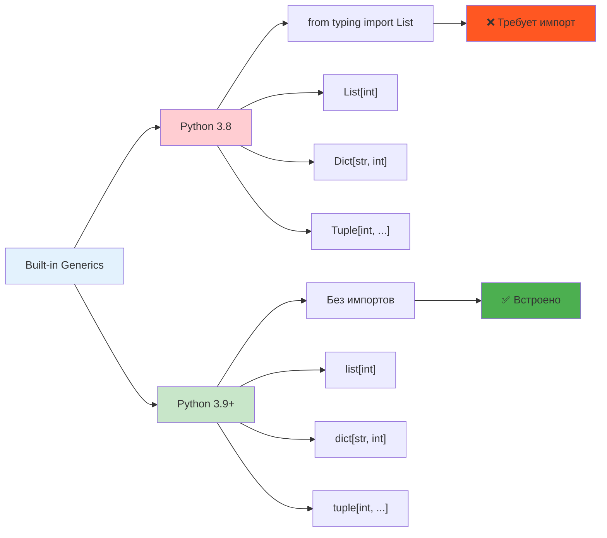

## ⚡ functools улучшения

### Новые возможности functools

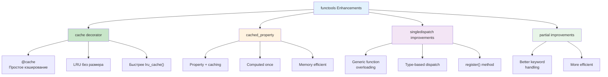

## 🎯 Практические применения

### Современные паттерны

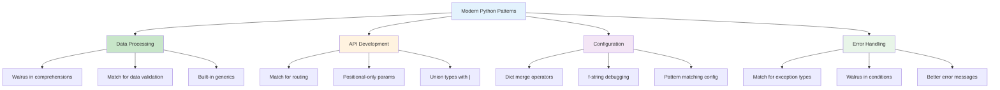

### Миграция на современный Python

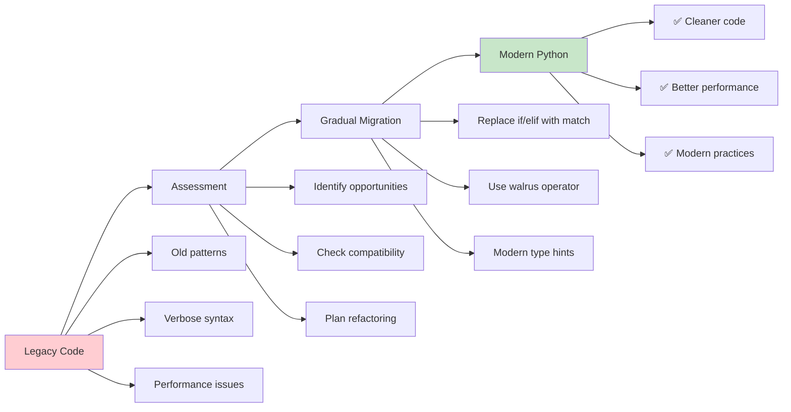

Эти диаграммы показывают все современные возможности Python и их практическое применение. 