# Диаграммы: Веб-разработка на Python

## 🌐 Архитектура веб-приложений

### Общая архитектура веб-приложения

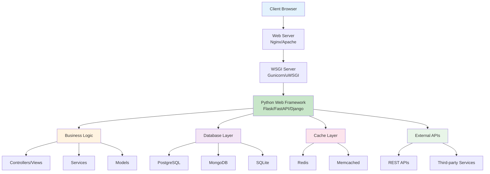

### MVC vs MVP vs MVVM паттерны

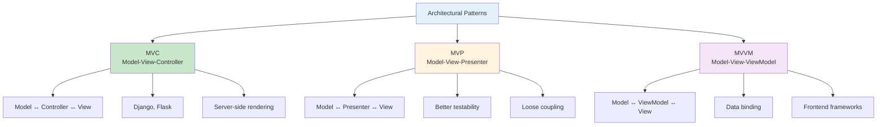

## 🚀 Flask Framework

### Flask архитектура и компоненты

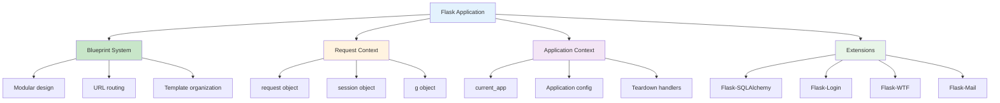

### Flask Request Lifecycle

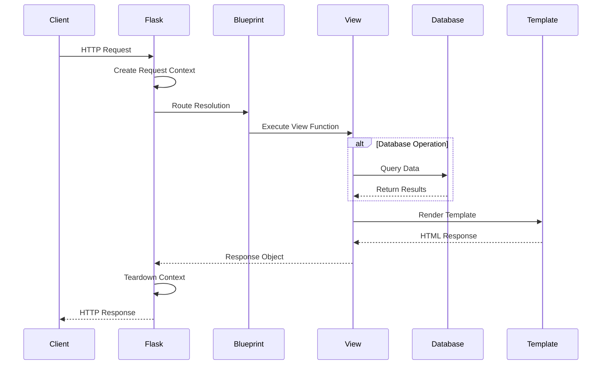

### Flask vs FastAPI сравнение

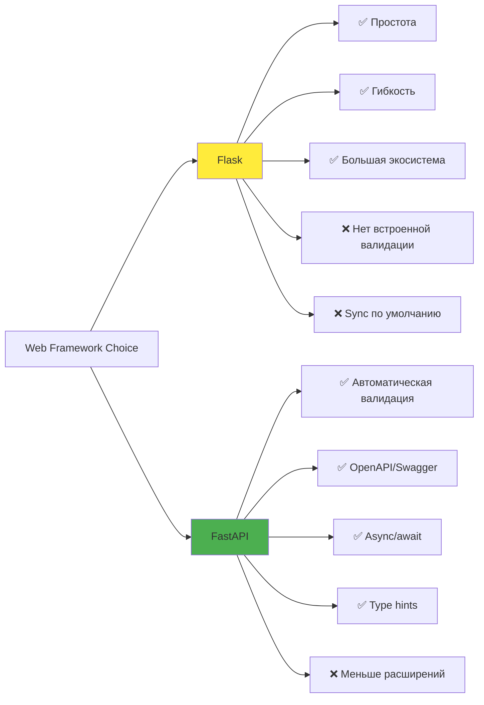

## ⚡ FastAPI Framework

### FastAPI архитектура

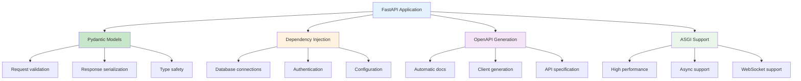

### FastAPI Request Processing

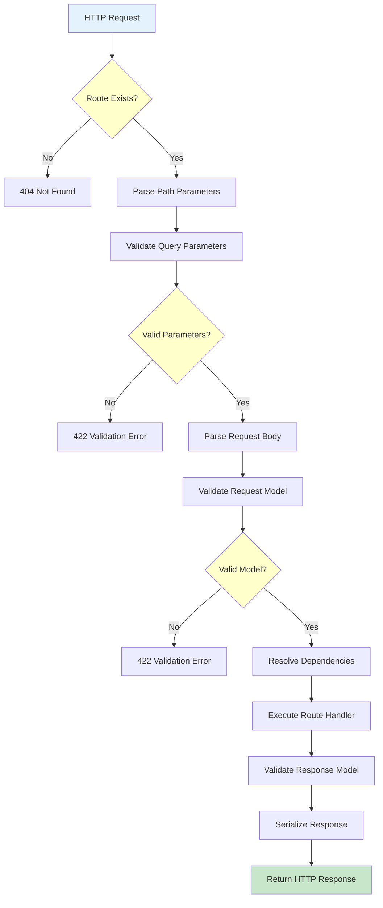

## 🌐 HTTP Protocol

### HTTP Request/Response Flow

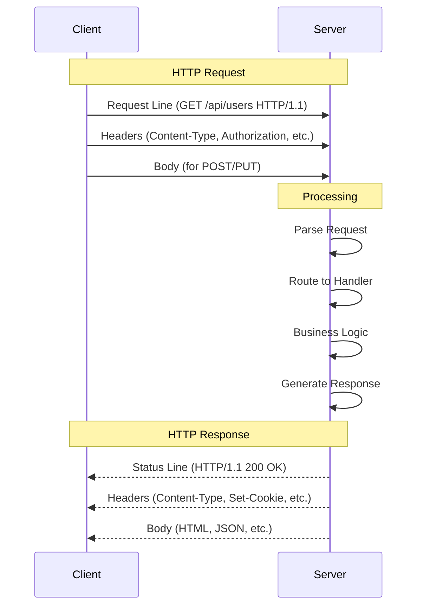

### HTTP Status Codes

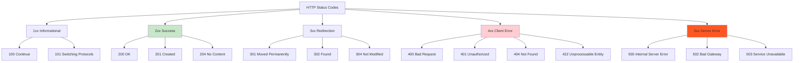

## 🕷️ Web Scraping

### Web Scraping Architecture

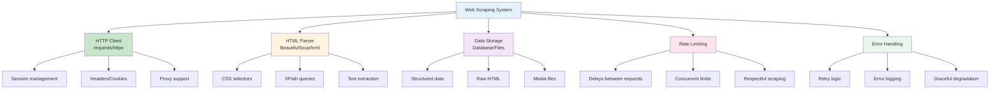

### Beautiful Soup селекторы

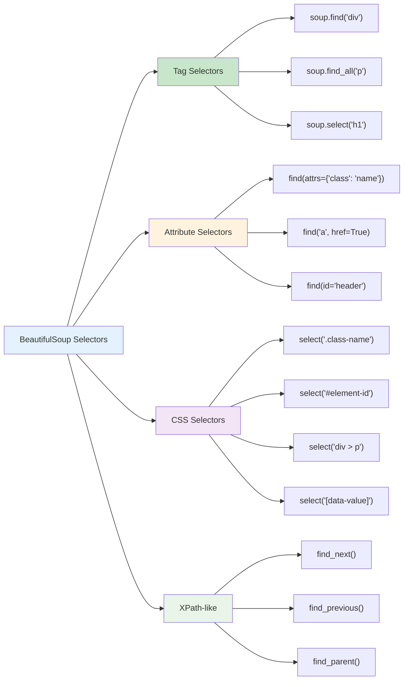

## 🔗 WebSocket Communication

### WebSocket vs HTTP

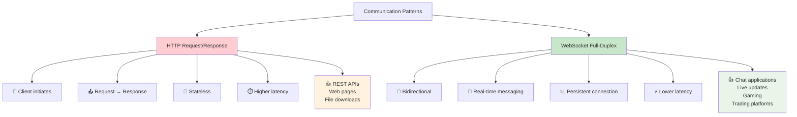

### WebSocket Lifecycle

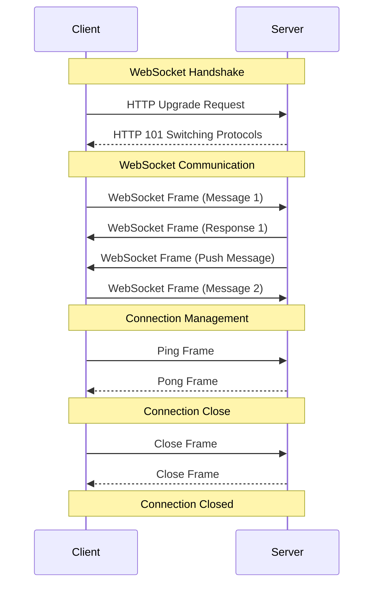

## 🚀 Deployment Strategies

### Deployment архитектура

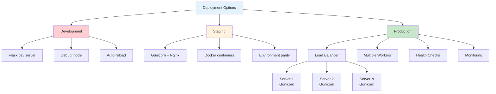

### Container Deployment

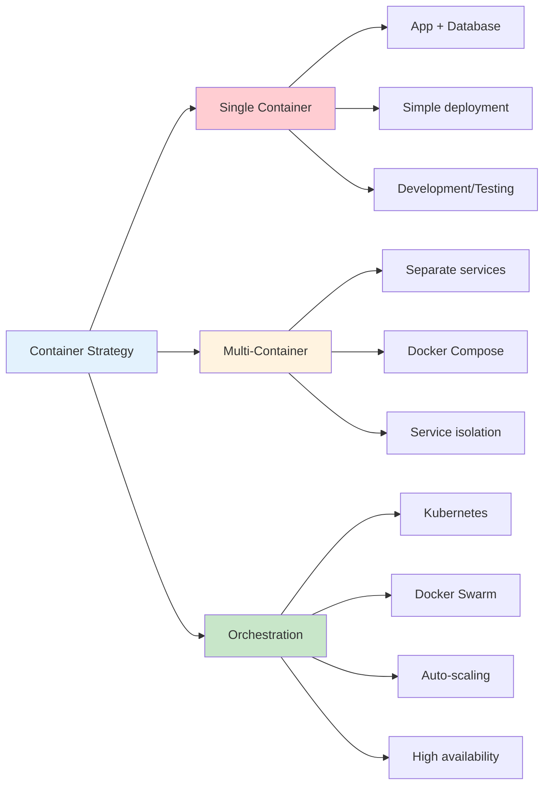

## 📊 Performance Optimization

### Web Application Performance

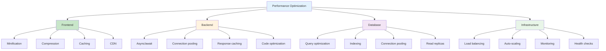

### Caching Strategies

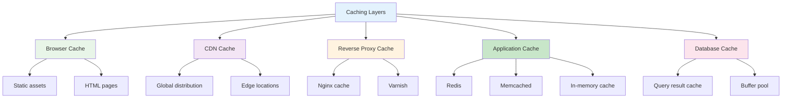

Эти диаграммы охватывают все аспекты веб-разработки на Python от архитектуры до развертывания. 