# Диаграммы: Базы данных в Python

## 🗄️ Архитектура работы с базами данных

### Слои доступа к данным

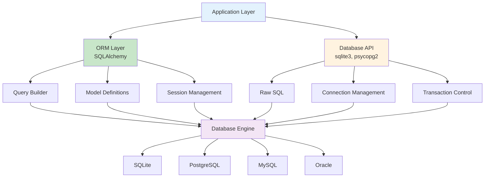

### Database Abstraction Layers

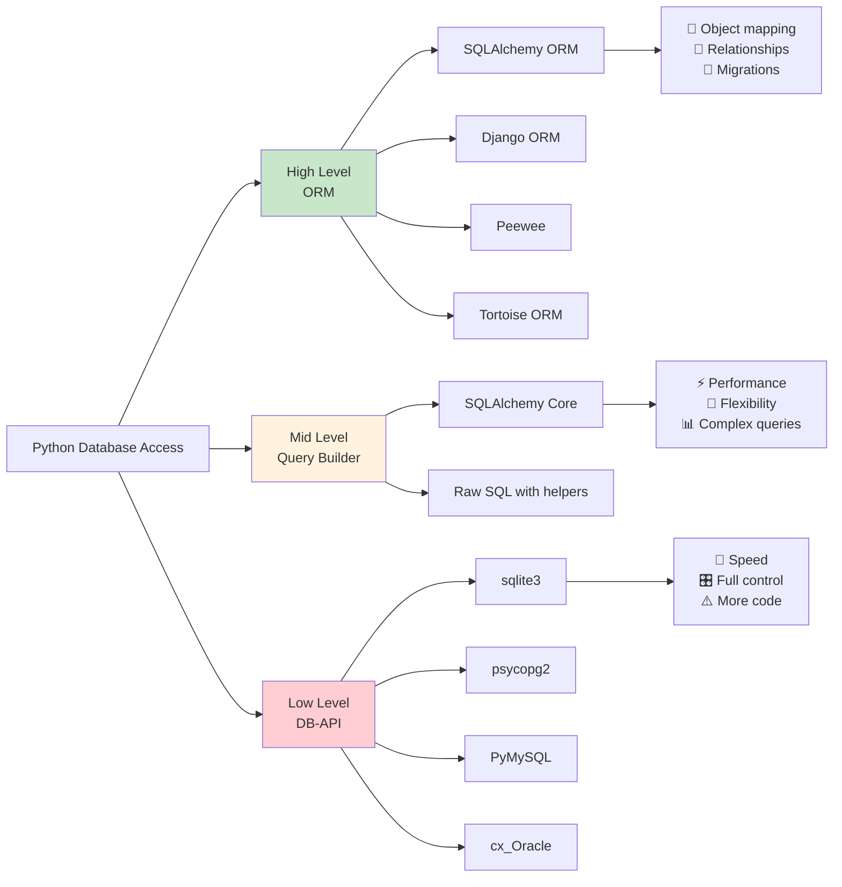

## 🗃️ SQLite Architecture

### SQLite внутренняя архитектура

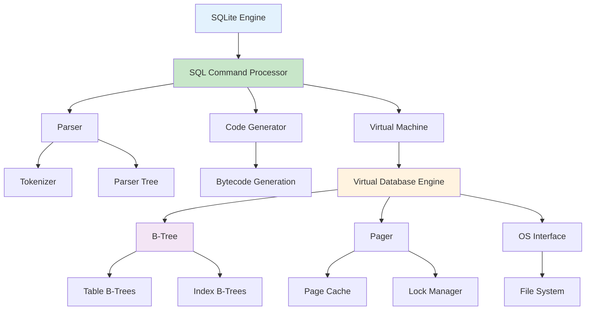

### SQLite vs Server Databases

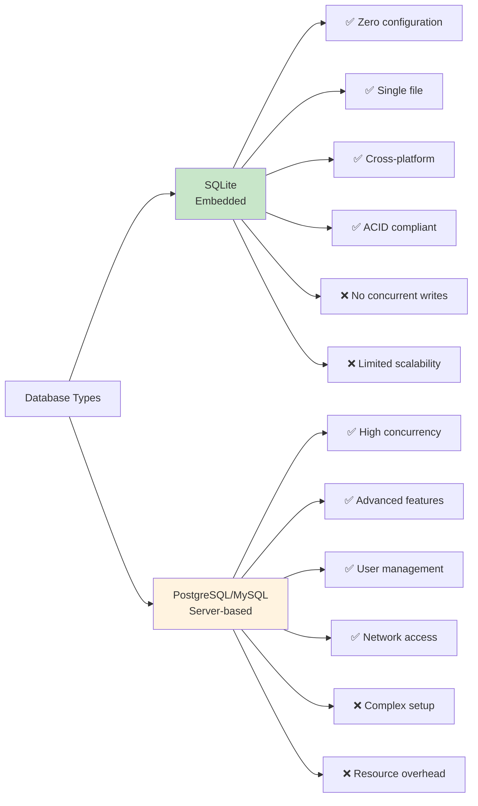

## 🏛️ SQLAlchemy ORM

### SQLAlchemy Architecture

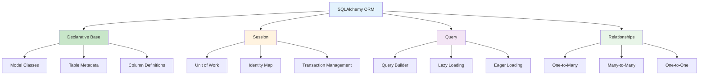

### SQLAlchemy Session Lifecycle

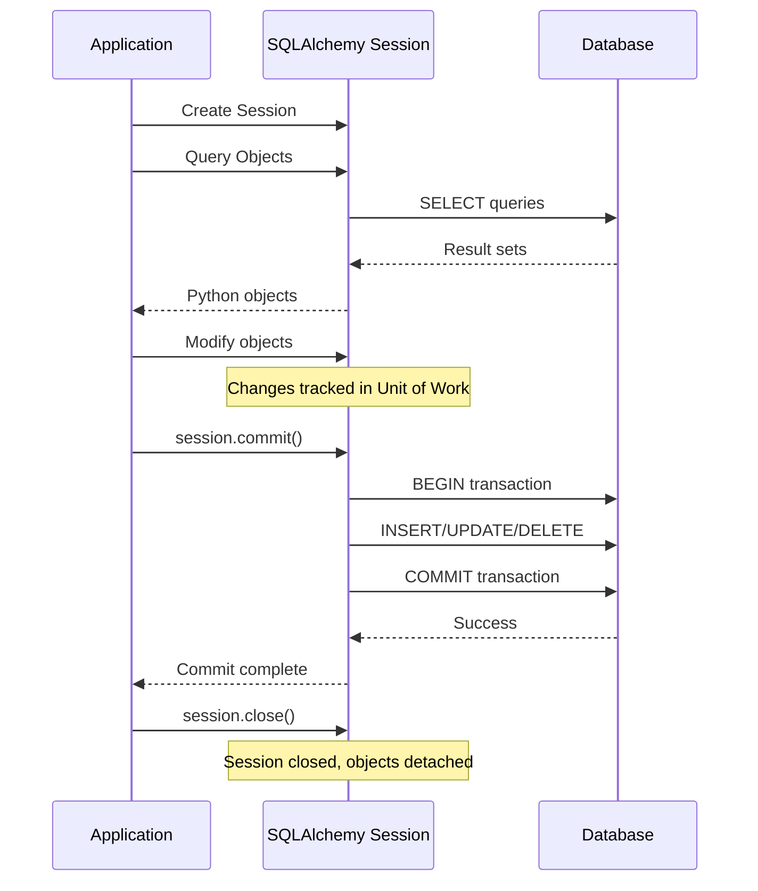

### ORM Relationships

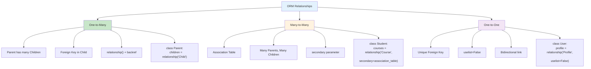

## 🔄 Транзакции и ACID

### ACID Properties

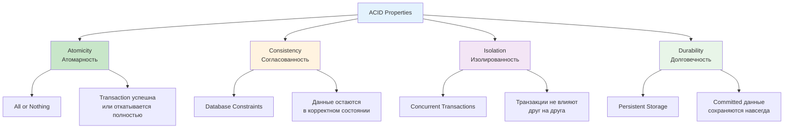

### Transaction Isolation Levels

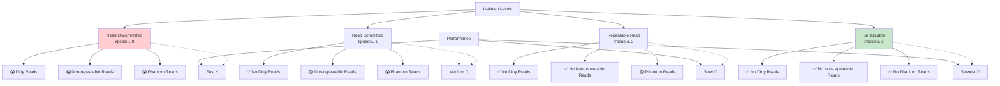

## 🏗️ Repository Pattern

### Repository Pattern Architecture

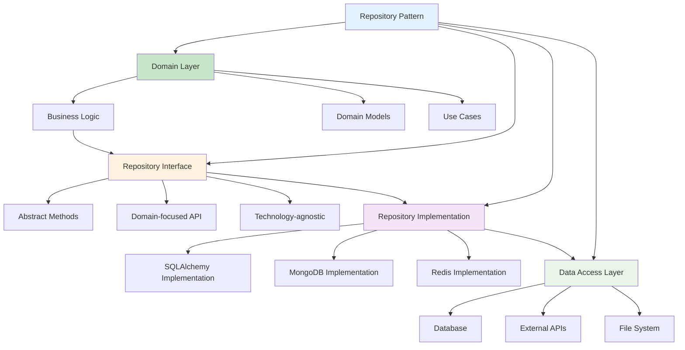

### Repository vs Active Record

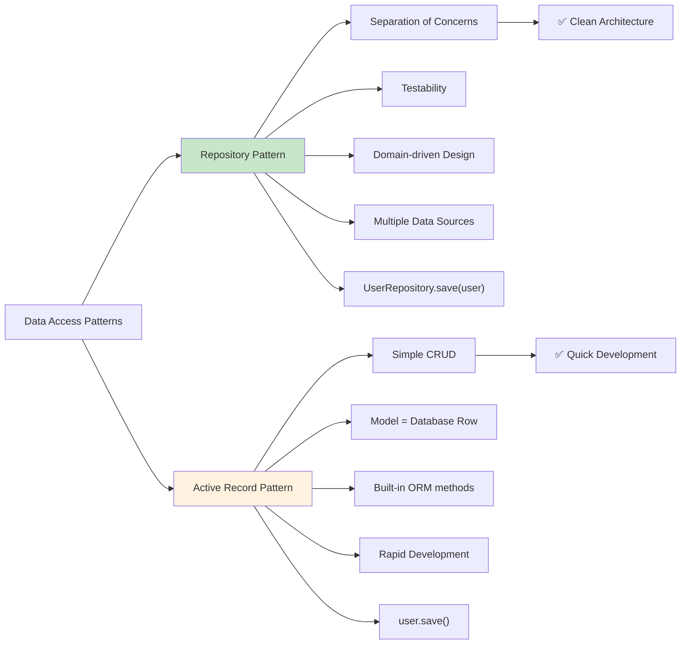

## 🔒 Database Security

### SQL Injection Prevention

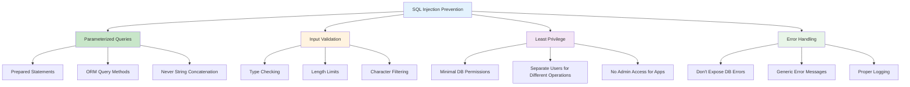

### Secure Database Connection

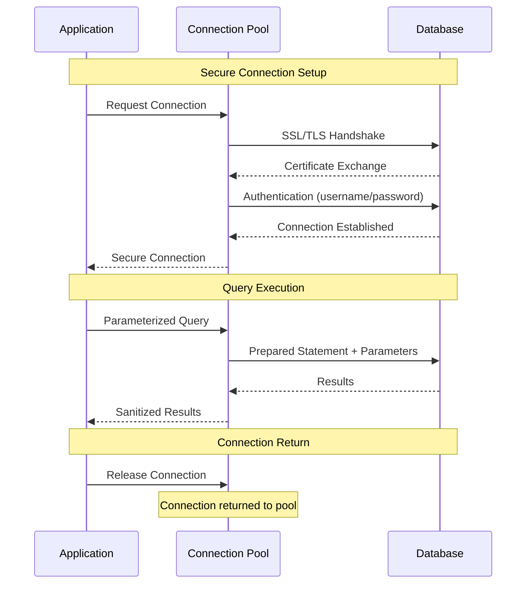

## 📊 Performance Optimization

### Database Performance Strategies

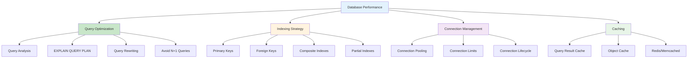

### Query Performance Analysis

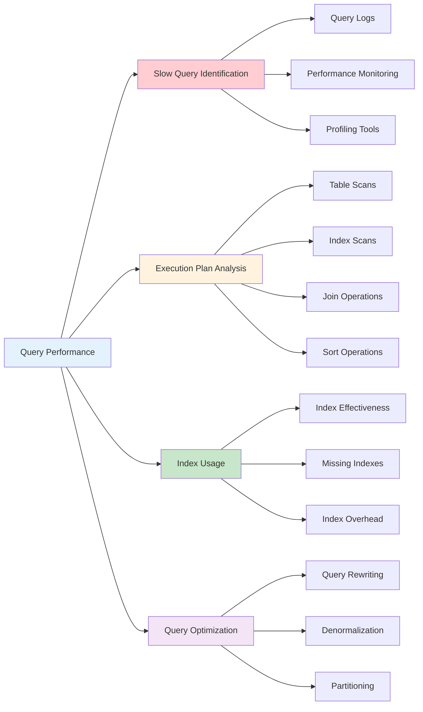

## 🔄 Database Migrations

### Migration Workflow

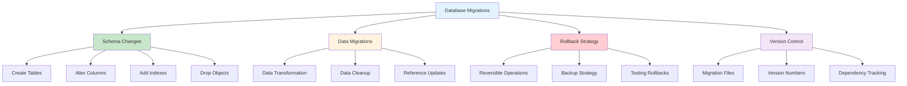

### Alembic Migration Flow

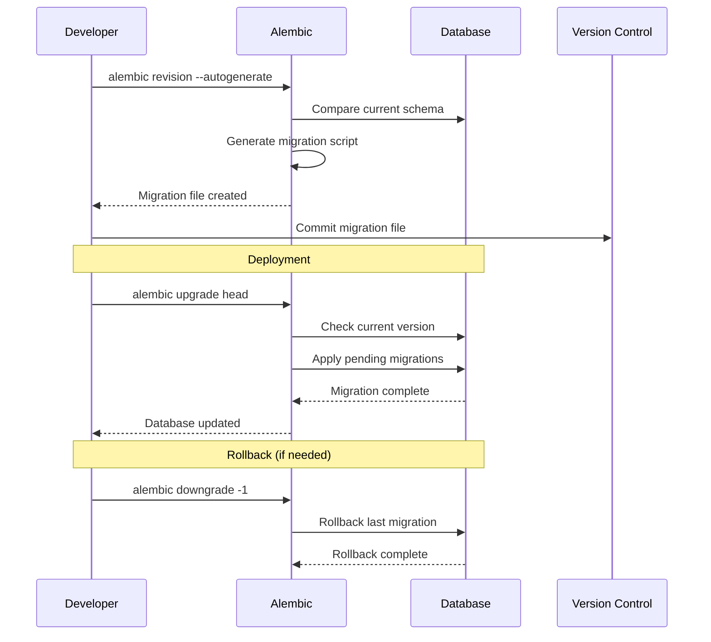

Эти диаграммы показывают полную картину работы с базами данных в Python от архитектуры до оптимизации производительности. 