# Диаграммы: Тестирование в Python

## 🧪 Архитектура тестирования

### Пирамида тестирования

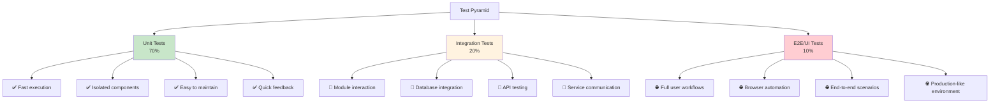

### Типы тестирования

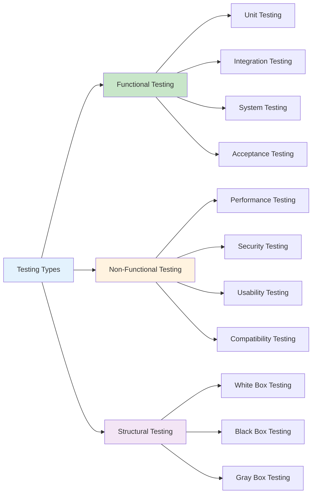

## 🏗️ Фреймворки тестирования Python

### unittest vs pytest сравнение

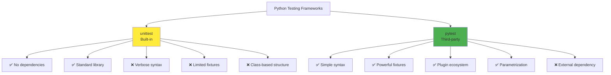

### pytest архитектура

```mermaid
graph TD
    A[pytest Framework] --> B[Test Discovery]
    A --> C[Test Execution]
    A --> D[Fixtures System]
    A --> E[Plugin System]
    A --> F[Reporting]
    
    B --> B1[test_*.py files]
    B --> B2[*_test.py files]
    B --> B3[Test* classes]
    B --> B4[test_* functions]
    
    C --> C1[Setup/Teardown]
    C --> C2[Parallel execution]
    C --> C3[Selective running]
    C --> C4[Failure handling]
    
    D --> D1[Function scope]
    D --> D2[Class scope]
    D --> D3[Module scope]
    D --> D4[Session scope]
    
    E --> E1[pytest-cov]
    E --> E2[pytest-mock]
    E --> E3[pytest-xdist]
    E --> E4[pytest-django]
    
    F --> F1[Console output]
    F --> F2[HTML reports]
    F --> F3[XML reports]
    F --> F4[Coverage reports]
    
    style A fill:#e3f2fd
    style D fill:#c8e6c9
    style E fill:#fff3e0
    style F fill:#f3e5f5
```

## 🔧 Fixtures и Setup/Teardown

### Жизненный цикл fixtures

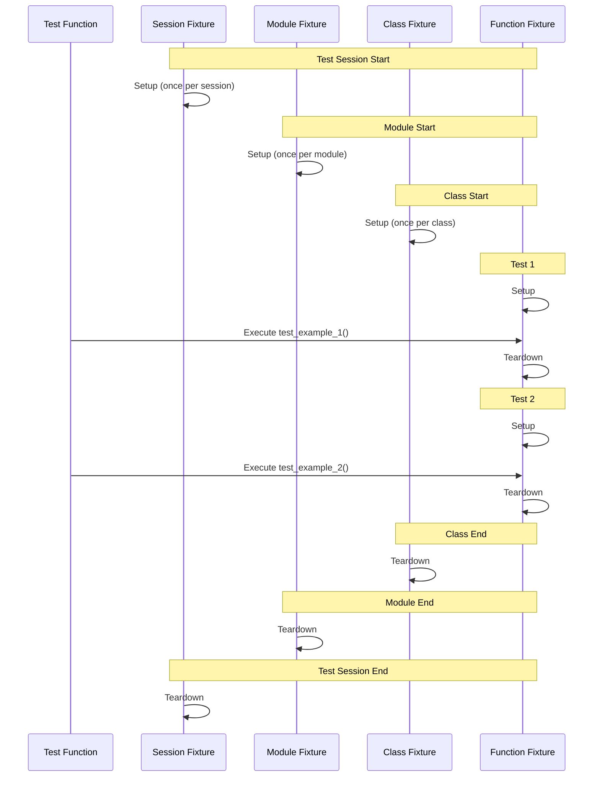

### Dependency Injection в pytest

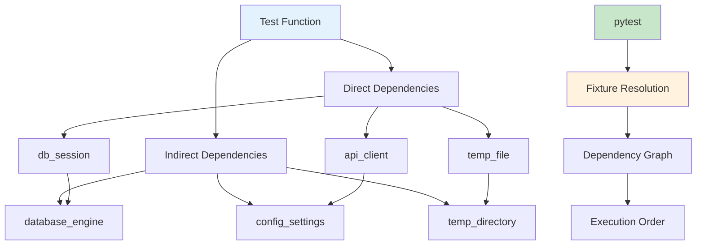

## 🎭 Mocking и Test Doubles

### Типы Test Doubles

```mermaid
graph TD
    A[Test Doubles] --> B[Dummy]
    A --> C[Fake]
    A --> D[Stub]
    A --> E[Spy]
    A --> F[Mock]
    
    B --> B1[Placeholder objects]
    B --> B2[No real implementation]
    B --> B3[Just to fill parameters]
    
    C --> C1[Working implementation]
    C --> C2[Simplified version]
    C --> C3[In-memory database]
    
    D --> D1[Predefined responses]
    D --> D2[Controlled behavior]
    D --> D3[Method return values]
    
    E --> E1[Records method calls]
    E --> E2[Verifies interactions]
    E --> E3[Partial real object]
    
    F --> F1[Full behavior simulation]
    F --> F2[Expectation verification]
    F --> F3[Complete replacement]
    
    style A fill:#e3f2fd
    style B fill:#ffcdd2
    style C fill:#fff3e0
    style D fill:#e8f5e8
    style E fill:#f3e5f5
    style F fill:#c8e6c9
```

### Mock объекты в Python

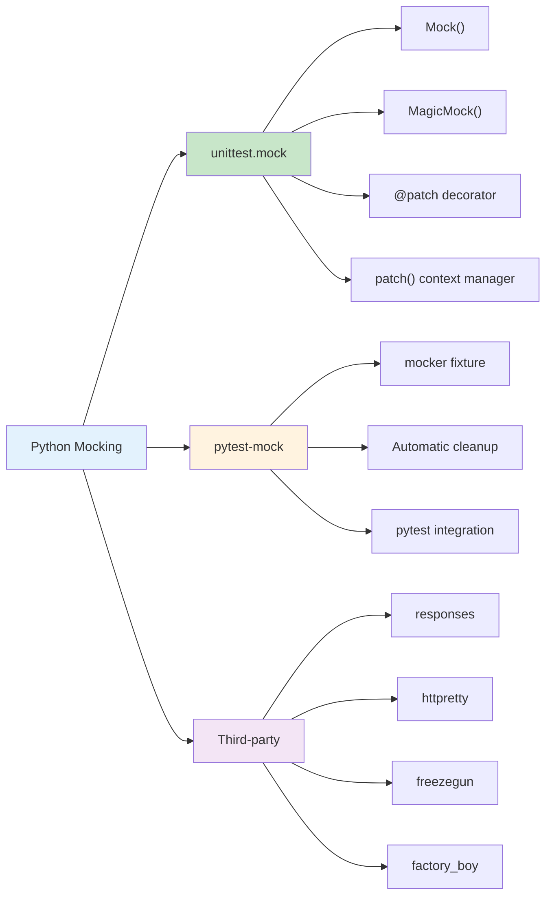

## 📊 Покрытие кода и метрики

### Типы покрытия кода

```mermaid
graph TD
    A[Code Coverage Types] --> B[Line Coverage]
    A --> C[Branch Coverage]
    A --> D[Function Coverage]
    A --> E[Statement Coverage]
    
    B --> B1[Executed lines / Total lines]
    B --> B2[Most common metric]
    B --> B3[Easy to measure]
    
    C --> C1[Executed branches / Total branches]
    C --> C2[if/else, loops, exceptions]
    C --> C3[More thorough than line coverage]
    
    D --> D1[Called functions / Total functions]
    D --> D2[Function-level granularity]
    D --> D3[API coverage verification]
    
    E --> E1[Executed statements / Total statements]
    E --> E2[Similar to line coverage]
    E --> E3[Language-specific]
    
    F[Coverage Quality] --> G[90-95%: Excellent]
    F --> H[80-90%: Good]
    F --> I[70-80%: Acceptable]
    F --> J[<70%: Needs improvement]
    
    style G fill:#4caf50
    style H fill:#8bc34a
    style I fill:#ffeb3b
    style J fill:#ff5722
```

### Coverage.py архитектура

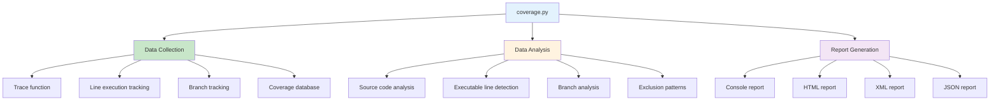

## 🚀 TDD и BDD методологии

### TDD цикл (Red-Green-Refactor)

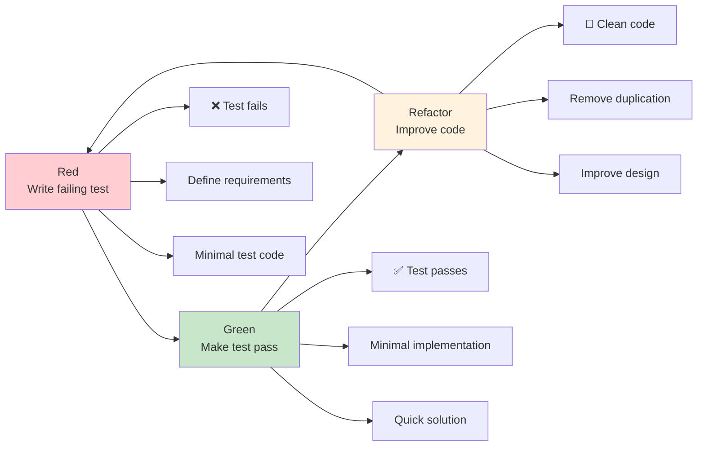

### BDD процесс (Behavior-Driven Development)

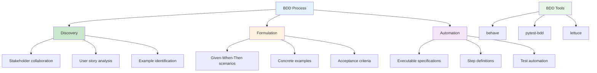

## 🔄 Параметризация и Data-Driven тестирование

### pytest параметризация

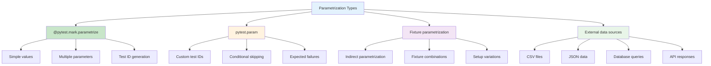

### Data-Driven Testing Flow

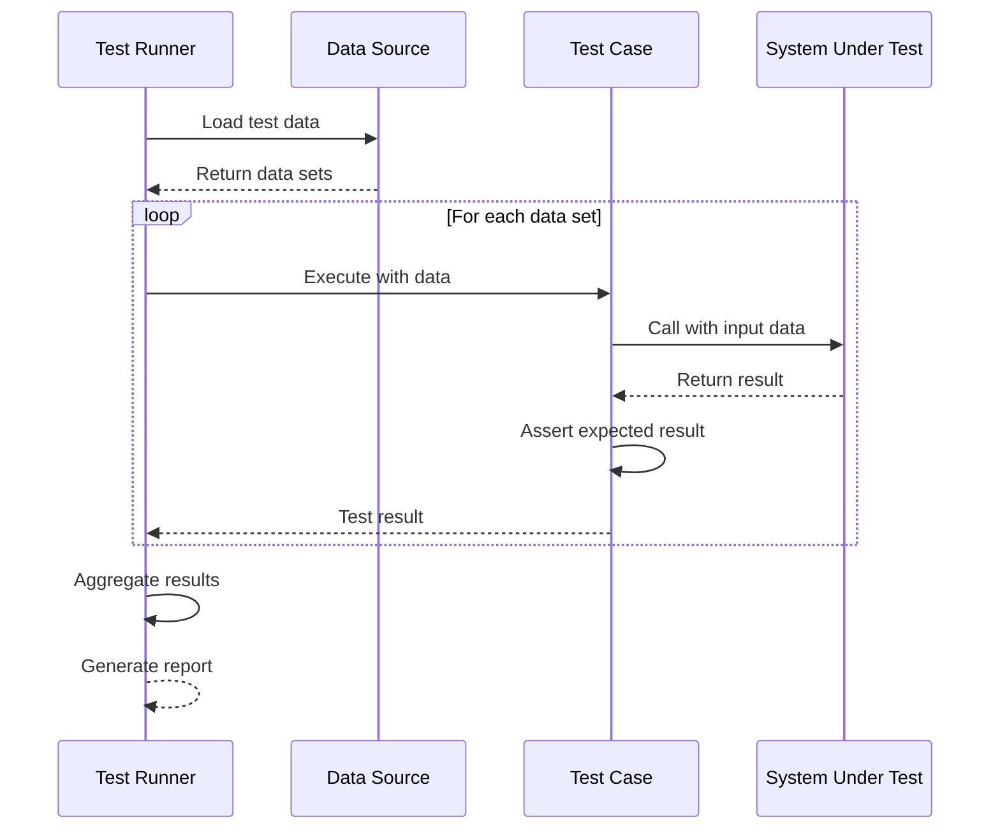

## 🏭 Integration и E2E тестирование

### Уровни интеграционного тестирования

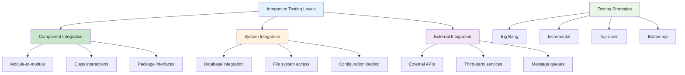

### E2E Testing Architecture

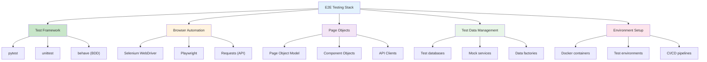

## 📈 Тестирование производительности

### Типы performance тестов

```mermaid
graph TD
    A[Performance Testing Types] --> B[Load Testing]
    A --> C[Stress Testing]
    A --> D[Volume Testing]
    A --> E[Spike Testing]
    A --> F[Endurance Testing]
    
    B --> B1[Normal expected load]
    B --> B2[Response time verification]
    B --> B3[Throughput measurement]
    
    C --> C1[Beyond normal capacity]
    C --> C2[Breaking point discovery]
    C --> C3[System stability under stress]
    
    D --> D1[Large amounts of data]
    D --> D2[Database performance]
    D --> D3[Memory usage]
    
    E --> E1[Sudden load increases]
    E --> E2[Auto-scaling testing]
    E --> E3[Traffic spikes]
    
    F --> F1[Extended periods]
    F --> F2[Memory leaks detection]
    F --> F3[Long-term stability]
    
    style A fill:#e3f2fd
    style B fill:#c8e6c9
    style C fill:#ffcdd2
    style D fill:#fff3e0
    style E fill:#f3e5f5
    style F fill:#e8f5e8
```

### Performance Testing Tools

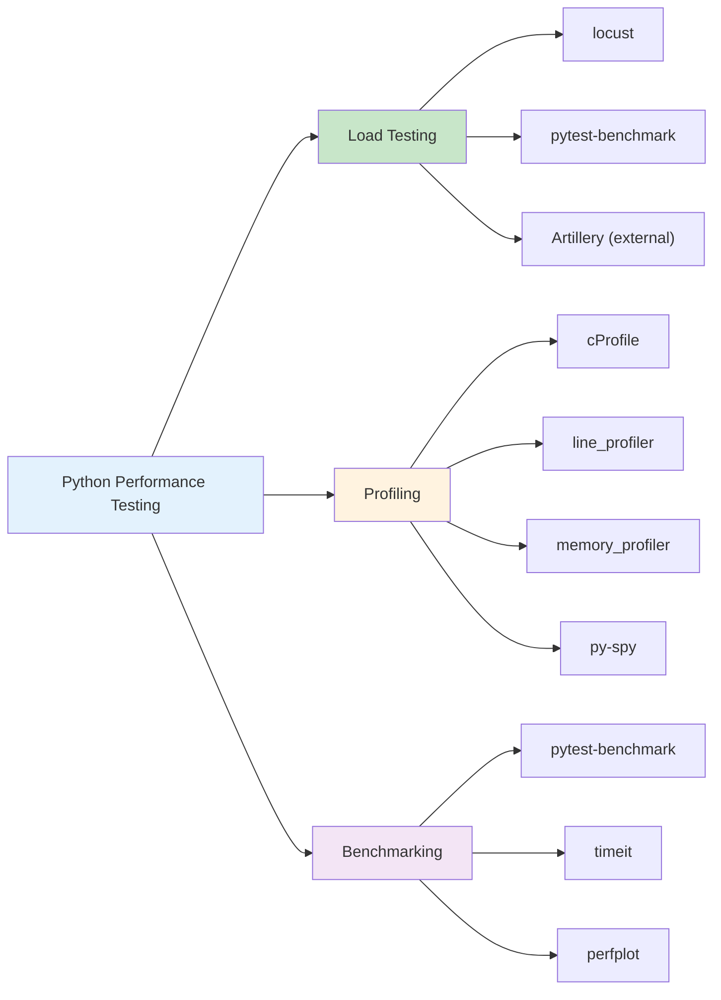

## 🔧 CI/CD и автоматизация тестирования

### CI/CD Testing Pipeline

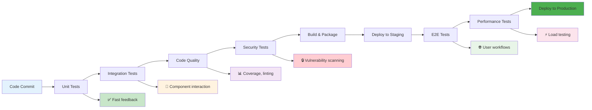

### Test Automation Pyramid в CI/CD

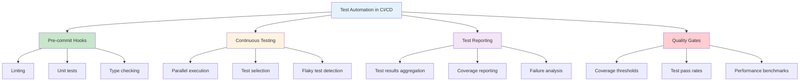

Эти диаграммы показывают полную картину тестирования в Python от базовых концепций до продвинутых техник и интеграции с CI/CD. 