# Диаграммы: Пакетирование и развертывание Python

## 📦 Управление зависимостями

### Эволюция управления пакетами в Python

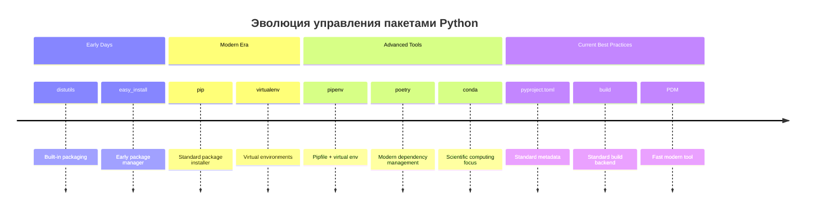

### Сравнение инструментов управления зависимостями

```mermaid
graph TD
    A[Python Dependency Management] --> B[pip + venv]
    A --> C[pipenv]
    A --> D[poetry]
    A --> E[conda]
    A --> F[PDM]
    
    B --> B1[✅ Standard library]
    B --> B2[✅ Lightweight]
    B --> B3[❌ Manual workflow]
    B --> B4[❌ No lock file]
    
    C --> C1[✅ Pipfile format]
    C --> C2[✅ Lock file support]
    C --> C3[❌ Slower performance]
    C --> C4[❌ Less active development]
    
    D --> D1[✅ Modern pyproject.toml]
    D --> D2[✅ Dependency resolution]
    D --> D3[✅ Build system]
    D --> D4[❌ Learning curve]
    
    E --> E1[✅ Scientific packages]
    E --> E2[✅ Cross-platform]
    E --> E3[❌ Large installation]
    E --> E4[❌ Not Python-specific]
    
    F --> F1[✅ Fast performance]
    F --> F2[✅ PEP 582 support]
    F --> F3[❌ Newer tool]
    F --> F4[❌ Smaller ecosystem]
    
    style D fill:#4caf50
    style B fill:#ffeb3b
    style C fill:#ff9800
    style E fill:#2196f3
    style F fill:#9c27b0
```

## 🏗️ Структура Python пакетов

### Анатомия Python пакета

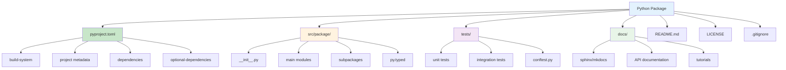

### pyproject.toml vs setup.py

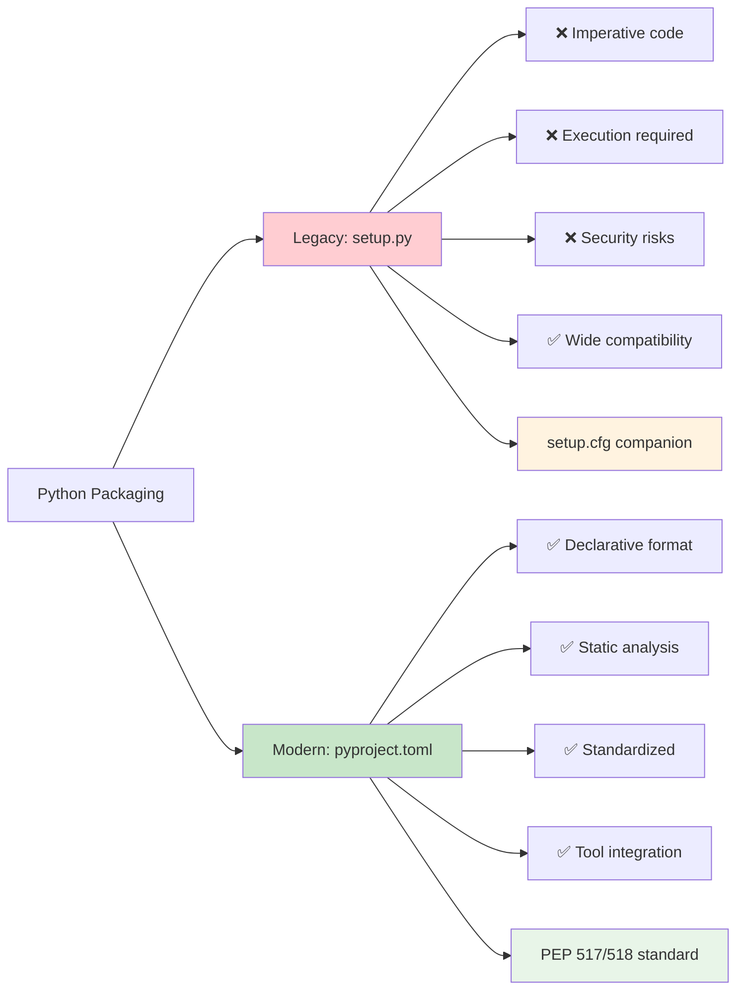

## 🐳 Контейнеризация с Docker

### Docker архитектура для Python

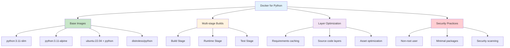

### Multi-stage Docker Build

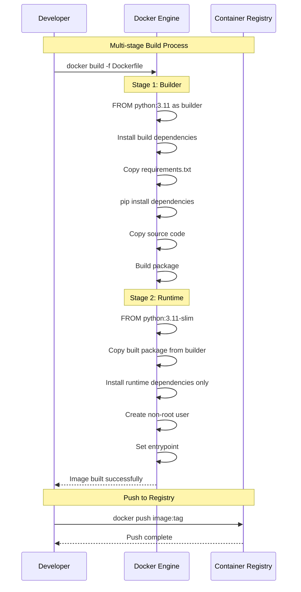

### Docker Compose для разработки

```mermaid
graph TD
    A[Docker Compose Stack] --> B[Web Service]
    A --> C[Database Service]
    A --> D[Redis Service]
    A --> E[Worker Service]
    A --> F[Nginx Service]
    
    B --> B1[Python app container]
    B --> B2[Volume mounts]
    B --> B3[Environment variables]
    B --> B4[Port mapping]
    
    C --> C1[PostgreSQL/MySQL]
    C --> C2[Data persistence]
    C --> C3[Initialization scripts]
    
    D --> D1[Caching layer]
    D --> D2[Session storage]
    D --> D3[Task queue]
    
    E --> E1[Celery workers]
    E --> E2[Background tasks]
    E --> E3[Shared volumes]
    
    F --> F1[Reverse proxy]
    F --> F2[Load balancing]
    F --> F3[SSL termination]
    
    style A fill:#e3f2fd
    style B fill:#c8e6c9
    style C fill:#fff3e0
    style D fill:#f3e5f5
    style E fill:#e8f5e8
    style F fill:#fce4ec
```

## 🚀 Стратегии развертывания

### Deployment Strategies

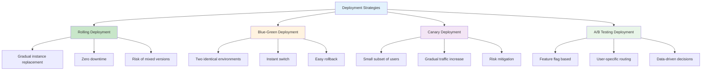

### Deployment Environments Pipeline

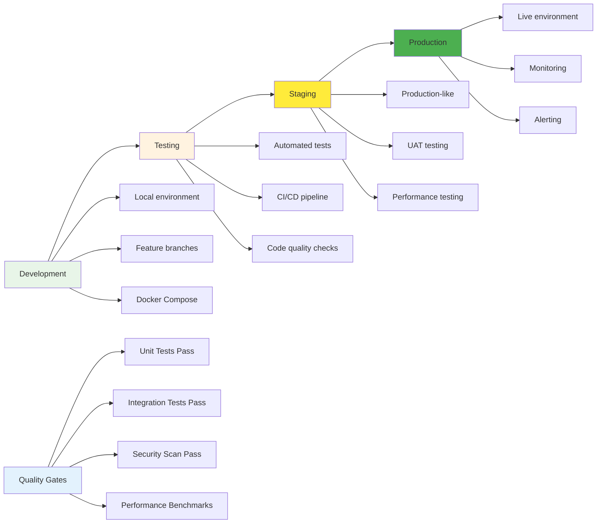

## ☁️ Cloud Deployment

### Cloud Platforms для Python

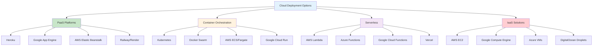

### Kubernetes для Python приложений

```mermaid
graph TD
    A[Kubernetes Python App] --> B[Deployment]
    A --> C[Service]
    A --> D[ConfigMap]
    A --> E[Secret]
    A --> F[Ingress]
    A --> G[HPA]
    
    B --> B1[ReplicaSet]
    B --> B2[Pod Template]
    B --> B3[Rolling Update Strategy]
    
    C --> C1[ClusterIP]
    C --> C2[Load Balancing]
    C --> C3[Service Discovery]
    
    D --> D1[Environment Variables]
    D --> D2[Configuration Files]
    D --> D3[Feature Flags]
    
    E --> E1[Database Credentials]
    E --> E2[API Keys]
    E --> E3[SSL Certificates]
    
    F --> F1[External Access]
    F --> F2[SSL Termination]
    F --> F3[Path-based Routing]
    
    G --> G1[CPU-based Scaling]
    G --> G2[Memory-based Scaling]
    G --> G3[Custom Metrics]
    
    style A fill:#e3f2fd
    style B fill:#c8e6c9
    style C fill:#fff3e0
    style D fill:#f3e5f5
    style E fill:#ffcdd2
    style F fill:#e8f5e8
    style G fill:#fce4ec
```

## 🔄 CI/CD Pipelines

### GitHub Actions для Python

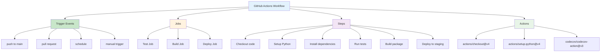

### CI/CD Pipeline Flow

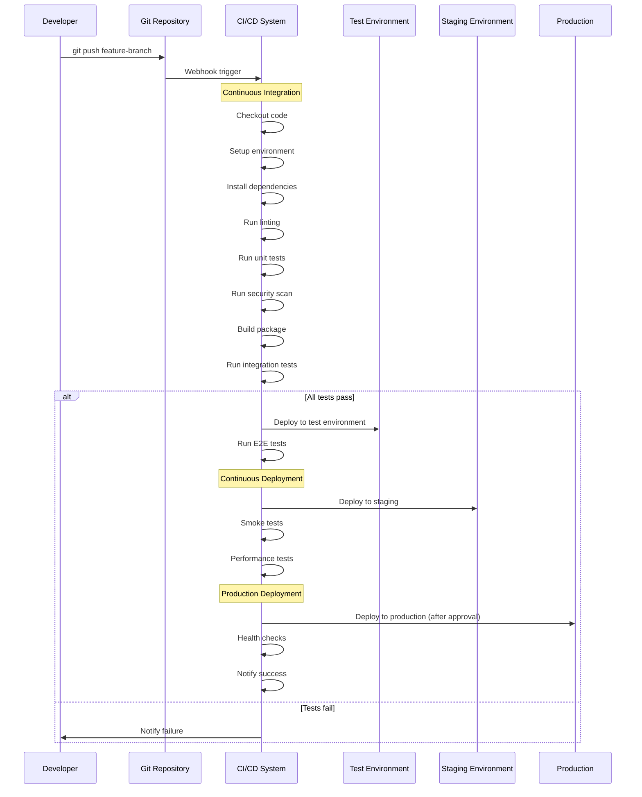

## 📊 Мониторинг и наблюдаемость

### Observability Stack

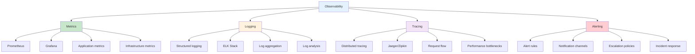

### Application Performance Monitoring

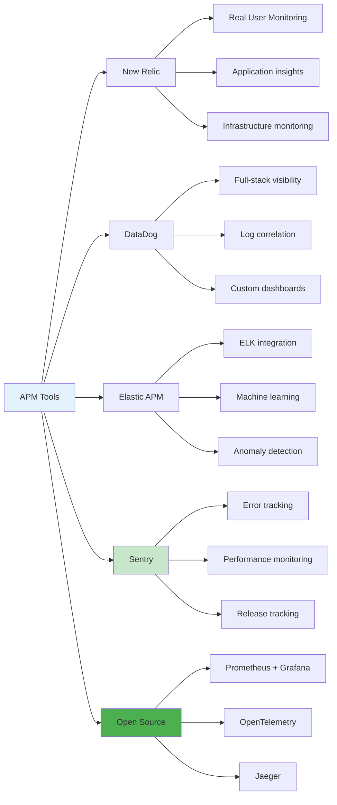

## 🔐 Security в развертывании

### Security Best Practices

```mermaid
graph TD
    A[Deployment Security] --> B[Container Security]
    A --> C[Secrets Management]
    A --> D[Network Security]
    A --> E[Access Control]
    A --> F[Compliance]
    
    B --> B1[Vulnerability scanning]
    B --> B2[Minimal base images]
    B --> B3[Non-root users]
    B --> B4[Read-only filesystems]
    
    C --> C1[Environment variables]
    C --> C2[External secret stores]
    C --> C3[Encryption at rest]
    C --> C4[Rotation policies]
    
    D --> D1[HTTPS enforcement]
    D --> D2[Network policies]
    D --> D3[Firewall rules]
    D --> D4[VPN access]
    
    E --> E1[RBAC]
    E --> E2[Multi-factor auth]
    E --> E3[Audit logging]
    E --> E4[Principle of least privilege]
    
    F --> F1[SOC 2]
    F --> F2[GDPR]
    F --> F3[PCI DSS]
    F --> F4[HIPAA]
    
    style A fill:#e3f2fd
    style B fill:#ffcdd2
    style C fill:#c8e6c9
    style D fill:#fff3e0
    style E fill:#f3e5f5
    style F fill:#e8f5e8
```

### Zero-Trust Security Model

```mermaid
graph TD
    A[Zero-Trust Architecture] --> B[Identity Verification]
    A --> C[Device Security]
    A --> D[Application Security]
    A --> E[Data Protection]
    
    B --> B1[Strong authentication]
    B --> B2[Continuous verification]
    B --> B3[Context-aware access]
    
    C --> C1[Device compliance]
    C --> C2[Endpoint protection]
    C --> C3[Certificate management]
    
    D --> D1[Application isolation]
    D --> D2[API security]
    D --> D3[Runtime protection]
    
    E --> E1[Data classification]
    E --> E2[Encryption everywhere]
    E --> E3[Data loss prevention]
    
    F[Zero-Trust Principles] --> G[Never Trust, Always Verify]
    F --> H[Least Privilege Access]
    F --> I[Assume Breach]
    
    style A fill:#e3f2fd
    style F fill:#ffcdd2
    style G fill:#c8e6c9
    style H fill:#fff3e0
    style I fill:#f3e5f5
```

## 📈 Масштабирование

### Scaling Strategies

```mermaid
graph TD
    A[Application Scaling] --> B[Horizontal Scaling]
    A --> C[Vertical Scaling]
    A --> D[Auto Scaling]
    
    B --> B1[Add more instances]
    B --> B2[Load balancing]
    B --> B3[Stateless design]
    B --> B4[Database sharding]
    
    C --> C1[Increase resources]
    C --> C2[CPU/Memory upgrade]
    C --> C3[Limited scalability]
    C --> C4[Downtime required]
    
    D --> D1[Metrics-based]
    D --> D2[Predictive scaling]
    D --> D3[Schedule-based]
    D --> D4[Cost optimization]
    
    E[Scaling Metrics] --> F[CPU Utilization]
    E --> G[Memory Usage]
    E --> H[Request Rate]
    E --> I[Response Time]
    E --> J[Queue Length]
    
    style A fill:#e3f2fd
    style B fill:#c8e6c9
    style C fill:#fff3e0
    style D fill:#f3e5f5
    style E fill:#e8f5e8
```

### Microservices Architecture

```mermaid
graph TD
    A[Microservices Architecture] --> B[Service Discovery]
    A --> C[API Gateway]
    A --> D[Load Balancing]
    A --> E[Circuit Breaker]
    A --> F[Message Queue]
    
    B --> B1[Service registry]
    B --> B2[Health checks]
    B --> B3[Dynamic routing]
    
    C --> C1[Request routing]
    C --> C2[Authentication]
    C --> C3[Rate limiting]
    C --> C4[Response transformation]
    
    D --> D1[Round robin]
    D --> D2[Weighted routing]
    D --> D3[Health-based routing]
    
    E --> E1[Failure isolation]
    E --> E2[Fallback mechanisms]
    E --> E3[Recovery strategies]
    
    F --> F1[Asynchronous communication]
    F --> F2[Event-driven architecture]
    F --> F3[Decoupling services]
    
    style A fill:#e3f2fd
    style B fill:#c8e6c9
    style C fill:#fff3e0
    style D fill:#f3e5f5
    style E fill:#ffcdd2
    style F fill:#e8f5e8
```

Эти диаграммы показывают полный жизненный цикл пакетирования и развертывания Python приложений от разработки до production. 