# Диаграммы: Анализ данных и Machine Learning в Python

## 📊 Экосистема анализа данных

### Python Data Science Stack

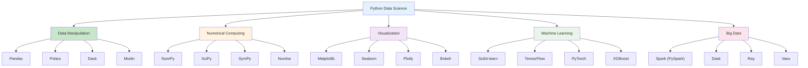

### Data Science Workflow

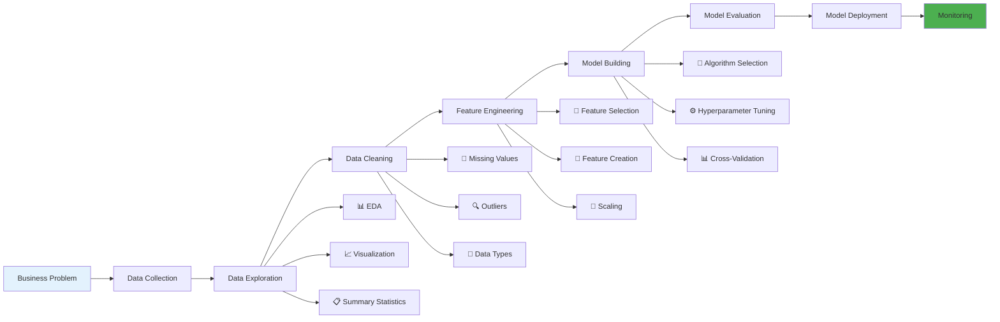

## 🐼 Pandas архитектура

### Pandas структуры данных

```mermaid
graph TD
    A[Pandas Data Structures] --> B[Series]
    A --> C[DataFrame]
    A --> D[Index]
    A --> E[MultiIndex]
    
    B --> B1[1D labeled array]
    B --> B2[Homogeneous data]
    B --> B3[Index + Values]
    B --> B4[NumPy-based]
    
    C --> C1[2D labeled structure]
    C --> C2[Heterogeneous columns]
    C --> C3[Rows + Columns]
    C --> C4[Dict-like access]
    
    D --> D1[Row/Column labels]
    D --> D2[Fast lookups]
    D --> D3[Alignment operations]
    D --> D4[Slicing support]
    
    E --> E1[Hierarchical indexing]
    E --> E2[Multiple levels]
    E --> E3[Complex data structures]
    E --> E4[Groupby operations]
    
    style A fill:#e3f2fd
    style B fill:#c8e6c9
    style C fill:#fff3e0
    style D fill:#f3e5f5
    style E fill:#e8f5e8
```

### Pandas операции и производительность

```mermaid
graph TD
    A[Pandas Operations] --> B[Vectorized Operations]
    A --> C[Apply Functions]
    A --> D[GroupBy Operations]
    A --> E[Join/Merge Operations]
    
    B --> B1[Element-wise operations]
    B --> B2[Broadcasting]
    B --> B3[NumPy integration]
    B --> B4[🚀 Fast execution]
    
    C --> C1[Row-wise application]
    C --> C2[Column-wise application]
    C --> C3[Custom functions]
    C --> C4[🐌 Slower performance]
    
    D --> D1[Split-Apply-Combine]
    D --> D2[Aggregation functions]
    D --> D3[Transformation]
    D --> D4[⚡ Optimized for groups]
    
    E --> E1[Inner/Outer joins]
    E --> E2[Left/Right joins]
    E --> E3[Concatenation]
    E --> E4[🔧 Memory intensive]
    
    F[Performance Tips] --> G[Use vectorized ops]
    F --> H[Avoid loops]
    F --> I[Use appropriate dtypes]
    F --> J[Chunk large datasets]
    
    style B fill:#4caf50
    style C fill:#ff9800
    style D fill:#2196f3
    style E fill:#9c27b0
    style F fill:#e3f2fd
```

## 🔢 NumPy и научные вычисления

### NumPy архитектура

```mermaid
graph TD
    A[NumPy Core] --> B[ndarray Object]
    A --> C[Universal Functions]
    A --> D[Broadcasting]
    A --> E[Linear Algebra]
    A --> F[Random Numbers]
    
    B --> B1[N-dimensional arrays]
    B --> B2[Homogeneous data]
    B --> B3[Contiguous memory]
    B --> B4[C/Fortran integration]
    
    C --> C1[Element-wise operations]
    C --> C2[Type casting]
    C --> C3[Output arrays]
    C --> C4[Custom ufuncs]
    
    D --> D1[Array shape compatibility]
    D --> D2[Automatic expansion]
    D --> D3[Memory efficiency]
    D --> D4[Vectorization]
    
    E --> E1[Matrix operations]
    E --> E2[Decompositions]
    E --> E3[Eigenvalues]
    E --> E4[Solving systems]
    
    F --> F1[Random sampling]
    F --> F2[Probability distributions]
    F --> F3[Random seeds]
    F --> F4[Generator objects]
    
    style A fill:#e3f2fd
    style B fill:#c8e6c9
    style C fill:#fff3e0
    style D fill:#f3e5f5
    style E fill:#e8f5e8
    style F fill:#fce4ec
```

### NumPy vs Python Lists

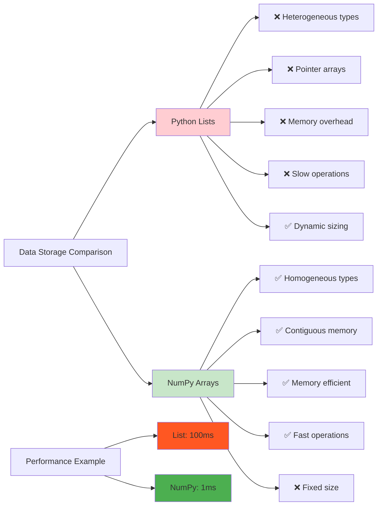

## 📈 Машинное обучение pipeline

### ML Pipeline Architecture

```mermaid
graph TD
    A[ML Pipeline] --> B[Data Ingestion]
    A --> C[Data Preprocessing]
    A --> D[Feature Engineering]
    A --> E[Model Training]
    A --> F[Model Evaluation]
    A --> G[Model Deployment]
    A --> H[Monitoring]
    
    B --> B1[Data sources]
    B --> B2[Data validation]
    B --> B3[Data versioning]
    
    C --> C1[Cleaning]
    C --> C2[Transformation]
    C --> C3[Normalization]
    
    D --> D1[Feature selection]
    D --> D2[Feature creation]
    D --> D3[Feature encoding]
    
    E --> E1[Algorithm selection]
    E --> E2[Hyperparameter tuning]
    E --> E3[Cross-validation]
    
    F --> F1[Metrics calculation]
    F --> F2[Model comparison]
    F --> F3[Error analysis]
    
    G --> G1[Model serialization]
    G --> G2[API endpoints]
    G --> G3[Batch prediction]
    
    H --> H1[Performance monitoring]
    H --> H2[Data drift detection]
    H --> H3[Model retraining]
    
    style A fill:#e3f2fd
    style B fill:#c8e6c9
    style C fill:#fff3e0
    style D fill:#f3e5f5
    style E fill:#e8f5e8
    style F fill:#fce4ec
    style G fill:#e1f5fe
    style H fill:#f3e5f5
```

### Scikit-learn архитектура

```mermaid
graph TD
    A[Scikit-learn] --> B[Estimators]
    A --> C[Transformers]
    A --> D[Predictors]
    A --> E[Model Selection]
    A --> F[Metrics]
    
    B --> B1["fit() method"]
    B --> B2[Consistent API]
    B --> B3[Parameter validation]
    
    C --> C1["transform() method"]
    C --> C2["fit_transform()"]
    C --> C3[Data preprocessing]
    
    D --> D1["predict() method"]
    D --> D2["predict_proba()"]
    D --> D3[Decision functions]
    
    E --> E1[Cross-validation]
    E --> E2[Grid search]
    E --> E3[Pipeline]
    E --> E4[Feature selection]
    
    F --> F1[Classification metrics]
    F --> F2[Regression metrics]
    F --> F3[Clustering metrics]
    F --> F4[Model evaluation]
    
    style A fill:#e3f2fd
    style B fill:#c8e6c9
    style C fill:#fff3e0
    style D fill:#f3e5f5
    style E fill:#e8f5e8
    style F fill:#fce4ec
```

## 🧠 Типы машинного обучения

### ML Algorithm Categories

```mermaid
graph TD
    A[Machine Learning] --> B[Supervised Learning]
    A --> C[Unsupervised Learning]
    A --> D[Reinforcement Learning]
    A --> E[Semi-Supervised Learning]
    
    B --> B1[Classification]
    B --> B2[Regression]
    
    B1 --> B3[Logistic Regression]
    B1 --> B4[Random Forest]
    B1 --> B5[SVM]
    B1 --> B6[Neural Networks]
    
    B2 --> B7[Linear Regression]
    B2 --> B8[Decision Trees]
    B2 --> B9[Gradient Boosting]
    
    C --> C1[Clustering]
    C --> C2[Dimensionality Reduction]
    C --> C3[Association Rules]
    
    C1 --> C4[K-Means]
    C1 --> C5[DBSCAN]
    C1 --> C6[Hierarchical]
    
    C2 --> C7[PCA]
    C2 --> C8[t-SNE]
    C2 --> C9[UMAP]
    
    D --> D1[Policy Learning]
    D --> D2[Value Functions]
    D --> D3[Q-Learning]
    
    E --> E1[Label Propagation]
    E --> E2[Self-Training]
    E --> E3[Co-Training]
    
    style A fill:#e3f2fd
    style B fill:#c8e6c9
    style C fill:#fff3e0
    style D fill:#f3e5f5
    style E fill:#e8f5e8
```

### Bias-Variance Tradeoff

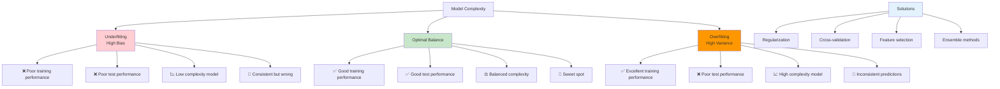

## 📊 Визуализация данных

### Matplotlib архитектура

```mermaid
graph TD
    A[Matplotlib Architecture] --> B[Backend Layer]
    A --> C[Artist Layer]
    A --> D[Scripting Layer]
    
    B --> B1[Interactive backends]
    B --> B2[Non-interactive backends]
    B --> B3[Output formats]
    
    C --> C1[Primitive artists]
    C --> C2[Composite artists]
    C --> C3[Collections]
    
    D --> D1[pyplot interface]
    D --> D2[Object-oriented interface]
    D --> D3[Convenience functions]
    
    E[Plot Components] --> F[Figure]
    E --> G[Axes]
    E --> H[Axis]
    E --> I[Artists]
    
    F --> F1[Top-level container]
    F --> F2[Multiple subplots]
    F --> F3[Figure-level properties]
    
    G --> G1[Plot area]
    G --> G2[Data visualization]
    G --> G3[Coordinate system]
    
    H --> H1[Axis labels]
    H --> H2[Tick marks]
    H --> H3[Axis limits]
    
    I --> I1[Lines, text, patches]
    I --> I2[Visual elements]
    I --> I3[Customizable properties]
    
    style A fill:#e3f2fd
    style B fill:#c8e6c9
    style C fill:#fff3e0
    style D fill:#f3e5f5
    style E fill:#e8f5e8
```

### Visualization Libraries Comparison

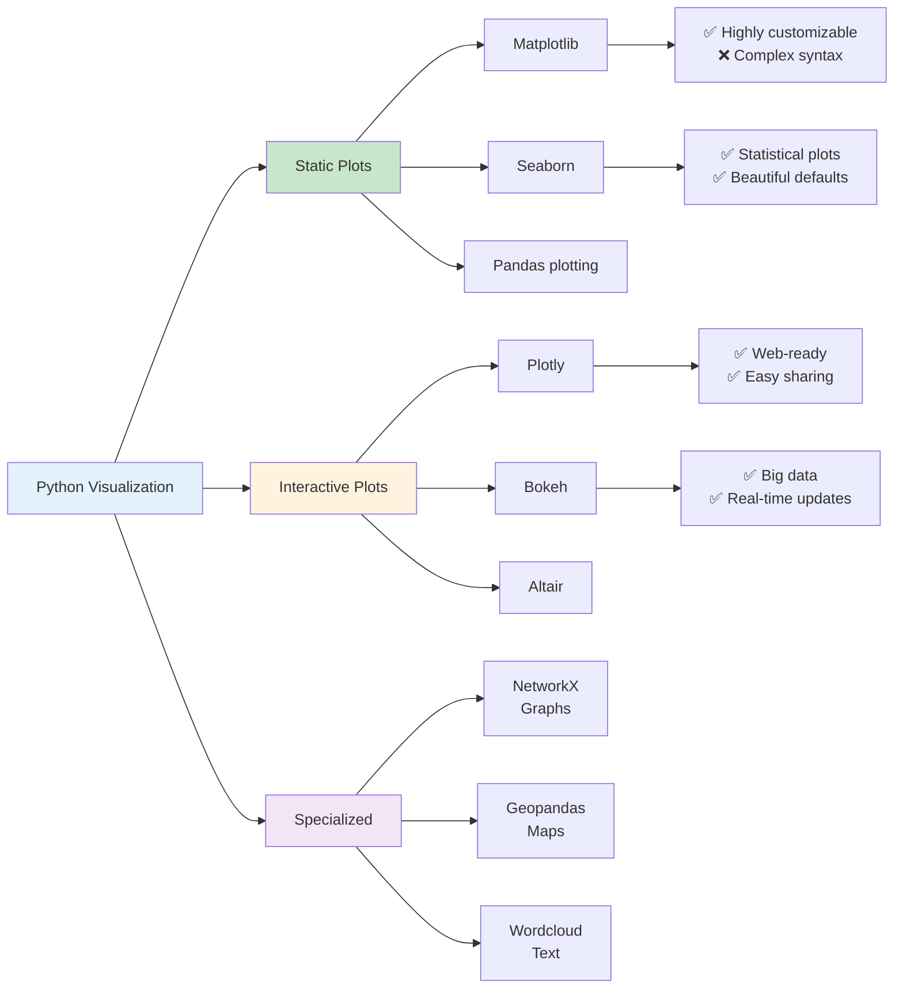

## 🚀 Оптимизация производительности

### Performance Optimization Strategies

```mermaid
graph TD
    A[Performance Optimization] --> B[Vectorization]
    A --> C[Parallel Processing]
    A --> D[Memory Optimization]
    A --> E[Algorithm Optimization]
    A --> F[Hardware Acceleration]
    
    B --> B1[NumPy operations]
    B --> B2[Pandas vectorized]
    B --> B3[Avoid Python loops]
    B --> B4[Broadcasting]
    
    C --> C1[Multiprocessing]
    C --> C2[Threading]
    C --> C3[Asyncio]
    C --> C4[Joblib]
    
    D --> D1[Data types optimization]
    D --> D2[Chunking large datasets]
    D --> D3[Memory mapping]
    D --> D4[Garbage collection]
    
    E --> E1[Algorithm selection]
    E --> E2[Data structures]
    E --> E3[Caching results]
    E --> E4[Early stopping]
    
    F --> F1["GPU computing (CUDA)"]
    F --> F2[JAX/XLA]
    F --> F3[Numba JIT]
    F --> F4[Cython]
    
    style A fill:#e3f2fd
    style B fill:#c8e6c9
    style C fill:#fff3e0
    style D fill:#f3e5f5
    style E fill:#e8f5e8
    style F fill:#fce4ec
```

### Big Data Processing Options

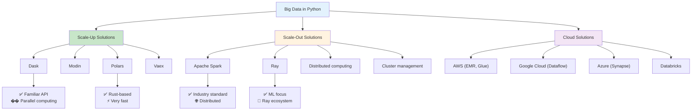

## 🔬 Feature Engineering

### Feature Engineering Pipeline

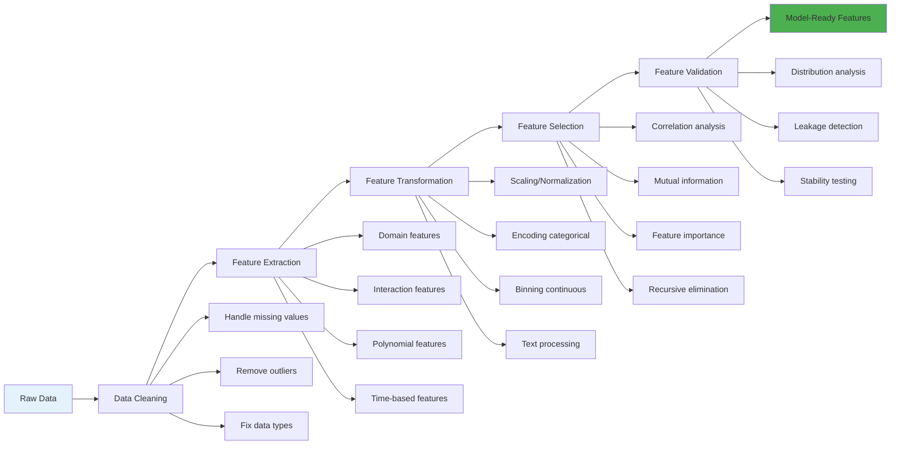

### Feature Selection Methods

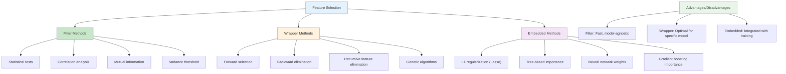

## 🎯 Model Evaluation

### Model Evaluation Metrics

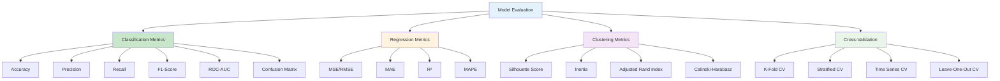

### Confusion Matrix Analysis

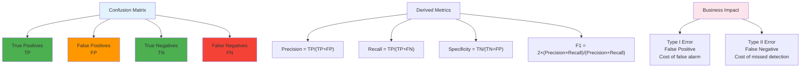

Эти диаграммы показывают полную экосистему анализа данных и машинного обучения в Python от базовых структур данных до продвинутых техник оптимизации. 