# Диаграммы: Безопасность в Python

## 🔐 Криптография и хеширование

### Эволюция алгоритмов хеширования паролей

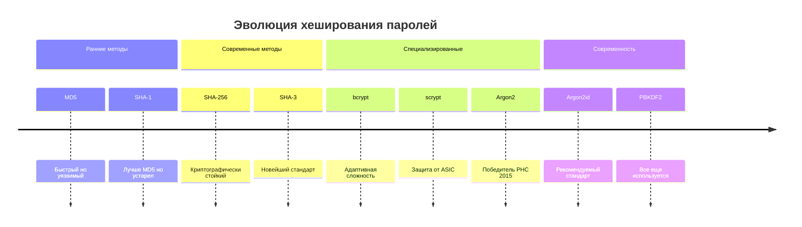

### Сравнение алгоритмов хеширования

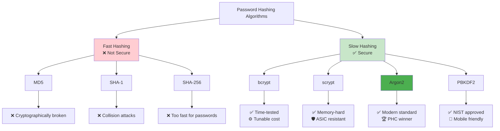

### Archитектура системы аутентификации

```mermaid
graph TD
    A[Authentication System] --> B[Registration]
    A --> C[Login]
    A --> D[Password Management]
    A --> E[Session Management]
    
    B --> B1[Input validation]
    B --> B2[Password strength check]
    B --> B3[Salt generation]
    B --> B4[Password hashing]
    B --> B5[Store user data]
    
    C --> C1[Username/email lookup]
    C --> C2[Password verification]
    C --> C3[Rate limiting]
    C --> C4[Session creation]
    C --> C5[Security logging]
    
    D --> D1[Password reset]
    D --> D2[Password change]
    D --> D3[Password history]
    D --> D4[Account lockout]
    
    E --> E1[Session tokens]
    E --> E2[Session expiration]
    E --> E3[Secure cookies]
    E --> E4[Session invalidation]
    
    style A fill:#e3f2fd
    style B fill:#c8e6c9
    style C fill:#fff3e0
    style D fill:#f3e5f5
    style E fill:#e8f5e8
```

## 🛡️ Защита от атак

### OWASP Top 10 для Python

```mermaid
graph TD
    A[OWASP Top 10] --> B[A01: Broken Access Control]
    A --> C[A02: Cryptographic Failures]
    A --> D[A03: Injection]
    A --> E[A04: Insecure Design]
    A --> F[A05: Security Misconfiguration]
    A --> G[A06: Vulnerable Components]
    A --> H[A07: Authentication Failures]
    A --> I[A08: Software Integrity Failures]
    A --> J[A09: Logging Failures]
    A --> K[A10: Server-Side Request Forgery]
    
    B --> B1[🛡️ Use proper authorization]
    B --> B2[🔍 Validate permissions]
    B --> B3[📝 Audit access controls]
    
    C --> C1[🔐 Use strong encryption]
    C --> C2[🔑 Secure key management]
    C --> C3[🛡️ Protect data in transit]
    
    D --> D1[🧹 Input sanitization]
    D --> D2[📊 Parameterized queries]
    D --> D3[🔍 Input validation]
    
    E --> E1[🏗️ Secure by design]
    E --> E2[🔒 Threat modeling]
    E --> E3[📋 Security requirements]
    
    style A fill:#e3f2fd
    style B fill:#ffcdd2
    style C fill:#ff9800
    style D fill:#f44336
```

### SQL Injection Protection

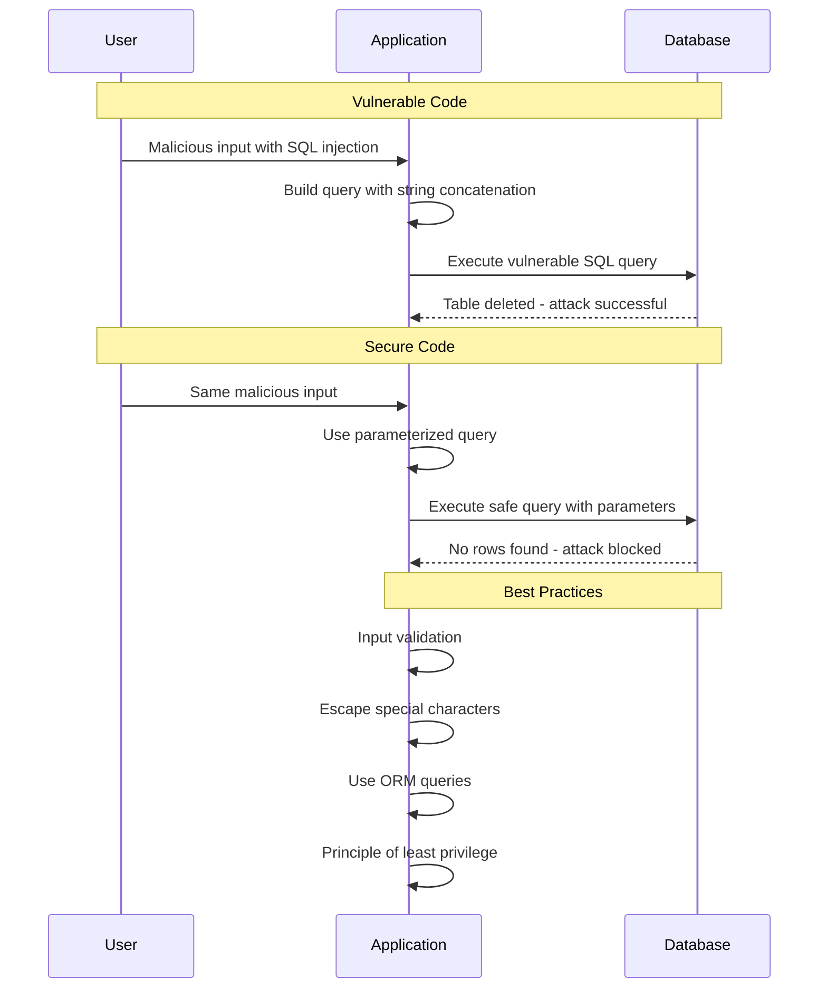

### Cross-Site Scripting (XSS) Prevention

```mermaid
graph TD
    A[XSS Prevention] --> B[Input Validation]
    A --> C[Output Encoding]
    A --> D[Content Security Policy]
    A --> E[HTTP Headers]
    
    B --> B1[Whitelist validation]
    B --> B2[Input sanitization]
    B --> B3[Length limits]
    B --> B4[Type checking]
    
    C --> C1[HTML encoding]
    C --> C2[JavaScript encoding]
    C --> C3[URL encoding]
    C --> C4[CSS encoding]
    
    D --> D1[Script source restrictions]
    D --> D2[Inline script blocking]
    D --> D3["Eval() restrictions"]
    D --> D4[Report violations]
    
    E --> E1[X-XSS-Protection]
    E --> E2[X-Content-Type-Options]
    E --> E3[X-Frame-Options]
    E --> E4[Referrer-Policy]
    
    style A fill:#e3f2fd
    style B fill:#c8e6c9
    style C fill:#fff3e0
    style D fill:#f3e5f5
    style E fill:#e8f5e8
```

## 🔒 Управление секретами

### Lifecycle управления секретами

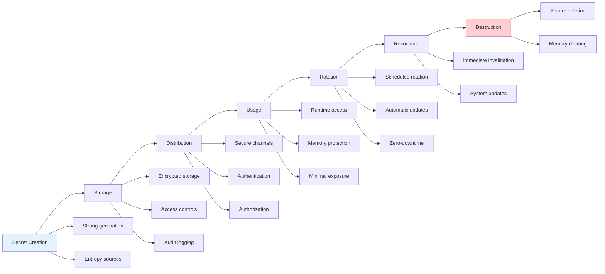

### Стратегии хранения секретов

```mermaid
graph TD
    A[Secret Storage Options] --> B[Environment Variables]
    A --> C[Configuration Files]
    A --> D[External Secret Stores]
    A --> E[Hardware Security Modules]
    
    B --> B1[✅ Simple setup]
    B --> B2[❌ Process visibility]
    B --> B3[❌ No rotation]
    B --> B4[⚠️ Low security]
    
    C --> C1[✅ Version control]
    C --> C2[❌ Plaintext risk]
    C --> C3[❌ File permissions]
    C --> C4[⚠️ Medium security]
    
    D --> D1[✅ Centralized management]
    D --> D2[✅ Access controls]
    D --> D3[✅ Audit trails]
    D --> D4[✅ High security]
    
    E --> E1[✅ Hardware protection]
    E --> E2[✅ Tamper resistant]
    E --> E3[❌ Cost/complexity]
    E --> E4[✅ Highest security]
    
    D --> D5[AWS Secrets Manager]
    D --> D6[HashiCorp Vault]
    D --> D7[Azure Key Vault]
    D --> D8[Google Secret Manager]
    
    style B fill:#ffcdd2
    style C fill:#ff9800
    style D fill:#c8e6c9
    style E fill:#4caf50
```

## 🛠️ Безопасная разработка

### Secure Development Lifecycle

```mermaid
graph TD
    A[Secure SDLC] --> B[Requirements]
    A --> C[Design]
    A --> D[Implementation]
    A --> E[Testing]
    A --> F[Deployment]
    A --> G[Maintenance]
    
    B --> B1[Security requirements]
    B --> B2[Compliance needs]
    B --> B3[Risk assessment]
    
    C --> C1[Threat modeling]
    C --> C2[Security architecture]
    C --> C3[Design reviews]
    
    D --> D1[Secure coding practices]
    D --> D2[Code reviews]
    D --> D3[Static analysis]
    
    E --> E1[Security testing]
    E --> E2[Penetration testing]
    E --> E3[Vulnerability scanning]
    
    F --> F1[Secure configuration]
    F --> F2[Monitoring setup]
    F --> F3[Incident response]
    
    G --> G1[Security updates]
    G --> G2[Monitoring]
    G --> G3[Incident handling]
    
    style A fill:#e3f2fd
    style B fill:#c8e6c9
    style C fill:#fff3e0
    style D fill:#f3e5f5
    style E fill:#e8f5e8
    style F fill:#fce4ec
    style G fill:#e1f5fe
```

### Security Testing Pyramid

```mermaid
graph TD
    A[Security Testing] --> B[Unit Security Tests]
    A --> C[Integration Security Tests]
    A --> D[System Security Tests]
    A --> E[Manual Security Tests]
    
    B --> B1[Input validation tests]
    B --> B2[Cryptographic function tests]
    B --> B3[Access control tests]
    B --> B4[⚡ Fast execution]
    
    C --> C1[API security tests]
    C --> C2[Database security tests]
    C --> C3[Authentication flow tests]
    C --> C4[🔄 Component interaction]
    
    D --> D1[Automated vulnerability scans]
    D --> D2[Configuration security tests]
    D --> D3[End-to-end security flows]
    D --> D4[🌐 Full system coverage]
    
    E --> E1[Penetration testing]
    E --> E2[Security code review]
    E --> E3[Threat modeling validation]
    E --> E4[👨‍💻 Expert analysis]
    
    style B fill:#c8e6c9
    style C fill:#fff3e0
    style D fill:#f3e5f5
    style E fill:#ffcdd2
```

## 🔍 Мониторинг и аудит безопасности

### Security Monitoring Architecture

```mermaid
graph TD
    A[Security Monitoring] --> B[Log Collection]
    A --> C[Event Analysis]
    A --> D[Threat Detection]
    A --> E[Incident Response]
    A --> F[Compliance Reporting]
    
    B --> B1[Application logs]
    B --> B2[System logs]
    B --> B3[Network logs]
    B --> B4[Database logs]
    
    C --> C1[Log aggregation]
    C --> C2[Correlation rules]
    C --> C3[Anomaly detection]
    C --> C4[Pattern matching]
    
    D --> D1[Signature-based detection]
    D --> D2[Behavioral analysis]
    D --> D3[Machine learning models]
    D --> D4[Threat intelligence]
    
    E --> E1[Alert triage]
    E --> E2[Investigation]
    E --> E3[Containment]
    E --> E4[Recovery]
    
    F --> F1[Audit trails]
    F --> F2[Compliance dashboards]
    F --> F3[Risk assessments]
    F --> F4[Management reports]
    
    style A fill:#e3f2fd
    style B fill:#c8e6c9
    style C fill:#fff3e0
    style D fill:#f3e5f5
    style E fill:#ffcdd2
    style F fill:#e8f5e8
```

### Security Event Types

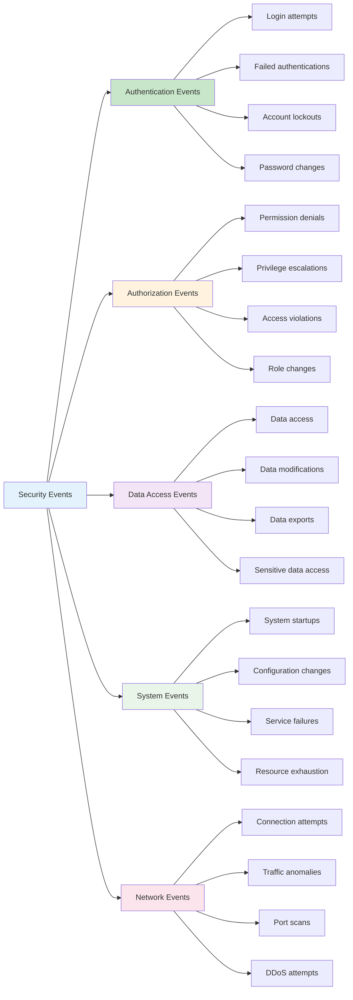

## 🌐 Web Application Security

### Web Security Headers

```mermaid
graph TD
    A[Security Headers] --> B[Content Security Policy]
    A --> C[Authentication Headers]
    A --> D[Transport Security]
    A --> E[Information Disclosure]
    
    B --> B1[script-src]
    B --> B2[style-src]
    B --> B3[img-src]
    B --> B4[connect-src]
    
    C --> C1[WWW-Authenticate]
    C --> C2[Authorization]
    C --> C3[Authentication-Info]
    
    D --> D1[Strict-Transport-Security]
    D --> D2[Upgrade-Insecure-Requests]
    D --> D3[X-Forwarded-Proto]
    
    E --> E1[X-Content-Type-Options]
    E --> E2[X-Frame-Options]
    E --> E3[X-XSS-Protection]
    E --> E4[Referrer-Policy]
    
    F[Implementation] --> G[Helmet.js equivalent]
    F --> H[Django security middleware]
    F --> I[Flask-Security]
    F --> J[Custom middleware]
    
    style A fill:#e3f2fd
    style B fill:#c8e6c9
    style C fill:#fff3e0
    style D fill:#f3e5f5
    style E fill:#e8f5e8
    style F fill:#fce4ec
```

### HTTPS Implementation

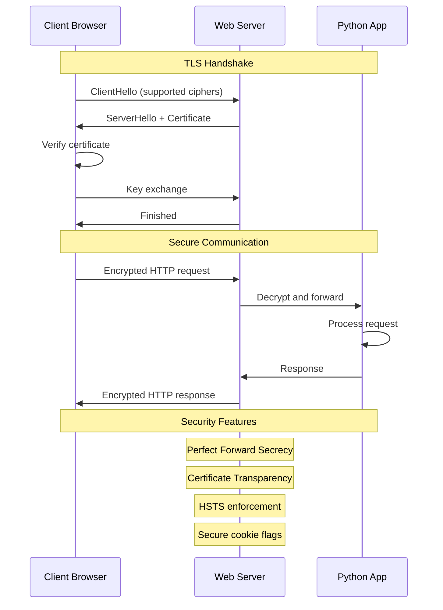

## 🔧 Инструменты безопасности

### Python Security Tools

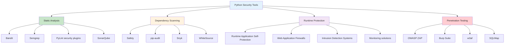

### Security Automation Pipeline

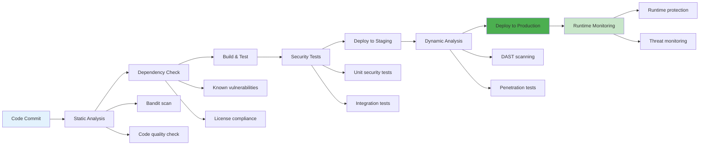

## 🚨 Incident Response

### Security Incident Response Process

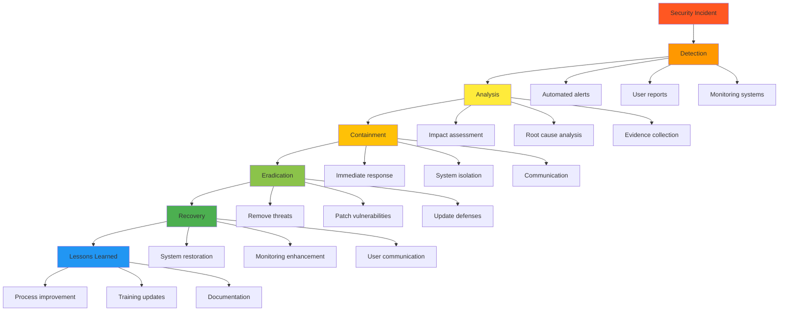

### Threat Intelligence Integration

```mermaid
graph TD
    A[Threat Intelligence] --> B[Intelligence Sources]
    A --> C[Data Processing]
    A --> D[Analysis & Enrichment]
    A --> E[Action & Response]
    
    B --> B1[Commercial feeds]
    B --> B2[Open source intel]
    B --> B3[Government sources]
    B --> B4[Industry sharing]
    
    C --> C1[Data normalization]
    C --> C2[Deduplication]
    C --> C3[Quality assessment]
    C --> C4[Format conversion]
    
    D --> D1[IOC correlation]
    D --> D2[Risk scoring]
    D --> D3[Context enrichment]
    D --> D4[Trend analysis]
    
    E --> E1[Automated blocking]
    E --> E2[Alert generation]
    E --> E3[Investigation support]
    E --> E4[Proactive hunting]
    
    style A fill:#e3f2fd
    style B fill:#c8e6c9
    style C fill:#fff3e0
    style D fill:#f3e5f5
    style E fill:#e8f5e8
```

Эти диаграммы показывают комплексный подход к безопасности в Python от криптографии до incident response. 