# Диаграммы: Регулярные выражения в Python

## 🎯 Основы регулярных выражений

### Архитектура регулярных выражений

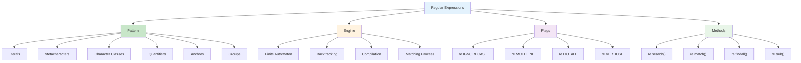

### Metacharacters и их назначение

```mermaid
graph TD
    A[Metacharacters] --> B[Character Classes]
    A --> C[Quantifiers]
    A --> D[Anchors]
    A --> E[Groups]
    A --> F[Alternation]
    
    B --> B1[". - Any character"]
    B --> B2["\\d - Digits"]
    B --> B3["\\w - Word characters"]
    B --> B4["\\s - Whitespace"]
    B --> B5["[...] - Custom class"]
    
    C --> C1["* - Zero or more"]
    C --> C2["+ - One or more"]
    C --> C3["? - Zero or one"]
    C --> C4["{n} - Exactly n"]
    C --> C5["{n,m} - Between n and m"]
    
    D --> D1["^ - Start of string"]
    D --> D2["$ - End of string"]
    D --> D3["\\b - Word boundary"]
    D --> D4["\\A - Start of string"]
    D --> D5["\\Z - End of string"]
    
    E --> E1["(...) - Capturing group"]
    E --> E2["(?:...) - Non-capturing"]
    E --> E3["(?P<name>...) - Named group"]
    E --> E4["(?=...) - Lookahead"]
    E --> E5["(?!...) - Negative lookahead"]
    
    F --> F1["| - OR operator"]
    F --> F2[Multiple patterns]
    
    style A fill:#e3f2fd
    style B fill:#c8e6c9
    style C fill:#fff3e0
    style D fill:#f3e5f5
    style E fill:#e8f5e8
    style F fill:#fce4ec
```

### Regex Engine Processing

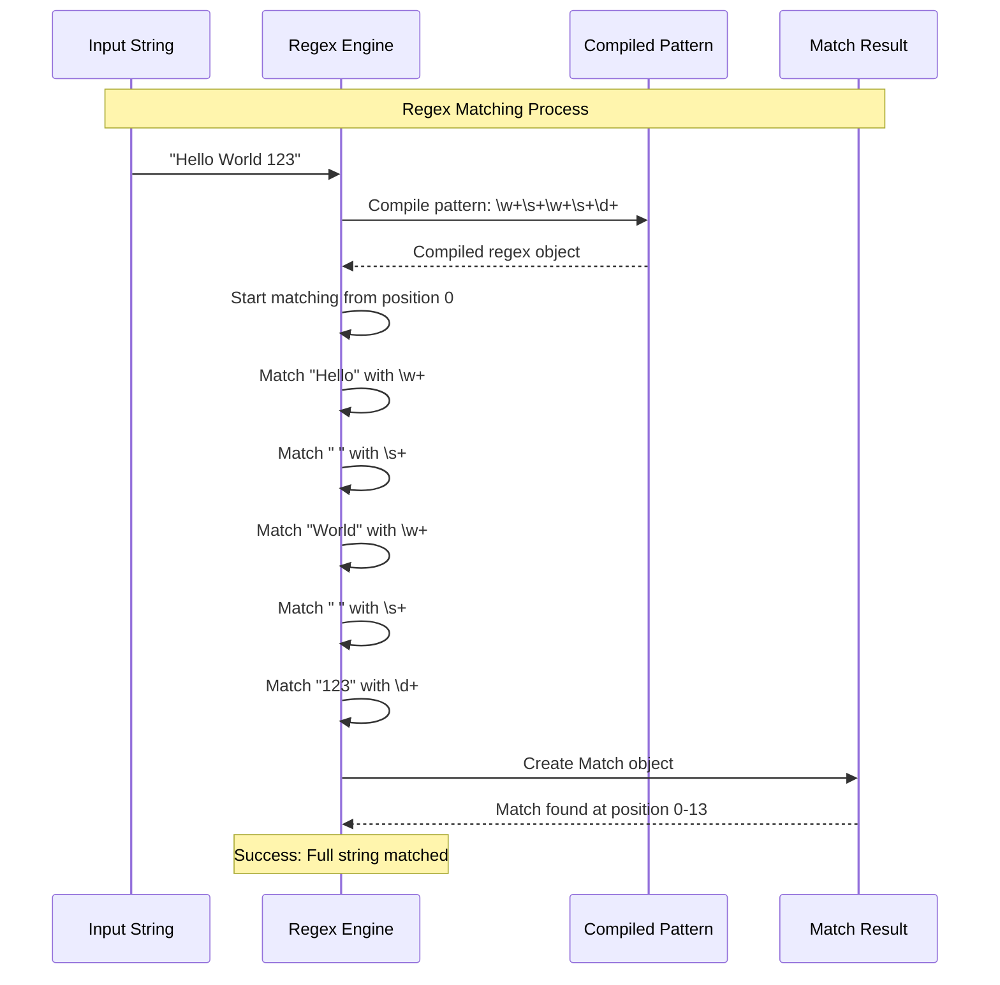

## 🔍 Методы поиска и сопоставления

### re Module Methods Comparison

```mermaid
graph TD
    A[re Module Methods] --> B["re.search()"]
    A --> C["re.match()"]
    A --> D["re.findall()"]
    A --> E["re.finditer()"]
    A --> F["re.sub()"]
    A --> G["re.split()"]
    
    B --> B1[🔍 Find first occurrence]
    B --> B2[📍 Search entire string]
    B --> B3[↩️ Returns Match object]
    B --> B4[✅ Most flexible]
    
    C --> C1[🎯 Match from beginning]
    C --> C2[📍 Start of string only]
    C --> C3[↩️ Returns Match object]
    C --> C4[⚠️ Strict positioning]
    
    D --> D1[📋 Find all occurrences]
    D --> D2[📍 Search entire string]
    D --> D3[↩️ Returns list of strings]
    D --> D4[🚀 Fast for simple patterns]
    
    E --> E1[🔄 Iterator of matches]
    E --> E2[📍 Search entire string]
    E --> E3[↩️ Returns Match objects]
    E --> E4[�� Memory efficient]
    
    F --> F1[🔄 Replace occurrences]
    F --> F2[📍 Search entire string]
    F --> F3[↩️ Returns modified string]
    F --> F4[⚙️ Supports replacement functions]
    
    G --> G1[✂️ Split string]
    G --> G2[📍 Search entire string]
    G --> G3[↩️ Returns list of strings]
    G --> G4[🔧 Regex-based splitting]
    
    style A fill:#e3f2fd
    style B fill:#c8e6c9
    style C fill:#fff3e0
    style D fill:#f3e5f5
    style E fill:#e8f5e8
    style F fill:#fce4ec
    style G fill:#e1f5fe
```

### Match Object Attributes

```mermaid
graph TD
    A[Match Object] --> B[Position Methods]
    A --> C[Content Methods]
    A --> D[Group Methods]
    A --> E[Span Methods]
    
    B --> B1[".start()"]
    B --> B2[".end()"]
    B --> B3[.pos]
    B --> B4[.endpos]
    
    C --> C1[.string]
    C --> C2[.re]
    C --> C3[.lastindex]
    C --> C4[.lastgroup]
    
    D --> D1[".group()"]
    D --> D2[".groups()"]
    D --> D3[".groupdict()"]
    D --> D4[".expand()"]
    
    E --> E1[".span()"]
    E --> E2[Individual group spans]
    E --> E3[Named group spans]
    
    F[Example Usage] --> G["match.group(0) - Full match"]
    F --> H["match.group(1) - First group"]
    F --> I["match.start() - Start position"]
    F --> J["match.end() - End position"]
    
    style A fill:#e3f2fd
    style B fill:#c8e6c9
    style C fill:#fff3e0
    style D fill:#f3e5f5
    style E fill:#e8f5e8
    style F fill:#fce4ec
```

## 🎭 Группы и захват

### Group Types and Behavior

```mermaid
graph TD
    A[Group Types] --> B[Capturing Groups]
    A --> C[Non-Capturing Groups]
    A --> D[Named Groups]
    A --> E[Lookahead/Lookbehind]
    
    B --> B1["(...) - Basic group"]
    B --> B2[📊 Numbered: \1, \2, etc.]
    B --> B3[💾 Stored in memory]
    B --> B4[🔄 Available in replacement]
    
    C --> C1["(?:...) - Non-capturing"]
    C --> C2[🚫 Not numbered]
    C --> C3[💨 Not stored]
    C --> C4[⚡ Better performance]
    
    D --> D1["(?P<name>...) - Named"]
    D --> D2[📝 Accessible by name]
    D --> D3[💾 Also numbered]
    D --> D4[📖 Self-documenting]
    
    E --> E1["(?=...) - Positive lookahead"]
    E --> E2["(?!...) - Negative lookahead"]
    E --> E3["(?<=...) - Positive lookbehind"]
    E --> E4["(?<!...) - Negative lookbehind"]
    
    F[Group Numbering] --> G[Groups numbered left to right]
    F --> H[Nested groups get higher numbers]
    F --> I[Named groups also get numbers]
    
    style A fill:#e3f2fd
    style B fill:#c8e6c9
    style C fill:#fff3e0
    style D fill:#f3e5f5
    style E fill:#e8f5e8
    style F fill:#fce4ec
```

### Group Matching Flow

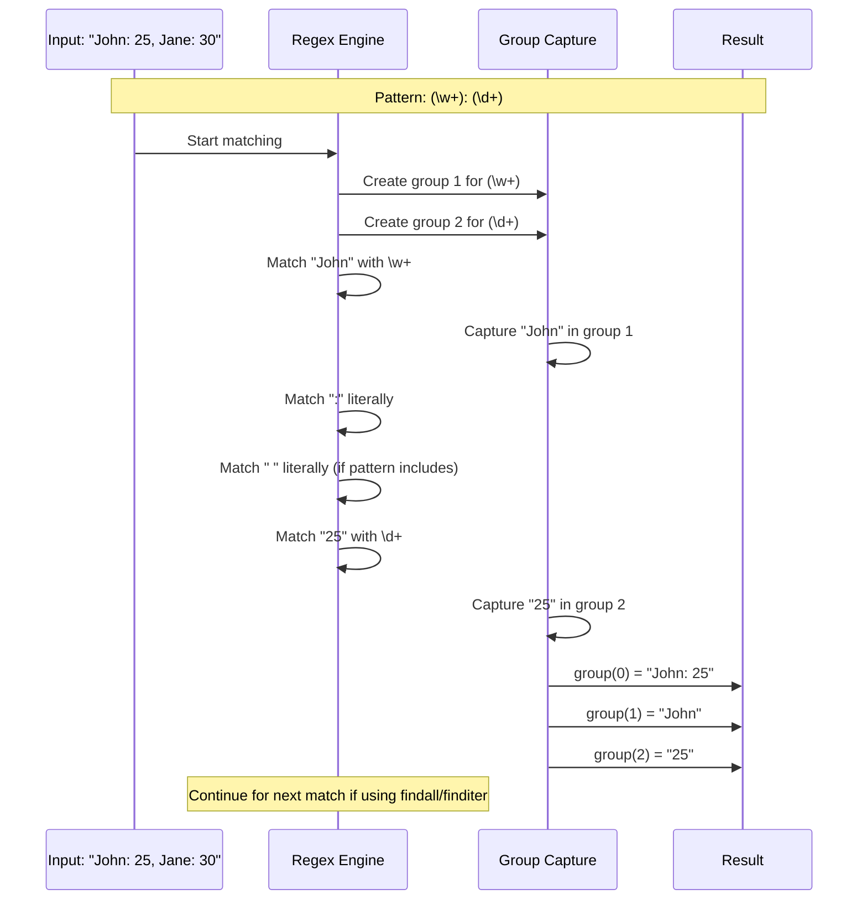

## ⚡ Производительность и оптимизация

### Regex Performance Factors

```mermaid
graph TD
    A[Regex Performance] --> B[Pattern Complexity]
    A --> C[Input Size]
    A --> D[Backtracking]
    A --> E[Compilation]
    A --> F[Engine Type]
    
    B --> B1["Simple patterns: O(n)"]
    B --> B2["Complex patterns: O(n²) or worse"]
    B --> B3["Catastrophic backtracking: O(2ⁿ)"]
    
    C --> C1[Linear growth for good patterns]
    C --> C2[Exponential for bad patterns]
    C --> C3[Memory usage increases]
    
    D --> D1[Occurs with alternation]
    D --> D2[Nested quantifiers problem]
    D --> D3[Solution: atomic groups]
    D --> D4[Solution: possessive quantifiers]
    
    E --> E1[One-time cost]
    E --> E2[Cache compiled patterns]
    E --> E3["Use re.compile()"]
    
    F --> F1["NFA (backtracking)"]
    F --> F2["DFA (no backtracking)"]
    F --> F3[Hybrid approaches]
    
    G[Optimization Tips] --> H[Anchor patterns]
    G --> I[Use non-capturing groups]
    G --> J[Avoid nested quantifiers]
    G --> K[Compile patterns once]
    
    style A fill:#e3f2fd
    style B fill:#ffcdd2
    style G fill:#c8e6c9
```

### Catastrophic Backtracking Example

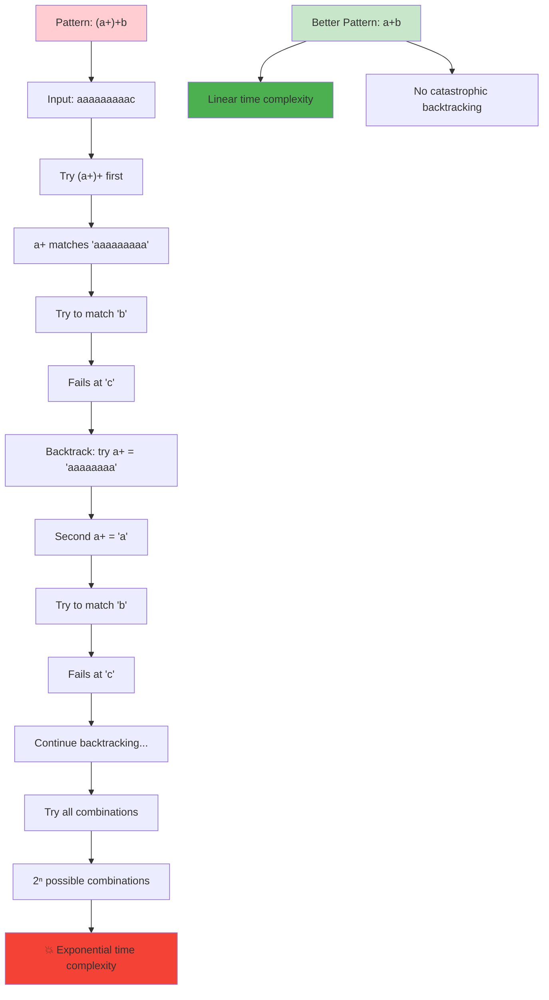

## 📝 Практические применения

### Common Regex Use Cases

```mermaid
graph TD
    A[Regex Applications] --> B[Validation]
    A --> C[Extraction]
    A --> D[Replacement]
    A --> E[Parsing]
    A --> F[Cleaning]
    
    B --> B1[Email validation]
    B --> B2[Phone number format]
    B --> B3[URL validation]
    B --> B4[Password strength]
    B --> B5[Credit card numbers]
    
    C --> C1[Extract URLs from text]
    C --> C2[Extract email addresses]
    C --> C3[Extract dates/times]
    C --> C4[Extract code patterns]
    C --> C5[Extract structured data]
    
    D --> D1[Replace text patterns]
    D --> D2[Format phone numbers]
    D --> D3[Normalize whitespace]
    D --> D4[Replace HTML tags]
    D --> D5[Template processing]
    
    E --> E1[Log file parsing]
    E --> E2[CSV processing]
    E --> E3[Configuration files]
    E --> E4[Protocol parsing]
    E --> E5[Code analysis]
    
    F --> F1[Remove extra spaces]
    F --> F2[Standardize formats]
    F --> F3[Remove special chars]
    F --> F4[Data normalization]
    F --> F5[Input sanitization]
    
    style A fill:#e3f2fd
    style B fill:#c8e6c9
    style C fill:#fff3e0
    style D fill:#f3e5f5
    style E fill:#e8f5e8
    style F fill:#fce4ec
```

### Email Validation Pattern Evolution

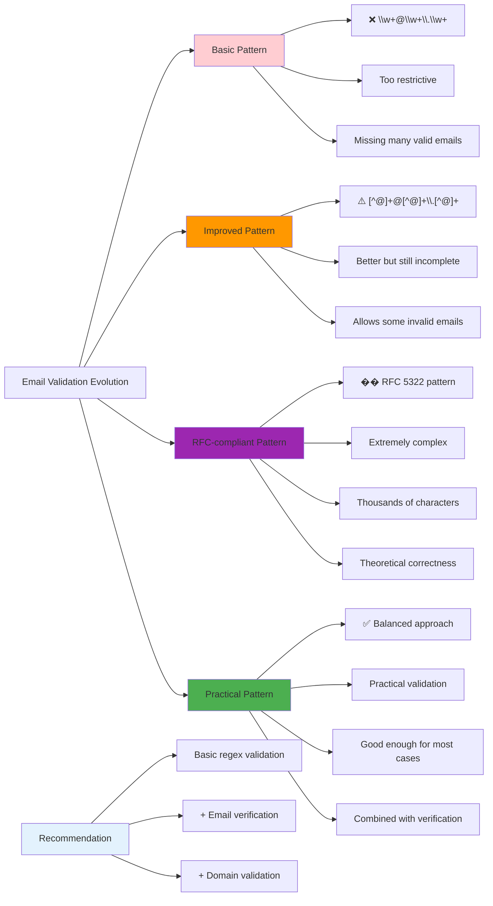

## 🔧 Advanced Regex Features

### Lookahead and Lookbehind

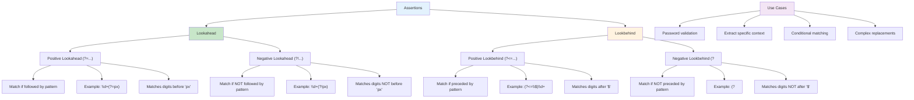

### Regex Flags and Modifiers

```mermaid
graph TD
    A[Regex Flags] --> B["re.IGNORECASE / re.I"]
    A --> C["re.MULTILINE / re.M"]
    A --> D["re.DOTALL / re.S"]
    A --> E["re.VERBOSE / re.X"]
    A --> F["re.ASCII / re.A"]
    A --> G["re.UNICODE / re.U"]
    
    B --> B1[Case-insensitive matching]
    B --> B2[Example: 'Hello' matches 'HELLO']
    B --> B3[Good for user input]
    
    C --> C1[^ and $ match line boundaries]
    C --> C2[Not just string boundaries]
    C --> C3[Useful for multiline text]
    
    D --> D1[. matches newlines too]
    D --> D2["By default . doesn't match \\n"]
    D --> D3[Useful for multiline patterns]
    
    E --> E1[Allows whitespace and comments]
    E --> E2[Makes complex patterns readable]
    E --> E3[Ignores whitespace in pattern]
    
    F --> F1[ASCII-only matching]
    F --> F2["\\w, \\d, \\s only match ASCII"]
    F --> F3[Python 3 default behavior]
    
    G --> G1[Unicode support]
    G --> G2["\\w includes Unicode letters"]
    G --> G3[Python 2 compatibility]
    
    H[Flag Combination] --> I["Multiple flags with |"]
    H --> J["Example: re.I | re.M"]
    H --> K["Inline flags: (?im)"]
    
    style A fill:#e3f2fd
    style B fill:#c8e6c9
    style C fill:#fff3e0
    style D fill:#f3e5f5
    style E fill:#e8f5e8
    style F fill:#fce4ec
    style G fill:#e1f5fe
    style H fill:#f8bbd9
```

## 🚀 Alternatives to Regex

### When NOT to Use Regex

```mermaid
graph TD
    A[Regex Limitations] --> B[Complex Parsing]
    A --> C[Performance Critical]
    A --> D[Maintainability]
    A --> E[Nested Structures]
    
    B --> B1[❌ HTML/XML parsing]
    B --> B2[❌ Programming languages]
    B --> B3[❌ Complex protocols]
    B --> B4[✅ Use dedicated parsers]
    
    C --> C1[❌ Large data processing]
    C --> C2[❌ Real-time systems]
    C --> C3[❌ Repeated operations]
    C --> C4[✅ Use compiled solutions]
    
    D --> D1[❌ Complex business logic]
    D --> D2[❌ Team comprehension]
    D --> D3[❌ Future modifications]
    D --> D4[✅ Use clear algorithms]
    
    E --> E1[❌ Balanced parentheses]
    E --> E2[❌ JSON parsing]
    E --> E3[❌ Mathematical expressions]
    E --> E4[✅ Use recursive parsers]
    
    F[Better Alternatives] --> G[Parsing Libraries]
    F --> H[String Methods]
    F --> I[Specialized Tools]
    F --> J[State Machines]
    
    G --> G1[BeautifulSoup for HTML]
    G --> G2[json module for JSON]
    G --> G3[csv module for CSV]
    
    H --> H1["str.split()"]
    H --> H2["str.replace()"]
    H --> H3["str.startswith()"]
    
    style A fill:#e3f2fd
    style B fill:#ffcdd2
    style F fill:#c8e6c9
```

### Performance Comparison

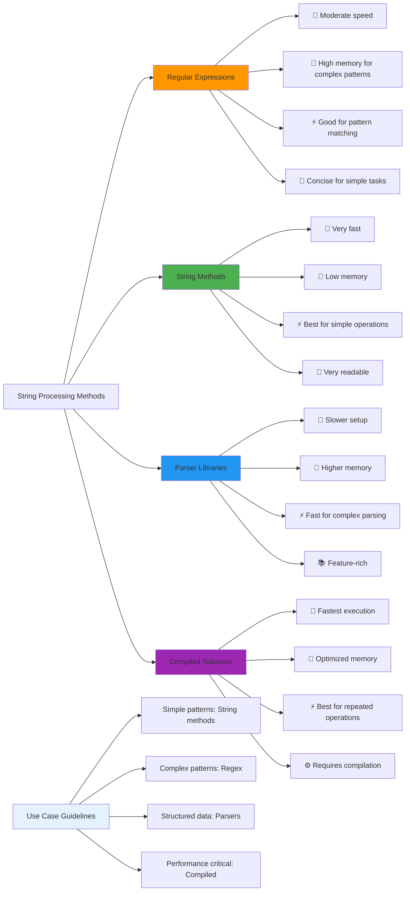

Эти диаграммы показывают полную картину регулярных выражений в Python от основ до продвинутых техник и альтернативных решений. 